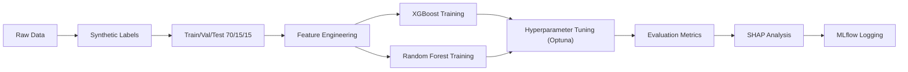

# ScholarAI — AI Models Design

> Covers feature engineering, training pipeline, model evaluation, explainability, and the interview simulation system.

---

## 1. Feature Engineering

### Input Feature Vector (Strict MVP Constraints)

| Feature | Type | Source | Definition |
|---|---|---|---|
| `gpa_normalized` | Float | `student_profiles` | `gpa / 4.0` → [0, 1] |
| `degree_match` | Binary | Computed | 1 if seeking MS |
| `field_match` | Binary | Computed | 1 if target_field ∈ {Data Science, AI, Analytics} |
| `country_match` | Binary | Computed | 1 if target_country == 'Canada' |
| `research_publications` | Integer | `student_profiles` | Count of relevant publications |
| `volunteer_hours` | Integer | `student_profiles` | Log-transform: `log(1 + hours)` |
| `meets_mandatory_reqs` | Binary | Computed | 1 if Stage 1 Knowledge Graph filter passed |

### Text Features (Embeddings)

- **SOP embedding:** Sentence-BERT (384-dim) of student's SOP draft
- **Scholarship description embedding:** Sentence-BERT of scholarship description
- **Cosine similarity:** Between the two embeddings — captures semantic alignment

---

## 2. Model Selection

| Model | Task | Justification |
|---|---|---|
| **XGBoost** | Match scoring (0–100%) | Best-in-class tabular classifier; handles mixed feature types; fast inference |
| **Random Forest** | Success probability | Robust to overfitting; interpretable; works well with small datasets |

### Why Not Deep Learning?

- **Small dataset** (initially synthetic) — tree-based models outperform neural networks on small tabular data (as shown in Grinsztajn et al., 2022)
- **Interpretability** — tree-based models have native SHAP TreeExplainer support (exact Shapley values)
- **Training speed** — can be retrained in minutes as new data arrives

---

## 3. Training Pipeline



### Hyperparameter Tuning

Using **Optuna** (Bayesian optimization):

| Parameter | Search Space (XGBoost) |
|---|---|
| `n_estimators` | [100, 500] |
| `max_depth` | [3, 10] |
| `learning_rate` | [0.01, 0.3] |
| `subsample` | [0.6, 1.0] |
| `colsample_bytree` | [0.6, 1.0] |
| `min_child_weight` | [1, 10] |

---

## 4. Model Evaluation

| Metric | Target | Rationale |
|---|---|---|
| **Precision@10** | ≥ 0.70 | Top-10 recommendations should be ≥ 70% relevant |
| **Recall@20** | ≥ 0.80 | System surfaces ≥ 80% eligible scholarships in top-20 |
| **NDCG@10** | ≥ 0.75 | Higher-match scholarships rank higher |
| **F1 Score** | ≥ 0.72 | Balanced precision/recall |
| **SHAP Stability** | ≥ 0.85 consistency ratio | Same input → consistent explanations across retraining |

---

## 5. Explainability Module (Primary Research Component)

### SHAP (Primary)

- **Method:** TreeExplainer (exact Shapley values for tree models)
- **Output:** Per-feature contribution percentages for each recommendation
- **Advantages:** Deterministic, fast, theoretically grounded

### LIME (Secondary / Validation)

- **Method:** Local Interpretable Model-agnostic Explanations
- **Use:** Cross-validate SHAP explanations; provide model-agnostic comparison
- **Metric:** Agreement rate between SHAP and LIME top-5 features

### Example Explanation Output

```
Why Match Score = 87% for "DAAD Research Grant"

  GPA contribution:          +32%  ████████████████
  Volunteer experience:      +18%  █████████
  Research publications:     +11%  █████
  Leadership activities:     +9%   ████
  Field match:               +8%   ████
  Language score:             +5%  ██
  Country preference:         +4%  ██
```

### Explainability Evaluation

- Retrain model 10× with different random seeds → report SHAP stability
- Measure SHAP–LIME correlation (Spearman's rank correlation of top features)
- **User study:** Students rate explanation helpfulness on 5-point Likert scale

> [!IMPORTANT]
> Explainable AI for scholarship recommendation is the **primary research contribution**. The comparison between SHAP and LIME on this novel domain, combined with user study validation, constitutes publishable research.

---

## 6. Dataset Strategy

### Data Sources

| Data Type | Source | Availability |
|---|---|---|
| Scholarship listings | Web scraping | Must be collected |
| Student profiles | Platform user submissions | Must be collected (cold start) |
| Application outcomes | Voluntary user reporting | Must be collected |
| University rankings | QS Rankings, THE Rankings | Public |
| Country/field taxonomy | ISO 3166, CIP codes | Public |

### Synthetic Data Generation

Since no public scholarship outcome dataset exists, initial training uses synthetic data:

```python
import numpy as np

def generate_profile():
    gpa = np.clip(np.random.normal(3.2, 0.5), 2.0, 4.0)
    pubs = np.random.poisson(1.5)
    leadership = np.random.randint(0, 5)
    volunteer_h = np.random.exponential(100)
    lang_score = np.clip(np.random.normal(7.0, 1.0), 4.0, 9.0)
    return {"gpa": round(gpa,2), "pubs": pubs, 
            "leadership": leadership, "volunteer": int(volunteer_h),
            "lang": round(lang_score,1)}
```

**Label heuristic:**
```
match = 0.30*gpa_match + 0.20*field_match + 0.15*country_match
      + 0.15*language_match + 0.10*research + 0.10*leadership
      + noise(μ=0, σ=0.05)
```

> [!CAUTION]
> Models trained on synthetic data reflect generation heuristic biases. All results must state this limitation. Retrain on real data when available.

---

## 7. AI Interview Simulation System

### Pipeline

```
Audio (WebRTC/upload) → Whisper STT → Transcript → LLM Evaluator → Structured Feedback
```

### Components

| Component | Technology | Function |
|---|---|---|
| Audio Capture | WebRTC (browser) / file upload | Capture spoken response |
| Speech-to-Text | OpenAI Whisper (large-v3) | Transcribe with timestamps |
| Answer Evaluation | GPT-4 via LangChain | Evaluate against rubric |
| Feedback Generation | GPT-4 structured output | JSON scores + actionable tips |

### Evaluation Prompt Template

```
You are a scholarship interview evaluator.

Question: {question}
Transcript: {transcript}
Scholarship Context: {scholarship_description}

Score each dimension 0–100:
1. Relevance: Does the answer address the question?
2. Specificity: Concrete examples included?
3. Confidence: Few filler words, clear structure?
4. Clarity: Well-organized, easy to follow?

Provide 3 specific improvement suggestions.
Output as JSON.
```

### Limitations

> [!WARNING]
> - Whisper accuracy degrades for **non-native English accents**
> - Confidence scoring from transcripts is **approximate** — prosodic features are lost
> - LLM scoring is **not calibrated** against human evaluators — correlation study needed

---

## 8. LLM Orchestration Strategy

| Task | LLM | Orchestration Tier |
|---|---|---|
| System Orchestration & Router | GPT-4o | LangChain AgentExecutor |
| SOP Analysis & Critique | Claude 3.5 Sonnet | LangChain RetrievalQA |
| RAG Context Generation | Gemini 1.5 Pro | LangChain VectorStoreRetriever (pgvector) |
| Interview Simulation | GPT-4o + Whisper | LangChain ConversationalRetrievalChain |

### Pipeline Flow

```
HTML page → Pydantic validation → PostgreSQL (pgvector) + Neo4j + OpenSearch
         → LangChain Router (GPT-4o) 
             → QA Request → Gemini (RAG)
             → SOP Request → Claude 3.5 Sonnet
```

### Cost Management

- **Cache** LangChain LLM responses in Redis
- **Batch** scraper pipeline processing using Celery
- **Budget alerts** via API billing dashboards
