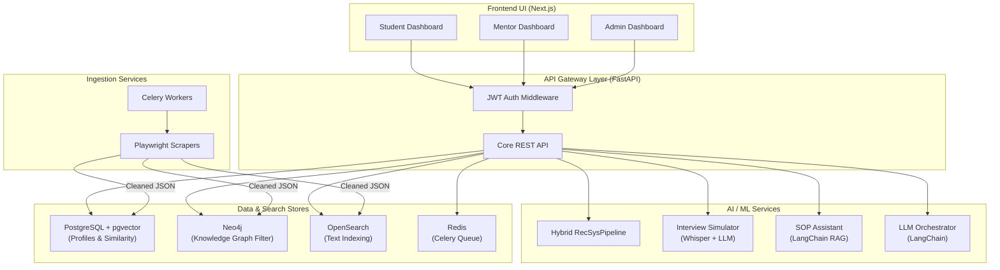
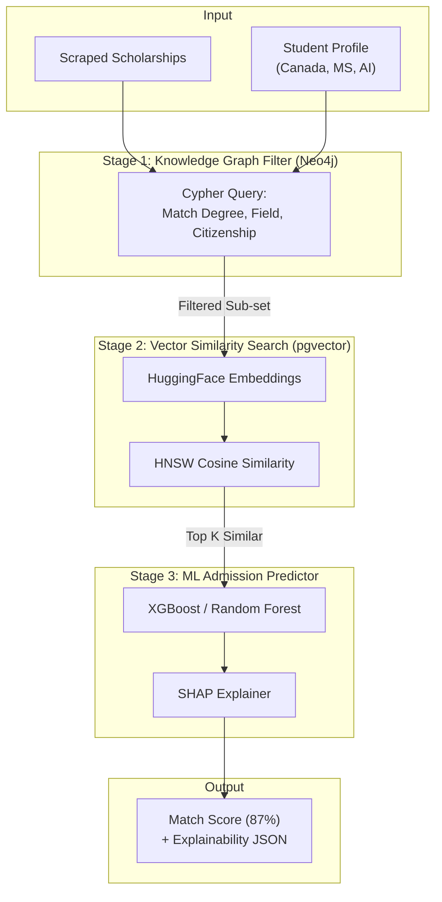
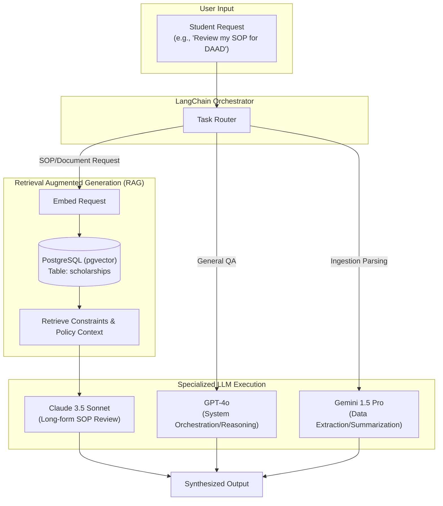

# ScholarAI — Architecture Diagrams

> All diagrams are provided in **Mermaid** syntax for rendering, strictly aligned to the MVP Master Blueprint.

---

## 1. High-Level System Architecture

This diagram illustrates the separation of concerns across the React frontend, FastAPI gateway, and the distinct search/graph/relational data stores. Note the inclusion of OpenSearch for general text querying, Neo4j for the knowledge graph, and PostgreSQL (with pgvector) as the primary relational ML-backing store. The blockchain module has been entirely removed from the MVP.

---

## 2. Hybrid Recommendation Pipeline

This outlines the strict 3-stage recommendation engine. Stage 1 operates purely on Graph relationships to filter out hard eligibility constraints (citizenship, degree). Stage 2 uses `pgvector` HuggingFace embeddings for soft similarity math. Stage 3 applies the XGBoost classifier to generate the final admission probability and SHAP explainability mask.

---

## 3. AI Processing & RAG Pipeline

This diagram showcases the LangChain orchestration flow. It demonstrates how different LLMs are routed based on their specialization, and how the RAG pipeline forces context retrieval directly from PostgreSQL to prevent hallucinations when reviewing SOPs or answering system queries.

