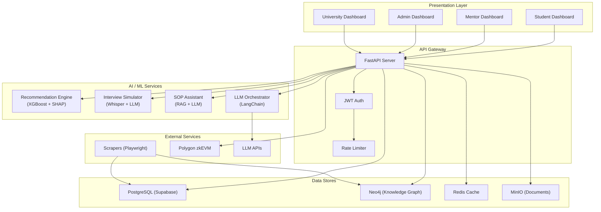
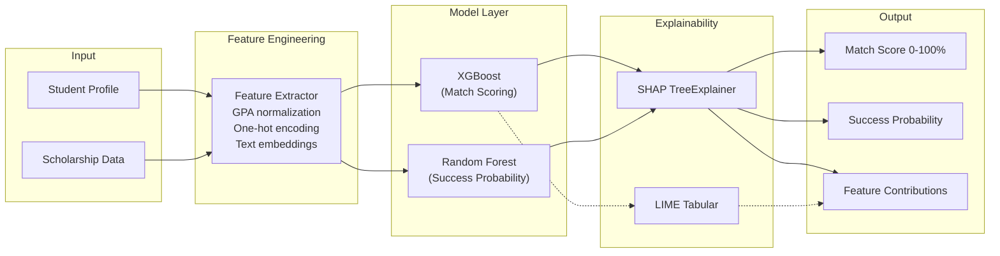
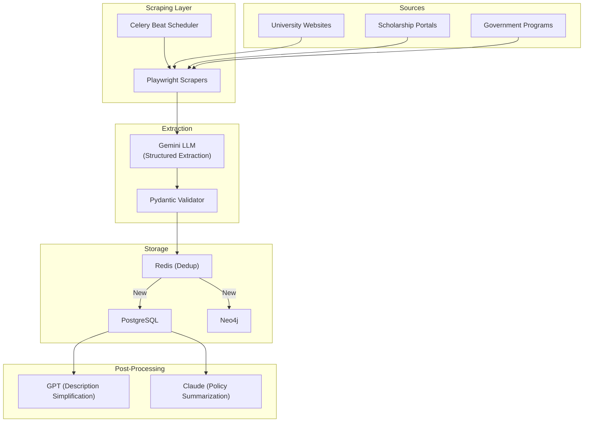
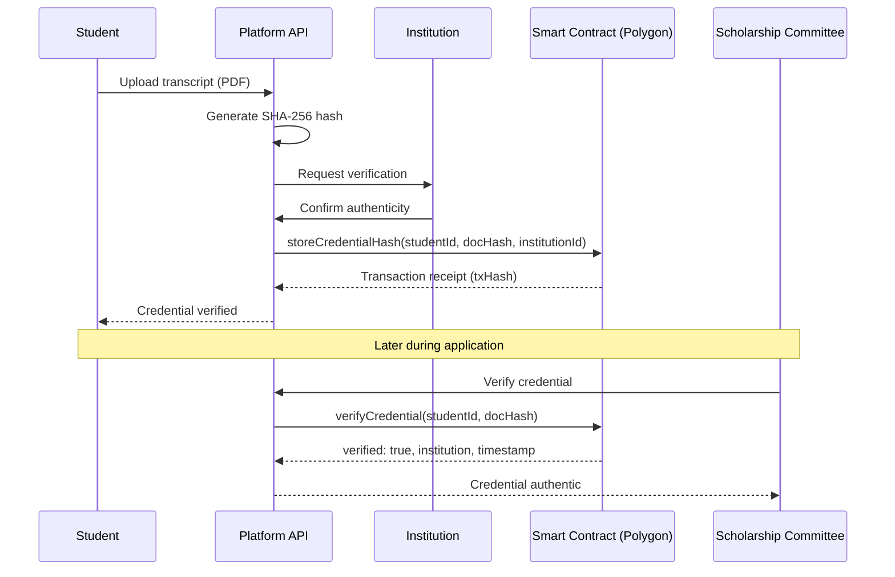
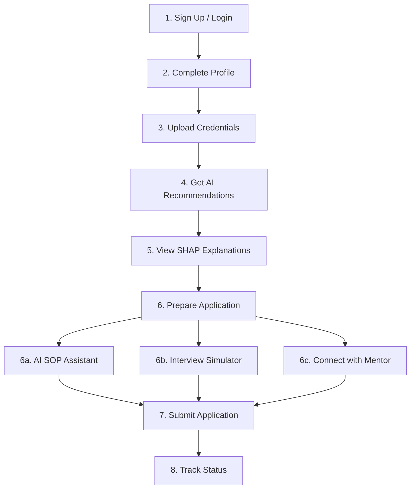
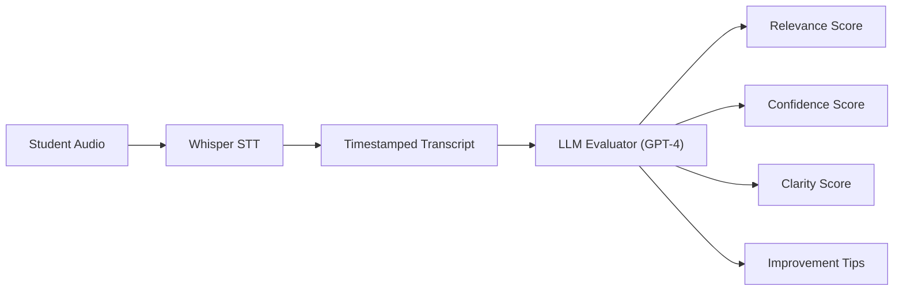
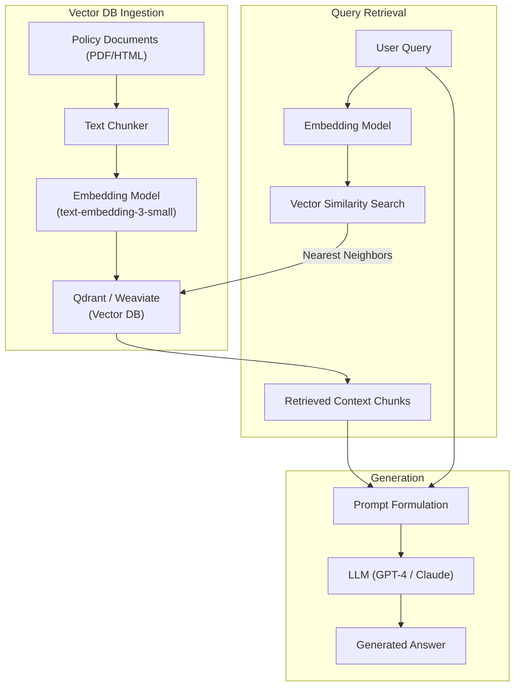
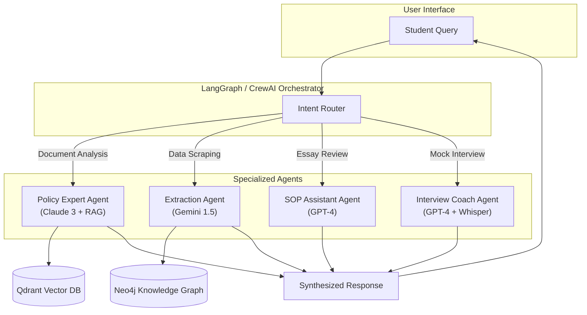

# ScholarAI — Architecture Diagrams

> All diagrams are provided in **Mermaid** syntax for rendering.

---

## 1. High-Level System Architecture

---

## 2. AI Pipeline Architecture

---

## 3. Data Ingestion Pipeline

---

## 4. Blockchain Verification Flow

---

## 5. User Journey Flow

---

## 6. AI Interview System Pipeline

---

## 7. RAG Pipeline

---

## 8. LLM Orchestration Architecture

