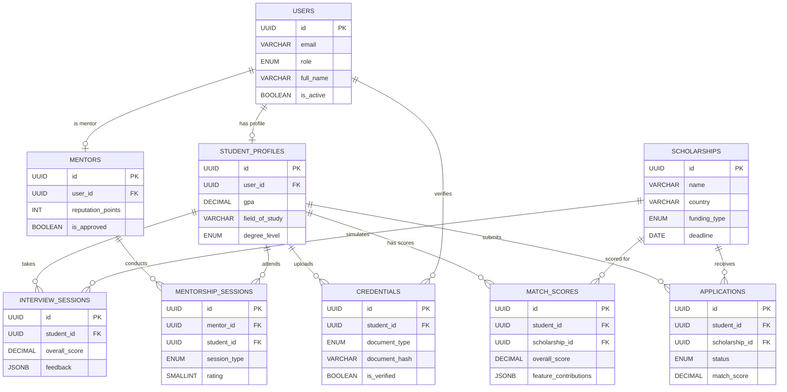

# ScholarAI — Database Schema

> **Engine:** PostgreSQL (via Supabase)  
> **ORM:** SQLAlchemy 2.0 with Alembic migrations

---

## Core Tables

### `users`
| Column | Type | Constraints |
|---|---|---|
| `id` | UUID | PK, DEFAULT gen_random_uuid() |
| `email` | VARCHAR(255) | UNIQUE, NOT NULL |
| `password_hash` | VARCHAR(255) | NOT NULL |
| `role` | ENUM('student','mentor','admin','university') | NOT NULL |
| `full_name` | VARCHAR(255) | NOT NULL |
| `avatar_url` | TEXT | NULLABLE |
| `is_active` | BOOLEAN | DEFAULT TRUE |
| `created_at` | TIMESTAMP | DEFAULT NOW() |
| `updated_at` | TIMESTAMP | DEFAULT NOW() |

### `student_profiles`
| Column | Type | Constraints |
|---|---|---|
| `id` | UUID | PK |
| `user_id` | UUID | FK → users.id, UNIQUE |
| `gpa` | DECIMAL(4,2) | CHECK (0 ≤ gpa ≤ 4.0) |
| `gpa_scale` | DECIMAL(4,1) | DEFAULT 4.0 |
| `field_of_study` | VARCHAR(255) | NOT NULL |
| `degree_level` | ENUM('bachelor','master','phd') | NOT NULL |
| `university` | VARCHAR(255) | |
| `country_of_origin` | VARCHAR(100) | |
| `target_countries` | TEXT[] | PostgreSQL array |
| `research_publications` | INTEGER | DEFAULT 0 |
| `research_experience_months` | INTEGER | DEFAULT 0 |
| `leadership_roles` | INTEGER | DEFAULT 0 |
| `volunteer_hours` | INTEGER | DEFAULT 0 |
| `language_test_type` | VARCHAR(50) | e.g., IELTS, TOEFL |
| `language_test_score` | DECIMAL(4,1) | |
| `extracurricular_summary` | TEXT | |
| `sop_draft` | TEXT | |
| `created_at` | TIMESTAMP | DEFAULT NOW() |
| `updated_at` | TIMESTAMP | DEFAULT NOW() |

### `scholarships`
| Column | Type | Constraints |
|---|---|---|
| `id` | UUID | PK |
| `name` | VARCHAR(500) | NOT NULL |
| `provider` | VARCHAR(255) | |
| `country` | VARCHAR(100) | NOT NULL |
| `university` | VARCHAR(255) | |
| `field_of_study` | TEXT[] | |
| `degree_levels` | TEXT[] | e.g., {'master','phd'} |
| `min_gpa` | DECIMAL(4,2) | |
| `funding_type` | ENUM('full','partial','tuition','stipend') | |
| `funding_amount_usd` | DECIMAL(12,2) | |
| `deadline` | DATE | |
| `required_documents` | TEXT[] | |
| `eligibility_criteria` | JSONB | Flexible criteria |
| `description` | TEXT | |
| `simplified_description` | TEXT | GPT-generated |
| `source_url` | TEXT | NOT NULL |
| `is_active` | BOOLEAN | DEFAULT TRUE |
| `last_scraped_at` | TIMESTAMP | |
| `created_at` | TIMESTAMP | DEFAULT NOW() |
| `updated_at` | TIMESTAMP | DEFAULT NOW() |

### `applications`
| Column | Type | Constraints |
|---|---|---|
| `id` | UUID | PK |
| `student_id` | UUID | FK → student_profiles.id |
| `scholarship_id` | UUID | FK → scholarships.id |
| `status` | ENUM('draft','submitted','under_review','accepted','rejected') | DEFAULT 'draft' |
| `match_score` | DECIMAL(5,2) | |
| `success_probability` | DECIMAL(5,2) | |
| `sop_version` | TEXT | |
| `submitted_at` | TIMESTAMP | |
| `created_at` | TIMESTAMP | DEFAULT NOW() |
| `updated_at` | TIMESTAMP | DEFAULT NOW() |

### `match_scores`
| Column | Type | Constraints |
|---|---|---|
| `id` | UUID | PK |
| `student_id` | UUID | FK → student_profiles.id |
| `scholarship_id` | UUID | FK → scholarships.id |
| `overall_score` | DECIMAL(5,2) | NOT NULL |
| `success_probability` | DECIMAL(5,2) | |
| `feature_contributions` | JSONB | SHAP values per feature |
| `model_version` | VARCHAR(50) | |
| `computed_at` | TIMESTAMP | DEFAULT NOW() |

### `mentors`
| Column | Type | Constraints |
|---|---|---|
| `id` | UUID | PK |
| `user_id` | UUID | FK → users.id, UNIQUE |
| `scholarships_won` | TEXT[] | |
| `fields_of_expertise` | TEXT[] | |
| `university` | VARCHAR(255) | |
| `country` | VARCHAR(100) | |
| `bio` | TEXT | |
| `reputation_points` | INTEGER | DEFAULT 0 |
| `is_approved` | BOOLEAN | DEFAULT FALSE |
| `max_mentees` | INTEGER | DEFAULT 5 |
| `created_at` | TIMESTAMP | DEFAULT NOW() |

### `mentorship_sessions`
| Column | Type | Constraints |
|---|---|---|
| `id` | UUID | PK |
| `mentor_id` | UUID | FK → mentors.id |
| `student_id` | UUID | FK → student_profiles.id |
| `session_type` | ENUM('sop_review','mock_interview','general_advice') | |
| `status` | ENUM('requested','scheduled','completed','cancelled') | |
| `rating` | SMALLINT | CHECK (1 ≤ rating ≤ 5) |
| `feedback` | TEXT | |
| `scheduled_at` | TIMESTAMP | |
| `completed_at` | TIMESTAMP | |
| `created_at` | TIMESTAMP | DEFAULT NOW() |

### `credentials`
| Column | Type | Constraints |
|---|---|---|
| `id` | UUID | PK |
| `student_id` | UUID | FK → student_profiles.id |
| `document_type` | ENUM('transcript','degree','certificate','recommendation','language_test') | |
| `document_hash` | VARCHAR(64) | SHA-256, NOT NULL |
| `file_url` | TEXT | Object storage path |
| `institution_id` | UUID | FK → users.id (university role) |
| `is_verified` | BOOLEAN | DEFAULT FALSE |
| `blockchain_tx_hash` | VARCHAR(66) | Polygon tx hash |
| `verified_at` | TIMESTAMP | |
| `created_at` | TIMESTAMP | DEFAULT NOW() |

### `interview_sessions`
| Column | Type | Constraints |
|---|---|---|
| `id` | UUID | PK |
| `student_id` | UUID | FK → student_profiles.id |
| `scholarship_id` | UUID | FK → scholarships.id, NULLABLE |
| `audio_url` | TEXT | |
| `transcript` | TEXT | Whisper output |
| `relevance_score` | DECIMAL(5,2) | |
| `confidence_score` | DECIMAL(5,2) | |
| `clarity_score` | DECIMAL(5,2) | |
| `overall_score` | DECIMAL(5,2) | |
| `feedback` | JSONB | Structured LLM feedback |
| `duration_seconds` | INTEGER | |
| `created_at` | TIMESTAMP | DEFAULT NOW() |

### `scraper_runs`
| Column | Type | Constraints |
|---|---|---|
| `id` | UUID | PK |
| `source_url` | TEXT | NOT NULL |
| `status` | ENUM('running','success','failed') | |
| `scholarships_found` | INTEGER | DEFAULT 0 |
| `scholarships_new` | INTEGER | DEFAULT 0 |
| `error_message` | TEXT | |
| `started_at` | TIMESTAMP | |
| `completed_at` | TIMESTAMP | |

---

## Indexes

```sql
CREATE INDEX idx_scholarships_country ON scholarships(country);
CREATE INDEX idx_scholarships_deadline ON scholarships(deadline) WHERE is_active = TRUE;
CREATE INDEX idx_scholarships_field ON scholarships USING GIN(field_of_study);
CREATE INDEX idx_match_scores_student ON match_scores(student_id);
CREATE INDEX idx_match_scores_score ON match_scores(overall_score DESC);
CREATE INDEX idx_applications_student ON applications(student_id);
CREATE INDEX idx_credentials_hash ON credentials(document_hash);
CREATE INDEX idx_credentials_student ON credentials(student_id);
```

---

## Relationship Summary

- **users ↔ student_profiles:** 1:1
- **users ↔ mentors:** 1:1
- **student_profiles ↔ applications:** 1:N
- **scholarships ↔ applications:** 1:N
- **student_profiles ↔ match_scores:** 1:N
- **student_profiles ↔ credentials:** 1:N
- **mentors ↔ mentorship_sessions:** 1:N
- **student_profiles ↔ mentorship_sessions:** 1:N

---

## ER Diagram (Mermaid)


