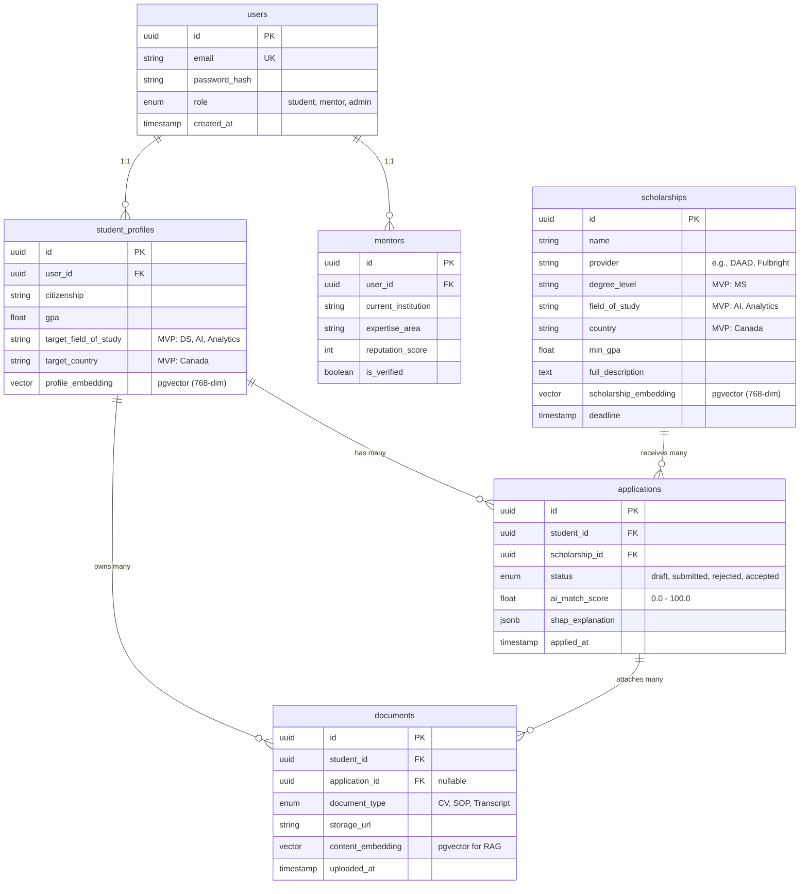

# ScholarAI — PostgreSQL Database Schema & ER Diagram

> **Description:** Primary relational database schema supporting users, scholarships, applications, RAG conversational memory, and Mentorship features. Includes `pgvector` extensions for semantic search.

---

## 1. Entity Relationship Diagram (ERD)



---

## 2. Table Definitions (PostgreSQL)

### 2.1 `users`
- `id` (UUID, Primary Key)
- `email` (VARCHAR(255), Unique, Not Null)
- `password_hash` (VARCHAR(255), Not Null)
- `role` (ENUM: 'student', 'mentor', 'admin', Not Null, Default 'student')

### 2.2 `student_profiles`
Detailed profile data for matching. Embeddings generated via HuggingFace models.
- `id` (UUID, Primary Key)
- `user_id` (UUID, Foreign Key -> `users.id`, Unique)
- `citizenship` (VARCHAR(100), Not Null)
- `gpa` (DECIMAL(3,2), Not Null)
- `target_field_of_study` (VARCHAR(150), Not Null)
- `target_country` (VARCHAR(100), Default 'Canada')
- `profile_embedding` (**VECTOR(768)**, pgvector) - Concatenated academic history.

### 2.3 `scholarships`
Targeted dataset (MS in DS/AI/Analytics in Canada, plus DAAD/Fulbright).
- `id` (UUID, Primary Key)
- `name` (VARCHAR(255), Not Null)
- `provider` (VARCHAR(255), Not Null)
- `degree_level` (VARCHAR(50), Default 'MS')
- `field_of_study` (VARCHAR(255), Not Null)
- `country` (VARCHAR(100), Default 'Canada')
- `min_gpa` (DECIMAL(3,2))
- `full_description` (TEXT)
- `scholarship_embedding` (**VECTOR(768)**, pgvector) - Stage 2 semantic search vector.

### 2.4 `applications`
Join table tracking matching and actual application status.
- `id` (UUID, Primary Key)
- `student_id` (UUID, Foreign Key -> `student_profiles.id`)
- `scholarship_id` (UUID, Foreign Key -> `scholarships.id`)
- `status` (ENUM: 'draft', 'submitted', 'rejected', 'accepted', Default 'draft')
- `ai_match_score` (DECIMAL(5,2)) - Calculated by Stage 3 ML Pipeline.
- `shap_explanation` (JSONB) - Stored XAI metrics (e.g., `{"gpa": "+32%", "volunteer": "+18%"}`).

### 2.5 `documents`
Stores metadata and parsed text for RAG retrieval during SOP reviews.
- `id` (UUID, Primary Key)
- `student_id` (UUID, Foreign Key -> `student_profiles.id`)
- `document_type` (ENUM: 'CV', 'SOP', 'Transcript')
- `storage_url` (VARCHAR(512), Not Null)
- `content_embedding` (**VECTOR(768)**, pgvector) - Vector retrieval for RAG-based SOP checks.

### 2.6 `mentors`
- `id` (UUID, Primary Key)
- `user_id` (UUID, Foreign Key -> `users.id`, Unique)
- `expertise_area` (VARCHAR(255))
- `reputation_score` (INTEGER, Default 0)

---

## 3. Indexes & pgvector Extensions

```sql
CREATE EXTENSION IF NOT EXISTS vector;

-- Stage 2 Vector Similarity Indexes (HNSW)
CREATE INDEX idx_student_embeddings ON student_profiles USING hnsw (profile_embedding vector_cosine_ops);
CREATE INDEX idx_scholarship_embeddings ON scholarships USING hnsw (scholarship_embedding vector_cosine_ops);
CREATE INDEX idx_document_embeddings ON documents USING hnsw (content_embedding vector_cosine_ops);
```
