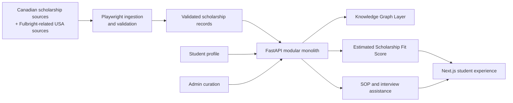

# ScholarAI Executive Summary

## Project Snapshot

| Item | Decision |
|---|---|
| Project type | Final Year Project with a realistic path to post-MVP startup evolution |
| Delivery team | 3 developers |
| Delivery window | 16 weeks |
| Budget posture | Limited budget, low-ops defaults, no expensive managed dependencies required for MVP |
| Product focus | Scholarship discovery and application support for MS Data Science, MS Artificial Intelligence, and MS Analytics |
| Geographic scope | Canada-first, with `Fulbright-related USA scope` as the only USA expansion allowed in MVP |
| Deferred geography | DAAD deferred |
| Architecture posture | Modular monolith |
| Source of truth | Structured validated data for eligibility, deadlines, and official scholarship rules |
| AI posture | Retrieval and generation are support tools, not the authority for scholarship policy |

## Problem Summary

| Problem | Why it matters | MVP response |
|---|---|---|
| Scholarship information is fragmented across provider and university sources. | Students spend time on manual search and miss valid opportunities. | Build a Canada-first discovery layer with curated ingestion and searchable scholarship records. |
| Eligibility rules are buried in inconsistent web content. | Students waste effort on opportunities they are not eligible for. | Normalize rules into structured validated records and expose explicit eligibility reasoning. |
| Existing platforms rarely explain why a recommendation appears. | Users cannot trust or act on rankings without context. | Surface an `Estimated Scholarship Fit Score` plus feature-level explanation outputs. |
| Application preparation is disconnected from discovery. | Students move between multiple tools for SOP and interview support. | Provide tightly scoped SOP and interview assistance inside the same product boundary. |
| A 3-developer team cannot support heavy infrastructure. | Over-architecture would consume the 16-week timeline. | Keep the MVP as a modular monolith with low-ops infrastructure. |

## ScholarAI in One Page

| Layer | MVP intent | Implementation grounding |
|---|---|---|
| Student experience | Discover scholarships, understand fit, track applications, improve documents, practice interviews. | Repo already contains FastAPI routes for auth, profile, scholarships, applications, admin, and AI tools. |
| Data and curation | Ingest source content, validate records, publish only reviewed scholarship data. | Repo contains `ScraperService`, `scraper_tasks`, `ScraperRun`, `HtmlSnapshot`, and audit scaffolding. |
| Matching | Filter obviously ineligible items, rank remaining scholarships, explain the ranking. | Repo already contains `RecommendationService`, `MatchScore`, embeddings, and Celery score recomputation tasks. |
| AI assistance | Support SOP and interview preparation without changing authoritative scholarship data. | Repo contains `SopService`, `InterviewService`, and related AI endpoints. |
| Operations | Keep the system operable by a small team. | Repo already includes Docker Compose, GitHub Actions CI, Alembic, Redis, Celery worker/beat, and backup automation. |

## Release Tier Summary

| Area | MVP | Future Research Extensions | Post-MVP Startup Features |
|---|---|---|---|
| Discovery corpus | Canada-first scholarship and program coverage for three MS tracks | Broader Canada coverage depth, experimental source expansion logic | Multi-region expansion and partner onboarding workflows |
| USA coverage | Fulbright-related provider and funding rules only | Add narrow cross-border rule scenarios if justified | Broad USA discovery and provider growth |
| Recommendation logic | Eligibility filtering, semantic retrieval, ranking, explanation output | Better graph reasoning and stronger evaluation design | Personalization, experimentation, and more advanced ranking loops |
| Application support | SOP feedback and structured interview practice | Voice-based interview experiments, richer writing assistance | Collaborative mentor workflows and advanced planning tools |
| Admin tooling | Minimum viable curation, audit trail, scraper triggering, publication control | Better reviewer workflows and annotation tooling | Full operations console, partner support, and internal analytics |
| Infrastructure | Modular monolith, Docker Compose, low-ops services | Optional narrow Neo4j slice if justified | Scale-oriented infra only after proven usage and budget support |

## Delivery Model

| Developer lane | Primary responsibility in MVP | Why this split is realistic |
|---|---|---|
| Developer 1 | Frontend experience, UX polish, product-facing docs | One focused frontend owner can carry the premium interface with limited page count. |
| Developer 2 | Backend modules, API contracts, architecture, governance | The FastAPI and Celery backbone needs one owner for consistency and delivery control. |
| Developer 3 | Data ingestion, recommendation, evaluation framing, curation workflows | Data quality and ranking logic are the highest technical leverage areas for the thesis and product. |

## Architecture Snapshot

## Executive Decision Summary

| Decision | Rationale |
|---|---|
| Keep the MVP Canada-first. | It reduces ingestion and validation overhead to something a 3-developer team can sustain. |
| Restrict USA scope to Fulbright-related needs. | It supports a legitimate cross-border case without turning the MVP into a broad international discovery platform. |
| Treat the Knowledge Graph Layer as mandatory logically, but not necessarily as a full independent database. | It preserves thesis and product intent while leaving room for the simplest feasible implementation. |
| Use structured validated data as the authority. | This avoids treating LLM output as a policy oracle for scholarships. |
| Frame ranking as an `Estimated Scholarship Fit Score`. | Real outcome labels are not guaranteed, so stronger claims would be misleading. |
| Keep the architecture as a modular monolith. | It matches the team size, current repo layout, and the need to ship in 16 weeks. |

## MVP Decision

The MVP is a Canada-first scholarship discovery and application-support platform for three MS domains, delivered as a modular monolith with explicit curation, explainable ranking, and tightly scoped AI assistance.

## Deferred Items

- Broad USA discovery outside Fulbright-related USA scope.
- DAAD ingestion and recommendation support.
- Full mentor marketplace or mentor-led workflow expansion.
- Startup-scale distributed architecture or expensive managed infrastructure.

## Assumptions

- The current repo skeleton is the baseline implementation target, even where some modules remain incomplete.
- The first release emphasizes student and admin curator workflows; mentor workflows are not assumed in the delivery-critical path.
- Voice-first interview practice is not required for the MVP even though the repo contains early hooks for it.

## Risks

- Legacy documents elsewhere in `docs/` still describe broader scope and heavier infrastructure, which can cause planning drift.
- The recommendation layer may look more mature in the repo than the validated data pipeline can realistically support in 16 weeks.
- If UI polish is spread across too many screens, the frontend will regress toward a template-like experience instead of a deliberate product.
