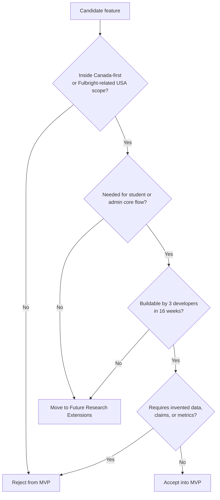

# ScholarAI PRD and Scope

## Product Baseline

| Item | Definition |
|---|---|
| Product name | ScholarAI |
| Product type | AI-assisted scholarship discovery and application support platform |
| Primary user | Prospective or current student seeking scholarship opportunities in the Canada-first MVP scope |
| Secondary user | Admin curator responsible for source ingestion, validation, publication, and operational review |
| Delivery constraint | 3 developers, 16 weeks, limited budget |
| Core product promise | Show relevant scholarships, explain fit, and support application preparation without overstating AI certainty |
| Source-of-truth rule | Official scholarship rules come from structured validated records, not LLM responses |

## Personas

| Persona | Scope tier | Primary needs | Product implication |
|---|---|---|---|
| Student applicant | MVP | Understand what scholarships apply, why they fit, and what to prepare next. | Student flows are the highest-priority product path. |
| Admin curator | MVP | Trigger ingestion, review records, publish validated data, monitor scraper health. | Minimal but reliable admin tooling is required to keep data quality defensible. |
| Mentor or reviewer | Future Research Extensions | Review student materials and provide guided feedback. | Do not make mentor workflows a dependency for MVP completion. |
| Institutional or provider partner | Post-MVP Startup Features | Manage listings, analytics, and partnership operations. | Excluded from MVP to protect delivery focus. |

## Jobs To Be Done

| Persona | Job to be done | MVP outcome |
|---|---|---|
| Student applicant | "Help me find scholarships I can realistically pursue in my target study area." | Recommendation list with clear eligibility and explanation signals. |
| Student applicant | "Help me understand what to do next after I find a scholarship." | Application planning view with deadlines, document needs, and next-step prompts. |
| Student applicant | "Help me improve my application materials." | SOP feedback and interview-practice flows that stay advisory. |
| Admin curator | "Help me publish trustworthy scholarship records without manual spreadsheet chaos." | Ingestion, validation, audit logging, and publish-state controls. |

## Core MVP User Journeys

| Journey | Entry condition | MVP flow | Must-have output |
|---|---|---|---|
| Account and profile setup | Student creates account | Register -> login -> create profile -> capture degree, field, GPA, target countries, language and activity signals | Stored student profile ready for ranking |
| Scholarship discovery | Student has profile | Browse or search scholarships -> filter -> inspect details -> save or start application plan | Ranked results and clear scholarship detail page |
| Recommendation review | Student has completed profile | Trigger recommendation endpoint -> compute or read cached scores -> show explanation cues | `Estimated Scholarship Fit Score` and explanation summary |
| Application planning | Student selects a scholarship | View deadlines, required documents, and application status markers | Actionable application checklist and tracking state |
| SOP support | Student has a draft or notes | Submit draft -> receive improvement guidance -> iterate | Advisory writing feedback without claiming official correctness |
| Interview practice | Student selects practice flow | Generate questions -> answer -> receive evaluation and suggestions | Structured interview feedback |
| Admin curation | Admin accesses operational view | Trigger scrape -> inspect runs and raw candidates -> review, correct, publish, unpublish, or retire records -> review audit trail | Published validated records and operational visibility |

## Scope Matrix

| Capability | MVP | Future Research Extensions | Post-MVP Startup Features |
|---|---|---|---|
| Canada-first scholarship corpus for MS Data Science, MS Artificial Intelligence, and MS Analytics | Yes | Expand source depth and normalization quality | Expand to additional countries and degree programs |
| Fulbright-related USA provider and funding logic | Yes | Add narrow cross-border rule scenarios if justified | Broad USA scholarship discovery |
| DAAD support | No | Yes | Yes |
| Student authentication and profile creation | Yes | Harden with more account management options | Partner and organization identity layers |
| Search and browse scholarship catalog | Yes | More advanced filtering and saved-search behavior | Personalized discovery campaigns |
| `Estimated Scholarship Fit Score` with explanation cues | Yes | Stronger graph reasoning and evaluation studies | Experimentation-driven ranking and personalization loops |
| Full predictive success claim | No | No unless real labels emerge | Possible only with valid labeled outcomes and governance |
| Application tracking dashboard | Yes | Better planning automation and reminders | Collaboration workflows and institutional coordination |
| SOP feedback and improvement | Yes | More retrieval-grounded document assistance | Collaborative editing and premium assistance modes |
| First-draft SOP generation from sparse input | No | Yes | Yes |
| Text-based interview practice | Yes | Better rubric design and session analytics | Voice, live coaching, and richer simulation modes |
| Voice capture and transcription | No | Yes | Yes |
| Admin curation and audit logs | Yes | Better reviewer assignment and queueing | Full internal operations console |
| Mentor-facing workflows | No | Yes | Yes |
| OpenSearch-dependent text infrastructure | No | Conditional research item | Possible if scale justifies it |

## Non-Goals for MVP

| Non-goal | Why it is out of scope now |
|---|---|
| Broad global scholarship search | The data collection and validation burden does not fit the 16-week plan. |
| General USA university discovery | It would dilute the Canada-first MVP and increase scraping scope without clear MVP value. |
| DAAD integration | It is explicitly deferred by repo policy. |
| Mentor marketplace or scheduling platform | The team cannot deliver this without compromising core student and admin workflows. |
| Legal-advice or immigration-advice features | The platform should not claim authority it does not have. |
| Autonomous application submission | It introduces operational and trust risk well beyond the MVP. |

## Release-Tier Product Definition

### MVP

| Area | Required behavior |
|---|---|
| Discovery | Show curated scholarships inside the Canada-first scope, with narrow Fulbright-related USA support only where relevant. |
| Recommendation | Produce an `Estimated Scholarship Fit Score`, explanation cues, and obvious-eligibility filtering. |
| Data quality | Keep authoritative scholarship rules in structured validated records and expose provenance-aware admin controls. |
| Student tooling | Support profile setup, scholarship exploration, application planning, SOP feedback, and text-based interview practice. |
| Admin tooling | Support scrape triggering, run visibility, scholarship record management, audit visibility, and publish-safe control points. |

### Future Research Extensions

| Area | Candidate extension |
|---|---|
| Recommendation | Evaluate richer graph reasoning or a narrower Neo4j-backed implementation if it materially improves clarity or maintainability. |
| AI assistance | Add voice interview practice, retrieval-grounded writing assistance, and deeper evaluation studies. |
| Workflow | Introduce mentor and reviewer flows only after the student and admin core is stable. |
| Geography | Expand beyond Canada only through tightly justified, documented increments. |

### Post-MVP Startup Features

| Area | Candidate extension |
|---|---|
| Platform growth | Provider dashboards, partnership tooling, paid features, and institutional operations workflows |
| Product growth | Collaboration features, richer planning automation, notifications, and broader profile personalization |
| Technical growth | Scale-oriented infrastructure changes only after usage and operational cost justify them |

## Acceptance Gates

## Release Gate Checklist

| Gate | MVP standard |
|---|---|
| Scope discipline | No feature expands beyond Canada-first or Fulbright-related USA scope without explicit reclassification. |
| Data defensibility | No scholarship rule is sourced only from an LLM response. |
| Student value | The release supports end-to-end discovery, ranking review, and at least one practical preparation flow. |
| Admin viability | The team can inspect scraper runs and manage scholarship records without direct database editing. |
| Delivery realism | The feature set fits the 3-developer, 16-week plan without hidden staffing assumptions. |

## MVP Decision

The MVP consists of student and admin-curator workflows that support Canada-first scholarship discovery, explanation-aware ranking, application planning, SOP feedback, and text-based interview practice within a modular monolith.

## Deferred Items

- Broad USA discovery outside Fulbright-related USA scope.
- DAAD support.
- Voice-first interview practice and full mentor workflows.
- Features that require real outcome labels before making stronger predictive claims.

## Assumptions

- Students are the primary product audience for the first release.
- Text-based interview support is sufficient to demonstrate the interview-prep concept in MVP.
- Full SOP generation is not delivery-critical even though early backend hooks exist for it.

## Risks

- If the team treats every existing route or model as an MVP commitment, the scope will exceed the timeline.
- If the Canada-first corpus is not bounded early, ingestion and curation work can overrun engineering capacity.
- If mentor or partner workflows leak into sprint planning, the core student path will lose polish and reliability.
