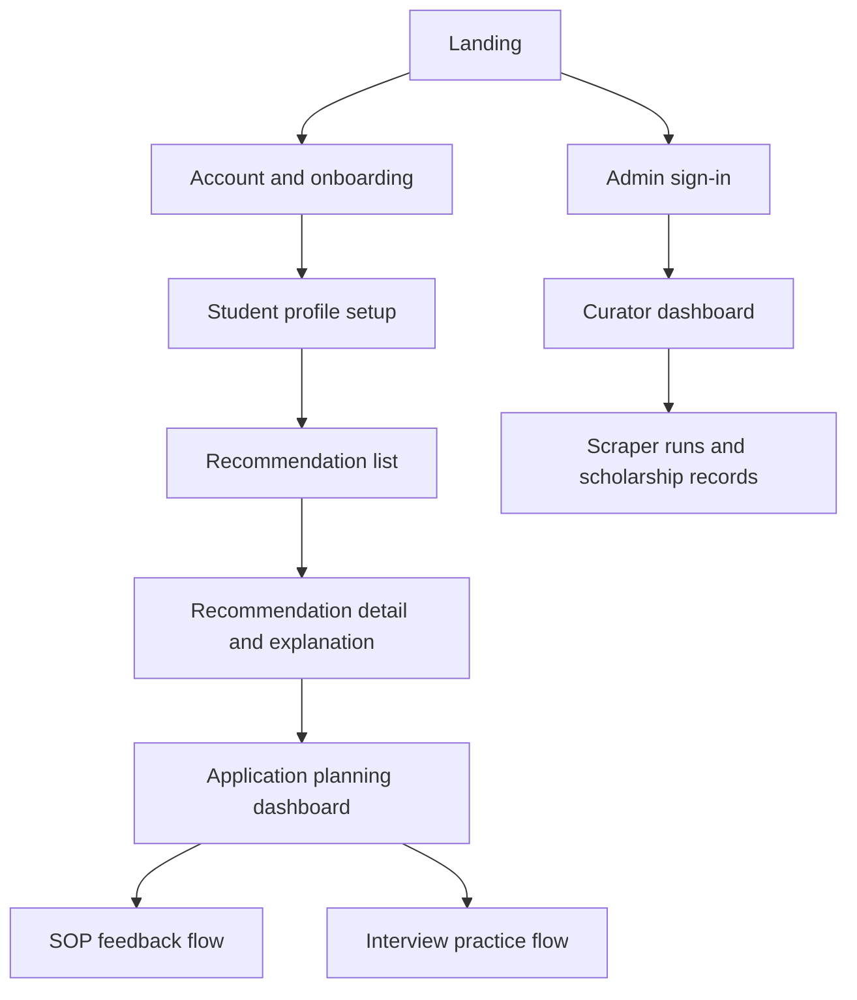

# ScholarAI Brand and Design System

## Design Baseline

| Item | Direction |
|---|---|
| Product mood | Premium, restrained, calm, academically credible |
| Visual posture | Editorial precision over dashboard-template density |
| Build target | Next.js + React + TypeScript + TailwindCSS |
| Current repo state | The frontend is still using a default starter page and generic global styles; this document defines the replacement direction. |
| Primary design goal | Help students focus on decisions and next steps, not on decorative UI noise |

## Brand Principles

| Principle | Application rule |
|---|---|
| Quiet confidence | Avoid hype language, flashy gradients, and AI-product cliches. |
| Academic seriousness | Use typography and spacing that feel credible for scholarships, application writing, and interviews. |
| Visible reasoning | Recommendation and eligibility UI should explain decisions, not hide them behind abstract scores. |
| Focused density | Show fewer, stronger sections rather than card grids and cluttered dashboards. |
| Buildable polish | Every visual rule must be maintainable by one strong frontend developer inside the MVP timeline. |

## Design Scope by Release Tier

| Tier | Design priority |
|---|---|
| MVP | Polish the student journey from onboarding through recommendation review, application planning, SOP feedback, and interview practice, plus the minimum viable admin-curation surfaces. |
| Future Research Extensions | Explore richer mentor patterns, voice-interaction affordances, and deeper data-review workflows only after the MVP interaction model is stable. |
| Post-MVP Startup Features | Add partner, collaboration, and growth-oriented experience layers only after the core ScholarAI interface is consistent and proven. |

## Anti-Patterns To Reject

| Reject | Why |
|---|---|
| Generic SaaS admin templates | They flatten product identity and make the platform feel interchangeable. |
| Purple-on-white AI branding | It is overused and does not match the restrained academic tone. |
| Heavy gradients and glow effects | They reduce credibility and age poorly. |
| Dense card mosaics | They bury the task flow students actually need. |
| Default system fonts and placeholder imagery | They make the product feel unfinished. |

## Color System

| Token | Hex | Use |
|---|---|---|
| `canvas` | `#F5F1E8` | Overall page background |
| `surface` | `#FCFAF6` | Cards, sheets, form panels |
| `surface-strong` | `#EFE8DA` | Secondary surfaces and highlighted panels |
| `ink` | `#16202A` | Primary text and anchors |
| `ink-muted` | `#55636F` | Secondary text |
| `line` | `#D8D0C3` | Borders and dividers |
| `pine` | `#31594A` | Primary action, trust, and active status |
| `pine-soft` | `#DCE7E1` | Soft highlight backgrounds |
| `brass` | `#A97A2B` | Small emphasis moments and key numeric signals |
| `danger` | `#B24C43` | Error and destructive states |
| `success` | `#2F6A53` | Success states |
| `focus` | `#224E7A` | Accessible focus ring |

### Usage Rules

| Rule | Decision |
|---|---|
| Accent limit | Use `pine` as the main accent and `brass` sparingly for emphasis. |
| Backgrounds | Prefer layered neutrals over flat white or full dark mode as the default presentation. |
| Gradients | If used, restrict to subtle neutral-to-warm tonal washes in hero or onboarding surfaces only. |
| Charts and status | Reuse semantic tokens instead of inventing extra colors per screen. |

## Typography System

| Role | Font | Size / line height | Weight | Usage |
|---|---|---|---|---|
| Display | `Newsreader` | `56/60` desktop, `40/44` mobile | 500 | Landing hero, key editorial moments |
| Heading 1 | `Instrument Sans` | `36/42` | 600 | Page titles |
| Heading 2 | `Instrument Sans` | `28/34` | 600 | Section headers |
| Heading 3 | `Instrument Sans` | `22/28` | 600 | Subsection headers |
| Body large | `Instrument Sans` | `18/30` | 400 | Introductory copy and narrative explanations |
| Body | `Instrument Sans` | `16/26` | 400 | Default UI copy |
| Small | `Instrument Sans` | `14/22` | 500 | Labels, helper text, metadata |
| Mono | `IBM Plex Mono` | `13/20` | 400 | Technical labels, IDs, provenance badges |

### Typography Rules

| Rule | Decision |
|---|---|
| Font pairing | `Newsreader` is for high-value display moments only; the rest of the UI stays on `Instrument Sans`. |
| Width control | Keep long-form copy around `60-72ch`; avoid edge-to-edge paragraphs. |
| Score emphasis | Use type weight and contrast before adding color. |
| Dashboard headings | Do not turn every panel into a headline; keep information hierarchy calm. |

## Spatial System

| Token | Value | Use |
|---|---|---|
| `space-1` | `4px` | Tight icon-label gaps |
| `space-2` | `8px` | Inline spacing |
| `space-3` | `12px` | Small stack spacing |
| `space-4` | `16px` | Default control spacing |
| `space-6` | `24px` | Card padding and section gaps |
| `space-8` | `32px` | Major section spacing |
| `space-12` | `48px` | Page band spacing |
| `space-16` | `64px` | Hero and major layout separation |
| `space-24` | `96px` | Landing page macro spacing |

| Token | Value | Use |
|---|---|---|
| `radius-sm` | `8px` | Inputs and chips |
| `radius-md` | `14px` | Cards and panels |
| `radius-lg` | `20px` | Feature callouts and modal shells |
| `radius-pill` | `999px` | Pills, score badges, segmented controls |

## Elevation and Surface Rules

| Level | Shadow | Usage |
|---|---|---|
| `flat` | none | Default content surfaces |
| `raised` | `0 8px 24px rgba(22, 32, 42, 0.06)` | Key panels and sticky controls |
| `overlay` | `0 16px 48px rgba(22, 32, 42, 0.10)` | Dialogs and command surfaces |

| Rule | Decision |
|---|---|
| Borders first | Prefer line and contrast before reaching for deeper shadows. |
| Noise control | Avoid stacking shadow, border, tint, and gradient on the same component. |
| Cards | Cards should group a decision or workflow unit, not act as a default wrapper for everything. |

## Motion Guidelines

| Pattern | Duration | Easing | Rule |
|---|---|---|---|
| Hover lift | `120ms` | `ease-out` | Very small translation or tint shift only |
| Panel reveal | `180ms` | `ease-out` | Use for filters, drawers, and accordions |
| Page section entrance | `240ms` | `cubic-bezier(0.22, 1, 0.36, 1)` | Use sparingly on first load |
| Progress state | `160ms` | `linear` | Keep loading motion subtle and non-distracting |

| Rule | Decision |
|---|---|
| Motion density | Do not animate every component; reserve motion for orientation and state change. |
| Reduced motion | Respect `prefers-reduced-motion` and remove non-essential transitions. |
| Loading | Prefer skeleton blocks and progress placeholders over spinner-only states. |

## Iconography Guidance

| Rule | Decision |
|---|---|
| Style | Simple outline icons at `1.5px` to `1.75px` stroke weight |
| Visual tone | Geometric, quiet, and legible at small sizes |
| Usage | Pair icons with labels in complex flows; avoid icon-only critical actions on desktop |
| Decorative icons | Keep minimal and never use them as the primary source of differentiation |

## Accessibility Rules

| Area | Rule |
|---|---|
| Contrast | Body text and interactive controls must meet WCAG AA contrast expectations. |
| Focus | Use a visible `focus` ring on all keyboard-reachable elements. |
| Inputs | Do not rely on color alone for validation or status. |
| Type | Minimum default body text is `16px`. |
| Motion | Support reduced motion and avoid flashing or looping decorative animation. |
| Forms | Error messages must be specific, adjacent to the field, and readable by assistive tech. |

## Tailwind Token Mapping

| Design token | CSS variable | Tailwind usage direction |
|---|---|---|
| `canvas` | `--color-canvas` | `bg-[var(--color-canvas)]` |
| `surface` | `--color-surface` | `bg-[var(--color-surface)]` |
| `ink` | `--color-ink` | `text-[var(--color-ink)]` |
| `ink-muted` | `--color-ink-muted` | `text-[var(--color-ink-muted)]` |
| `line` | `--color-line` | `border-[var(--color-line)]` |
| `pine` | `--color-accent` | `bg-[var(--color-accent)]` and `text-[var(--color-accent)]` |
| `brass` | `--color-accent-alt` | highlight details only |
| Display font | `--font-display` | `font-[family-name:var(--font-display)]` |
| UI font | `--font-ui` | default app font |
| Mono font | `--font-mono` | technical labels |

## MVP Information Architecture

## MVP Screen Priorities

| Screen | Page purpose | Hierarchy | Responsive behavior | Critical states |
|---|---|---|---|---|
| Landing page | Explain the product clearly and direct students into onboarding | Hero -> proof of value -> core flows -> CTA | Single-column narrative on mobile; keep hero compact | Loading-free by default, clear fallback for sign-in and CTA |
| Onboarding | Set expectations and reduce friction before profile setup | Progress framing -> key benefits -> next action | Short stacked steps on mobile | Empty state is the default; success confirms completion |
| Student profile setup | Capture inputs that materially affect eligibility and ranking | Personal basics -> academics -> targets -> supporting signals | Use vertical sectioning on mobile, two-column only where safe on desktop | Draft save, validation errors, completed state |
| Recommendation list | Help students scan fit and choose where to focus | Filters -> ranked list -> saved actions | Collapse filters into drawer on mobile | Loading skeletons, no-results state, stale-cache notice if needed |
| Recommendation detail / explanation | Explain fit, requirements, and next action | Scholarship summary -> why it fits -> requirements -> action panel | Keep CTA visible without crowding mobile viewport | Source missing, outdated data warning, saved state |
| Application planning dashboard | Turn discovery into execution | Upcoming deadlines -> active applications -> document tasks | Stack columns into one decision lane on mobile | Empty state for no applications, success on status update |
| SOP feedback flow | Support iteration on scholarship statement quality | Draft input -> feedback -> revision actions | Mobile keeps editor and feedback in sequence, not side-by-side | Draft missing, analysis in progress, revision saved |
| Interview practice flow | Prepare answers with low-friction feedback | Session setup -> question -> answer -> evaluation | Text-first mobile flow with one question at a time | Waiting, partial session, completed feedback |
| Admin curator screens | Maintain data quality and run operations | Alerts -> scraper runs -> record review -> audit visibility | Mobile support is secondary; desktop-first clarity is acceptable | Job running, validation issue, publish success, publish blocked |

## MVP Screen Behavior Matrix

| Screen | Navigation model | Loading state | Empty state | Error state | Success feedback | Interaction rule | Accessibility expectation |
|---|---|---|---|---|---|---|---|
| Landing page | Global header with one primary CTA and one secondary sign-in action | Avoid visible loading for static content | Not applicable | CTA failure should return inline message near the action | CTA completion routes cleanly into onboarding | Keep decision count low above the fold | Hero copy and CTA order must be keyboard-clear and screen-reader sensible |
| Onboarding | Step flow with visible progress and back action | Skeleton for only async account checks | Default empty state is the product entry state | Inline field and step errors, never modal-only | Completion state confirms next step immediately | One primary action per step | Progress indicator must be announced semantically |
| Student profile setup | Progressive form sections with sticky step summary on desktop | Section skeletons for prefilled or saved data | Empty form is valid first-run state | Field-local validation plus summary banner | Save confirmation without blocking the next action | Autosave or explicit save must never hide unsaved changes | Labels, hints, and errors must be programmatically associated |
| Recommendation list | Top nav plus filter drawer or sidebar depending viewport | Skeleton cards and quiet filter placeholders | Show how to broaden or fix filters | State-specific message when ranking data or fetch fails | Save or shortlist feedback stays inline on the card | Filtering should feel immediate and reversible | Filters and result counts must remain keyboard reachable |
| Recommendation detail / explanation | Back to list plus anchored action panel | Detail shell and explanation placeholders | If explanation data is absent, explain why plainly | Show stale-data or missing-source warnings inline | Saved status and plan-add actions confirm in place | Keep CTA persistent without hijacking reading flow | Explanation bars need text labels, not color-only meaning |
| Application planning dashboard | Local section nav between timeline, tasks, and statuses | Skeleton timeline and task rows | Empty dashboard should coach the first tracked application | Update failures must preserve existing task state | Status changes should confirm with visible state change and timestamp | Editing status should require minimal clicks | Timelines and task chips must have text equivalents |
| SOP feedback flow | Within-page tabs or segmented control, not deep nested routing | Editor placeholder and feedback skeleton | Empty state should invite draft paste or upload | Analysis errors must preserve the student draft | Revision saved state should be visible without leaving the page | Keep compare and revise actions explicit | Editor controls, feedback headings, and comments must read in logical order |
| Interview practice flow | Linear session flow with clear resume or restart actions | Question placeholder and evaluation progress state | No-session state should invite a short first practice run | Failed evaluation must not discard the student's answer | Completed session should show summary and next recommended action | Keep one active prompt on screen at a time | Timer, prompts, and scoring feedback must be readable without color dependence |
| Admin curator screens | Side navigation or tab rail isolated from student UX | Table skeletons and job-state placeholders | Empty queues should still show next operational actions | Publish blocks and validation issues must be specific and actionable | Successful publish or trigger events should write visible status updates | Dangerous actions require confirmation and audit trace | Tables, filters, and action menus must remain fully keyboard operable |

## Component Guardrails

| Component | Rule |
|---|---|
| Navigation | Keep the top-level nav sparse. Students should never see admin density in the main navigation. |
| Filters | Use concise filter chips and a quiet drawer, not a permanent wall of controls. |
| Recommendation cards | Show score, core reason, deadline, and next action; avoid oversized badges and noisy metadata blocks. |
| Explanation panels | Use bars, labeled contributions, and plain-language bullets instead of dense charts by default. |
| Forms | Prefer large labels, clear helper text, and one-column mobile rhythm. |
| Tables | Use tables mainly in admin and documentation screens; student views should stay more narrative and task-driven. |
| Alerts | Use neutral framing first, with stronger color only for actual risk or failure. |

## Copy and Tone Rules

| Rule | Decision |
|---|---|
| Tone | Calm, confident, direct, and useful |
| Avoid | Sales slogans, inflated AI language, and robotic helper text |
| Recommendation copy | Explain what the product sees, not what it "guarantees" |
| Error copy | Tell the user what happened and what they can do next |

## Design Review Checklist

| Question | Pass condition |
|---|---|
| Does it feel premium? | The screen uses hierarchy, spacing, and typography rather than decorative noise. |
| Does it feel original? | It avoids the look of a generic dashboard kit. |
| Does it stay restrained? | Accent color and motion are used sparingly. |
| Does it support the task clearly? | The next action is obvious without excessive UI explanation. |
| Can the team build it well? | The layout is maintainable in Next.js and TailwindCSS within MVP constraints. |

## MVP Decision

ScholarAI's MVP UI should feel editorial, quiet, and premium, with the main polish concentrated on the student journey from onboarding through recommendation review and application preparation.

## Deferred Items

- Broad visual exploration beyond the defined neutral-plus-pine brand direction.
- Highly animated interactions, voice-first UI patterns, and decorative landing-page effects.
- Mentor-facing design patterns until mentor workflows are explicitly reclassified into scope.

## Assumptions

- `Newsreader`, `Instrument Sans`, and `IBM Plex Mono` are acceptable implementation choices through `next/font`.
- Desktop-first clarity with careful mobile adaptation is the correct posture for this product's information density.
- Admin screens can be simpler and more utilitarian than student-facing screens as long as they remain coherent with the token system.

## Risks

- If the team keeps the current starter styling too long, the frontend will inherit template patterns that are harder to unwind later.
- If too many color accents or card treatments are added, the product will lose the restrained academic tone this system depends on.
- If all screens are treated as equally premium-critical, the frontend effort will spread too thin across the 16-week schedule.
