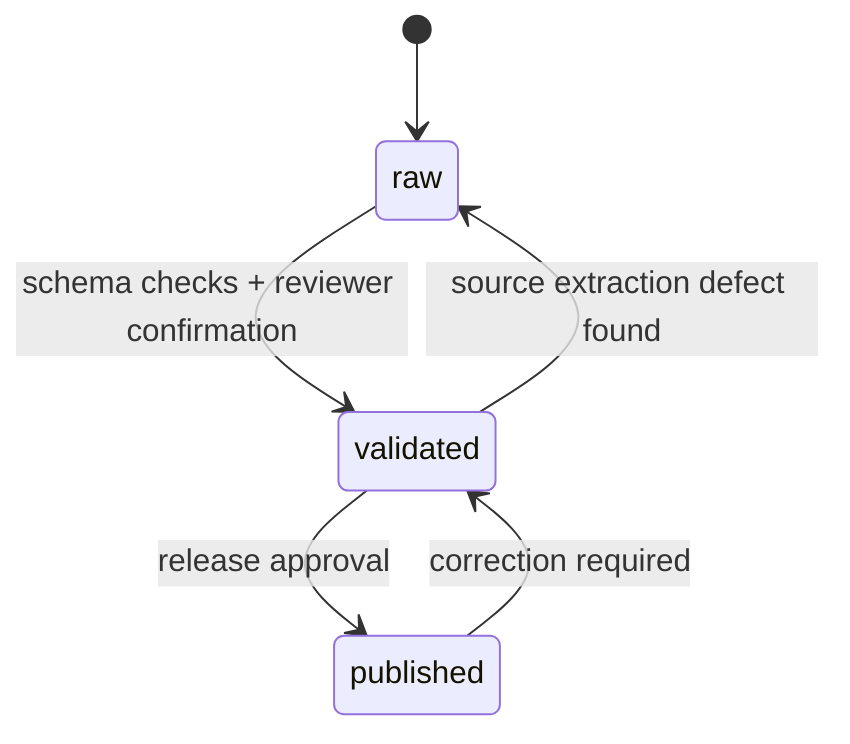

# ScholarAI Requirements and Governance

## Document Baseline

| Item | Decision |
|---|---|
| Purpose | Define functional requirements, non-functional requirements, and governance rules for the ScholarAI MVP |
| Governing constraints | 3 developers, 16 weeks, limited budget, modular monolith |
| Source-of-truth rule | Structured validated data is authoritative for scholarship rules and deadlines |
| Governance goal | Keep the product academically defensible and implementation-realistic |

## Functional Requirements

| ID | Requirement | Scope tier | Implementation grounding |
|---|---|---|---|
| `FR-01` | The system must support student registration, login, token refresh, and identity retrieval. | MVP | `auth` routes and security configuration already exist in the backend. |
| `FR-02` | The system must allow a student to create, read, and update a single primary profile. | MVP | `profile` routes and `StudentProfile` model already exist. |
| `FR-03` | The system must store student attributes needed for eligibility and ranking, including academics, field, degree, targets, and supporting signals. | MVP | `StudentProfile` already includes GPA, degree, field, target countries, and related features. |
| `FR-04` | The system must ingest scholarship source content and persist operational metadata for each run. | MVP | `ScraperService`, `ScraperRun`, and `HtmlSnapshot` already exist. |
| `FR-05` | The system must maintain scholarship records with source URL, source name, deadlines, requirements, and publication-ready content. | MVP | `Scholarship` and `EligibilityRequirement` models already exist. |
| `FR-06` | The system must allow admin users to create, patch, delete, and inspect scholarship records. | MVP | `admin` routes already expose these operations. |
| `FR-07` | The system must expose scholarship list and detail views to students. | MVP | `scholarships` routes already exist. |
| `FR-08` | The system must compute and persist recommendation outputs for a student profile. | MVP | `RecommendationService`, `MatchScore`, and Celery tasks already exist. |
| `FR-09` | Recommendation outputs must be expressed as an `Estimated Scholarship Fit Score` with explanation-friendly fields. | MVP | `MatchScore` includes overall score and feature contributions. |
| `FR-10` | The system must support application record creation, listing, and status updates. | MVP | `applications` routes and `Application` model already exist. |
| `FR-11` | The system must provide SOP feedback or improvement support to students. | MVP | `ai` routes and `SopService` already exist. |
| `FR-12` | The system must provide text-based interview question generation and answer evaluation. | MVP | `InterviewService` and related AI routes already exist. |
| `FR-13` | The system must record audit logs for admin-sensitive operations. | MVP | `AuditLog`, `AuditService`, and admin audit route scaffolding already exist. |
| `FR-14` | The system may introduce a narrower Neo4j-backed Knowledge Graph Layer if a relationally derived graph abstraction proves insufficient. | Future Research Extensions | Keep the logical layer mandatory, but the physical implementation optional. |
| `FR-15` | The system may add voice capture and transcription to interview practice. | Future Research Extensions | The current repo has interview scaffolding and Whisper settings, but voice is not required for MVP. |
| `FR-16` | The system may add mentor-facing review workflows. | Future Research Extensions | Not part of the MVP-critical path. |
| `FR-17` | The system may add provider and institutional partner tooling. | Post-MVP Startup Features | Excluded from the 16-week build. |

## Non-Functional Requirements

| ID | Requirement | Scope tier | Decision |
|---|---|---|---|
| `NFR-01` | Delivery realism | MVP | Architecture and feature set must remain buildable by 3 developers in 16 weeks. |
| `NFR-02` | Operability | MVP | Local and small-team deployment must work through Docker Compose. |
| `NFR-03` | Maintainability | MVP | The system must remain a modular monolith with clear module boundaries. |
| `NFR-04` | Data defensibility | MVP | Authoritative scholarship rules must come from structured validated data. |
| `NFR-05` | Auditability | MVP | Admin-sensitive actions must be traceable through audit logs or equivalent event history. |
| `NFR-06` | Background processing | MVP | Long-running scraping, scoring, and generation tasks must run outside request-response paths. |
| `NFR-07` | API consistency | MVP | HTTP APIs must stay versioned under `/api/v1` and use typed schemas. |
| `NFR-08` | Frontend quality | MVP | Student-facing screens must follow the defined premium, restrained brand system rather than generic starter styling. |
| `NFR-09` | Accessibility | MVP | Core student flows must meet keyboard, focus, and readable-contrast expectations. |
| `NFR-10` | Security posture | MVP | Secrets must remain environment-driven, and auth-protected routes must not expose admin operations to student roles. |
| `NFR-11` | Research rigor | Future Research Extensions | Any stronger predictive or evaluative claims require explicit methodology and validity discussion. |
| `NFR-12` | Scale optimization | Post-MVP Startup Features | Optimize for scale only after real product usage justifies it. |

## Governance Rules

| Area | Rule | Practical implication |
|---|---|---|
| Scope governance | Every feature must be classified as MVP, Future Research Extensions, or Post-MVP Startup Features. | Prevents startup ideas from silently entering MVP delivery. |
| Data authority | Scholarship rules, deadlines, and official requirements are valid only when captured in structured validated records. | LLM output cannot directly alter scholarship truth. |
| Geographic governance | Canada-first is default; USA is limited to Fulbright-related USA scope; DAAD is deferred. | Stops the ingestion plan from expanding uncontrollably. |
| Architecture governance | MVP remains a modular monolith. | Avoid microservice decomposition and extra ops burden. |
| Decision governance | Conditional decisions must be recorded before code spreads across multiple modules. | Keeps documentation ahead of architecture drift. |
| Release governance | MVP release decisions favor reliability and clarity over feature breadth. | Supports a shippable 16-week outcome. |

## Provenance Model

## Provenance and Publication Rules

| State | Meaning | Allowed actions |
|---|---|---|
| `raw` | Newly extracted or imported content that has not yet been trusted | Parse, inspect, normalize, and reject |
| `validated` | Structured content that has passed checks and reviewer acceptance | Prepare for publication, compare against new source pulls, correct issues |
| `published` | Student-visible or API-served scholarship data | Serve to users, monitor for stale data, roll back to `validated` if defects appear |

## Authority Hierarchy

| Rank | Source | Allowed use |
|---|---|---|
| 1 | Official provider or university source content normalized into validated records | Operational truth for scholarship rules |
| 2 | Admin-curated structured overrides backed by source evidence | Controlled correction path |
| 3 | Heuristic ranking and explanation outputs | Discovery and prioritization support only |
| 4 | LLM-generated writing or interview assistance | Advisory support only |

## Role and Decision Ownership

| Decision area | Primary owner | Required guardrail |
|---|---|---|
| Scope changes | Product/document owner for the relevant file | Must be reclassified by release tier before implementation |
| Scholarship record publication | Admin curator | Only `validated` records may become `published` |
| Recommendation logic changes | Data and ML owner | Must preserve `Estimated Scholarship Fit Score` framing unless real labels justify more |
| Architecture changes | Backend and architecture owner | Must preserve modular monolith posture for MVP |
| UI direction changes | Frontend owner | Must remain consistent with the brand and design system |

## Decision Register

| Topic | Status | Current decision |
|---|---|---|
| Knowledge Graph Layer physical implementation | Conditional | Keep logically mandatory; choose relationally derived graph abstraction unless a narrow Neo4j slice is clearly simpler. |
| OpenSearch usage | Deferred | Not required for MVP despite its presence in `docker-compose.yml`. |
| Voice interview support | Deferred | Treat as Future Research Extensions, not as a release-critical dependency. |
| Mentor workflows | Deferred | Keep out of MVP unless spare capacity is proven late in the schedule. |

## Release Control Checklist

| Check | Pass condition |
|---|---|
| Scope check | The feature is explicitly classified by release tier. |
| Authority check | No student-facing rule relies only on an LLM response. |
| Architecture check | The change does not force microservices or heavy new infrastructure. |
| Documentation check | Relevant docs are updated before or with the implementation change. |
| Audit check | Admin-sensitive changes remain reviewable after execution. |

## MVP Decision

The MVP requirements focus on reliable student and admin-curator flows, explicit data authority, asynchronous background processing, and a modular-monolith architecture that the team can actually deliver.

## Deferred Items

- OpenSearch as a required search tier.
- Full Neo4j dependency as a mandatory physical service.
- Mentor and partner workflows.
- Stronger predictive claims or evaluation claims without valid labeled outcomes.

## Assumptions

- The existing route and model skeleton reflects the intended domain boundaries even where some behaviors remain incomplete.
- Admin curation is the minimum acceptable governance layer for defensible scholarship data.
- Documentation updates are part of change control, not an optional afterthought.

## Risks

- If provenance rules are ignored in implementation, the product can present untrusted scholarship information as authoritative.
- If conditional architecture decisions remain undocumented, modules may drift into incompatible assumptions.
- If release-tier classification is not enforced, the team will absorb startup-scale scope into MVP work.
