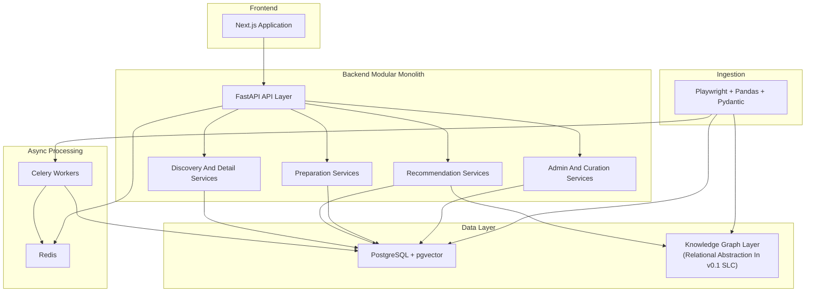
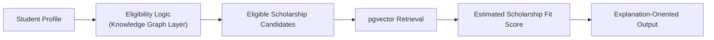
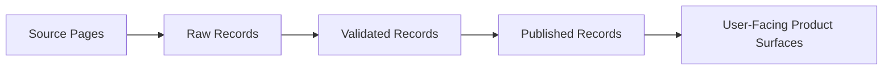

# ScholarAI System Architecture

## Architecture Objective
Define a system architecture that delivers the core ScholarAI workflows within v0.1 SLC constraints while preserving a path to later research extensions and startup growth.

## Architecture Principles
1. Keep the v0.1 SLC architecture as a modular monolith.
2. Prefer one strong relational foundation over multiple specialized stores unless clearly justified.
3. Preserve strict boundaries between validated facts and generated guidance.
4. Keep every major subsystem understandable by a 3-person team.
5. Optimize for data reliability and maintainability before optimization for breadth.

## v0.1 SLC Architecture Summary
| Layer | SLC decision (v0.1) |
|---|---|
| Frontend | One Next.js application for student and admin experiences |
| Backend | One FastAPI application with internal service modules |
| Async work | Celery workers with Redis for queueing |
| Primary data | PostgreSQL |
| Vector retrieval | pgvector inside PostgreSQL |
| Knowledge Graph Layer | Logical layer implemented first as a relationally derived graph abstraction |
| Deployment | Docker Compose |

## High-Level Container Diagram

## Core Modules
| Module | Responsibility |
|---|---|
| Discovery and detail | Search, filter, list, and detail views over validated scholarship data |
| Recommendation | Eligibility-aware filtering, ranking, and explanation-oriented outputs |
| Preparation | Application strategy guidance, document feedback, and interview practice |
| Admin and curation | Validation, publication, provenance tracking, and operational controls |
| Ingestion | Source extraction, parsing, schema validation, deduplication, and publication into the main data layer |

## Knowledge Graph Layer
The Knowledge Graph Layer is mandatory as a logical concept because ScholarAI needs relationship-aware filtering over eligibility conditions and scholarship context. For v0.1 SLC, the default implementation is a relationally derived graph abstraction backed by PostgreSQL tables and joins. This keeps infrastructure lighter while preserving the graph reasoning model.

### Why this default
- It is simpler to operate than adding Neo4j at the start.
- It keeps policy-critical data closer to the primary transactional store.
- It is easier for a 3-person team to debug and validate in a 16-week window.

### When Neo4j becomes justified
- Relationship traversal becomes difficult to express or maintain in relational queries.
- Research evaluation explicitly requires a graph-database comparison.
- Operational evidence shows the relational abstraction is no longer adequate.

## Recommendation Pipeline

### Stage intent
| Stage | Purpose | Data authority |
|---|---|---|
| Eligibility logic | Apply hard constraints and remove invalid candidates | Structured validated data |
| Vector retrieval | Find semantically relevant candidates among valid options | Structured records plus embeddings |
| Estimated fit scoring | Rank candidates using available features and assumptions | Estimated output, not causal prediction |
| Explanation output | Surface understandable reasons for ranking | Derived from ranking features and validated facts |

## Preparation Workflows
| Workflow | Role in architecture | Boundary |
|---|---|---|
| Application strategy guidance | User-facing advisory layer | Cannot override validated scholarship facts |
| Document feedback | RAG-assisted writing support | Limited to SOP, essay, and document quality guidance |
| Interview practice | Prompt-and-feedback workflow | Advisory practice tool, not authoritative evaluation |

## Ingestion And Provenance Flow

### Ingestion responsibilities
1. Collect source content using Playwright-based workflows.
2. Parse and normalize records.
3. Validate structure and required fields.
4. Track provenance state.
5. Publish only after validation.

## Data And Service Boundaries
| Concern | Architectural choice |
|---|---|
| Scholarship facts | Stored as structured records in PostgreSQL |
| Embeddings | Stored in PostgreSQL through pgvector |
| Background tasks | Isolated into Celery workers, not separate business services |
| Admin workflows | Remain inside the same FastAPI backend, protected by capability checks |
| Search system sprawl | Avoided in v0.1 SLC; no separate OpenSearch layer by default |

## Authorization Architecture Constraints
1. Authorization uses a capability matrix evaluated in backend dependencies.
2. Role labels are assignment bundles and must not bypass capability checks.
3. University access is institution-scoped and must enforce `institution_id` filtering at service and query layers.
4. During migration, legacy role claims can be read only through a compatibility window with deprecation milestones.
5. High-risk capability decisions must be auditable.

## Deployment Topology
### v0.1 SLC
- One frontend container.
- One backend container.
- PostgreSQL container.
- Redis container.
- Celery worker container.

### Conditional additions
- Neo4j only if the Knowledge Graph Layer needs a dedicated graph database.
- Extra observability or experiment services only after proving necessity.

## Architecture Tradeoffs
| Decision | Benefit | Cost |
|---|---|---|
| Modular monolith | Lower coordination overhead and simpler deployment | Requires clear internal module discipline |
| PostgreSQL + pgvector baseline | Fewer moving parts and strong data centralization | Less specialized than a multi-store architecture |
| Relational graph abstraction first | Simpler v0.1 SLC operations | May be less expressive than Neo4j for future graph research |
| Advisory AI boundaries | Stronger trust and defensibility | Less flashy product claims |

## Non-v0.1 SLC Architecture Explicitly Excluded
- Broad microservice decomposition.
- Separate search engine without a documented gap.
- Heavy orchestration layers for multiple LLM providers as a default requirement.
- Infrastructure choices justified only by future scale assumptions.

## SLC decision (v0.1)
ScholarAI v0.1 SLC architecture is a modular monolith centered on Next.js, FastAPI, PostgreSQL, pgvector, Celery, and Redis, with the Knowledge Graph Layer implemented first as a relationally derived graph abstraction.

## Deferred items
- Dedicated Neo4j deployment unless a clear graph-specific need emerges.
- Additional search systems such as OpenSearch.
- Independent AI microservices or multi-service orchestration platforms.

## Assumptions
- PostgreSQL can support the v0.1 SLC mix of transactional data, embeddings, and graph-derived reasoning.
- The recommendation pipeline can remain interpretable and useful without real outcome-label prediction claims.
- The team benefits more from fewer deployable units than from specialized infrastructure early on.

## Risks
- If relational graph logic becomes too complex, the v0.1 SLC architecture may need adjustment sooner than expected.
- A single backend can become messy if module boundaries are not enforced.
- Preparation workflows can blur into policy advice unless product boundaries remain explicit.

