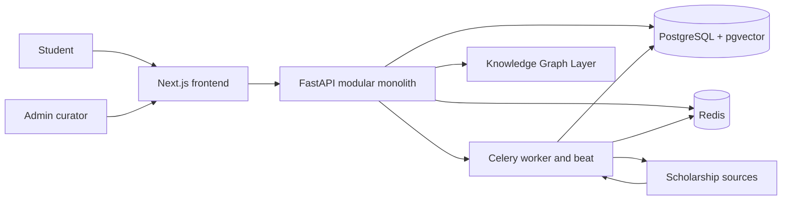
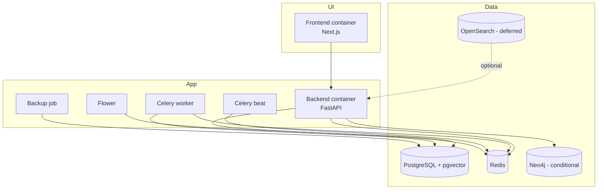
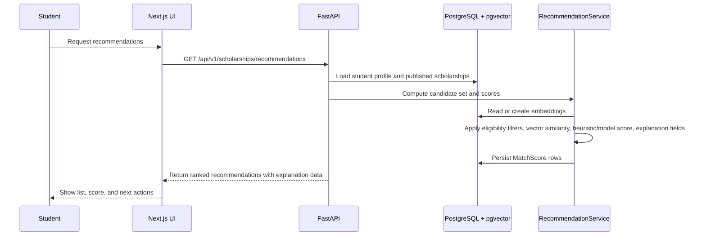

# ScholarAI System Architecture

## Architecture Baseline

| Item | Current position |
|---|---|
| System style | Modular monolith |
| Frontend family | Next.js + React + TypeScript + TailwindCSS |
| Backend family | FastAPI |
| Async processing | Celery + Redis |
| Primary data store | PostgreSQL |
| Semantic retrieval | `pgvector` in PostgreSQL |
| Knowledge Graph Layer | Mandatory logically, physically implemented as the simplest defensible option |
| Deployment posture | Docker Compose for local and MVP environments |
| Delivery constraint | 3 developers, 16 weeks, limited budget |

## Architecture Principles

| Principle | Decision |
|---|---|
| One deployable core | Keep the MVP as a single application boundary with internal modules rather than separate services. |
| Async by default for heavy work | Run scraping, score recomputation, and long AI jobs through Celery. |
| Data truth over AI convenience | Student-facing scholarship facts come from validated records, not generated text. |
| Conditional infrastructure | Only keep Neo4j or OpenSearch as required runtime components if they materially simplify MVP delivery. |
| Documentation-first drift control | Module boundaries in code should mirror the doc boundaries in this pack. |

## Architecture by Release Tier

| Tier | Architecture stance |
|---|---|
| MVP | One modular monolith, PostgreSQL plus `pgvector`, Celery plus Redis, Docker Compose deployment, and a logically mandatory but physically simple Knowledge Graph Layer. |
| Future Research Extensions | Narrow Neo4j adoption, stronger evaluation infrastructure, or extra retrieval components only if they materially improve the thesis and remain operable by the team. |
| Post-MVP Startup Features | Scale-oriented platform changes, broader partner integrations, and more complex deployment topology only after real usage justifies the added operational cost. |

## System Context

## Container View

## Module Boundaries

| Layer | Repo location | Responsibility |
|---|---|---|
| Frontend app | `frontend/src/app` | Student and admin UI routes, layouts, page composition, and Tailwind-driven presentation |
| API entrypoint | `backend/app/main.py` | App startup, middleware, router registration, health endpoint |
| API routes | `backend/app/api/v1/routes` | HTTP endpoints for auth, profile, scholarships, applications, admin, and AI tools |
| Core platform | `backend/app/core` | Config, database access, security, rate limiting, dependencies, migrations, admin-audit hooks |
| Domain models | `backend/app/models/models.py` | Relational schema for users, profiles, scholarships, requirements, applications, scores, documents, interviews, scraper runs, and audit logs |
| Domain services | `backend/app/services` | Recommendation, scraping, SOP, interview, and audit orchestration |
| Async tasks | `backend/app/tasks` | Celery routing, schedules, score recomputation, bounded SOP assistance jobs, scraping jobs |
| ML and experiments | `ai_services/` | Training scripts, evaluation utilities, and non-runtime experimentation artifacts |
| Setup utilities | `setup/` | Ingestion examples, ETL scaffolding, and scraper utilities outside the live app boundary |

## Backend Module Map

| Module | Runtime role | MVP status |
|---|---|---|
| `auth` | Authentication and current-user identity | MVP |
| `profile` | Student profile CRUD | MVP |
| `scholarships` | Search, list, detail, and recommendations | MVP |
| `applications` | Student application tracking | MVP |
| `admin` | Scholarship record admin, scraper trigger, audit visibility, stats | MVP |
| `ai` | SOP and interview assistance endpoints | MVP |
| `credentials`, `mentorship`, `interview`, `sop` legacy route files | Older or alternate route surfaces not included in the main API router | Deferred from current documented API surface |

## Data Store Decisions

| Store | Role in MVP | Decision |
|---|---|---|
| PostgreSQL | System of record for users, profiles, scholarships, applications, audit logs, and vectors | Locked |
| `pgvector` | Semantic retrieval for profile, scholarship, and document embeddings | Locked |
| Redis | Celery broker/backend and short-lived cache support | Locked |
| Neo4j | Optional physical implementation for the Knowledge Graph Layer | Conditional |
| OpenSearch | Optional search tier if Postgres-based retrieval proves insufficient | Deferred |

## Knowledge Graph Layer Decision

| Aspect | Decision |
|---|---|
| Logical requirement | Mandatory |
| MVP physical default | Relationally derived graph abstraction over scholarship requirements and student attributes |
| Conditional alternative | Narrow Neo4j slice only if it is simpler to reason about and operate than the relational approach |
| Scope guardrail | Do not let graph experimentation become a separate platform project inside the MVP timeline |

## Recommendation Runtime Flow

## Async Jobs

| Task | Queue | Trigger | Purpose |
|---|---|---|---|
| `tasks.compute_match_scores` | `ml` | On-demand or batch dispatch | Compute and persist student recommendation scores |
| `tasks.recompute_all_scores` | `ml` | Beat schedule daily at `02:00 UTC` | Rebuild recommendation cache for all student profiles |
| `tasks.run_full_scrape` | `scraper` | Beat schedule weekly Sunday at `03:00 UTC` | Run scholarship ingestion across configured sources |
| `tasks.generate_sop` | `ai` | On-demand | Run bounded SOP assistance outside the request path; current task naming is broader than the MVP commitment |
| `postgres-backup` container job | separate container | Looping schedule via environment | Create regular database backups |

## Deployment Topology

| Environment | Target topology | Notes |
|---|---|---|
| Local development | Docker Compose with frontend, backend, PostgreSQL, Redis, Celery, and optional Neo4j | Matches the current repo shape |
| MVP demo / team environment | Same Compose-oriented topology on a small host or VM | Keeps operations simple and reproducible |
| CI | GitHub Actions running backend smoke tests and frontend lint | Already present in `.github/workflows/ci.yml` |

## Architecture Decision Register

| Topic | Status | Decision |
|---|---|---|
| Modular monolith | Locked | Keep one deployable application boundary for MVP. |
| Frontend visual system | Locked | Replace the starter Next.js UI with the design-system direction in `03_brand_and_design_system.md`. |
| PostgreSQL + `pgvector` | Locked | Use as the primary store plus semantic retrieval layer. |
| Celery + Redis | Locked | Use for scraping, score recomputation, and long-running AI jobs. |
| Knowledge Graph Layer implementation | Conditional | Start with relationally derived graph logic unless a narrow Neo4j slice is clearly simpler. |
| OpenSearch | Deferred | Do not treat as a required MVP dependency. |
| Microservices | Rejected for MVP | Operational overhead is not defensible for the team and timeline. |

## Architecture Constraints and Exclusions

| Excluded approach | Why |
|---|---|
| Broad distributed microservices | Too much ops and integration cost for the team size |
| Mandatory multi-database graph and search stack from day one | Adds failure modes before the core student flow is proven |
| LLM-managed scholarship truth | Violates the structured validated data rule |
| Realtime complexity without a clear need | WebSockets or live collaboration are not required for MVP value |

## Implementation Notes

| Observation | Documentation impact |
|---|---|
| The frontend is still a starter page. | Architecture should treat the UI layer as structurally present but functionally immature. |
| The repo includes Neo4j and OpenSearch in `docker-compose.yml`. | Their presence does not automatically make them required MVP dependencies. |
| The backend API router currently includes auth, profile, scholarships, applications, admin, and AI modules. | These routes define the documented MVP API surface. |
| Legacy route files still exist outside the mounted router. | Treat them as non-authoritative until explicitly reintroduced. |

## MVP Decision

ScholarAI's MVP architecture is a modular monolith with a Next.js frontend, FastAPI backend, PostgreSQL plus `pgvector`, and Celery plus Redis for asynchronous work, all deployed through low-ops Docker Compose environments.

## Deferred Items

- Mandatory OpenSearch usage.
- Full graph-database dependence unless clearly justified.
- Microservice decomposition, event-platform sprawl, and heavy platform engineering work.
- Realtime collaboration or other infrastructure-heavy interaction modes.

## Assumptions

- The current repo layout is the intended implementation baseline for MVP documentation.
- PostgreSQL plus `pgvector` is sufficient for the first release unless clear evidence proves otherwise.
- A relationally derived Knowledge Graph Layer is acceptable for MVP if it preserves eligibility reasoning and maintainability.

## Risks

- The current Compose stack can encourage the team to treat optional infrastructure as mandatory work.
- If legacy routes are revived without documentation control, the published API surface will become inconsistent.
- If the Knowledge Graph Layer decision stays unresolved too long, the recommendation and data-model docs can diverge.
