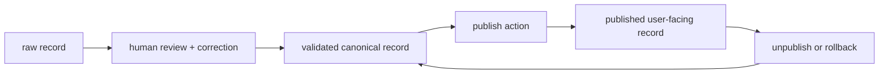
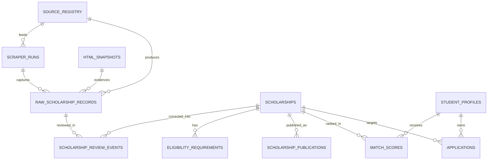

# ScholarAI Data Models

## Document Baseline

| Item | Decision |
|---|---|
| Purpose | Define the MVP-safe PostgreSQL schema outline, Knowledge Graph Layer schema outline, provenance model, and state boundaries |
| Primary system of record | PostgreSQL |
| Semantic retrieval | `pgvector` in PostgreSQL |
| Knowledge Graph Layer | Mandatory logically; MVP physical implementation may be relationally derived |
| Core reliability rule | Structured validated data is the operational source of truth |
| Publication rule | Only validated scholarship records may become published |

## Data Model by Release Tier

| Tier | Data-model stance |
|---|---|
| MVP | Keep raw ingestion records, validated canonical scholarship records, and publication metadata distinct and traceable in PostgreSQL. |
| Future Research Extensions | Add richer graph projections, better curation analytics, and stronger similarity or lineage tooling if the MVP pipeline is stable. |
| Post-MVP Startup Features | Add partner-owned records, more advanced lineage, and broader regional schema expansion only after the Canada-first model is proven. |

## Source-of-Truth Rules

| Rule | Decision |
|---|---|
| Operational truth | Scholarship eligibility, deadlines, funding rules, and official requirements come from structured validated records. |
| Raw data status | `raw` records are evidence and parser output, not trusted product data. |
| Publication boundary | `published` user-facing records must come only from validated records. |
| AI boundary | RAG or LLM outputs may summarize or assist, but cannot become authoritative scholarship records. |
| Student visibility | `raw` records are not user-visible by default. |

## State Model

## Current Repo Grounding and MVP Additions

| Area | Current repo grounding | Required MVP addition |
|---|---|---|
| Canonical scholarship entity | `Scholarship` table already exists and is used by API routes. | Treat `Scholarship` as the validated canonical entity, not as direct scraper output. |
| Eligibility rules | `EligibilityRequirement` already exists. | Keep it derived only from validated records. |
| Source capture | `HtmlSnapshot` and `ScraperRun` already exist. | Add a source registry and raw-record table so fetch output is not written straight into canonical scholarship rows. |
| Provenance | `source_url`, `source_name`, `last_scraped_at`, and audit logs already exist. | Expand provenance to include parser version, validation status, curator status, publication status, and correction metadata. |
| Publication state | `Scholarship.is_active` exists. | Add explicit publication metadata so activation is not the only publication control. |

## PostgreSQL Schema Outline

### MVP schema boundary

| Schema area | Tables | Role |
|---|---|---|
| Identity and user data | `users`, `student_profiles` | User and student profile state |
| Scholarship curation core | `source_registry`, `scraper_runs`, `html_snapshots`, `raw_scholarship_records`, `scholarship_review_events`, `scholarships`, `eligibility_requirements`, `scholarship_publications` | Source ingestion, curation, canonical data, and publication control |
| Student workflow | `applications`, `documents`, `interview_sessions`, `match_scores` | Student-facing product data |
| Operations and support | `audit_logs`, `embedding_cache` | Admin traceability and embedding reuse |

### Existing core tables retained from the repo

| Table | Key fields | MVP role |
|---|---|---|
| `users` | `id`, `email`, `role`, `is_active` | Authentication and authorization |
| `student_profiles` | `user_id`, `field_of_study`, `degree_level`, `gpa`, `target_countries`, `citizenship`, `profile_embedding` | Student matching input |
| `scholarships` | `name`, `provider`, `country`, `field_of_study`, `degree_levels`, `deadline`, `source_url`, `source_name` | Validated canonical scholarship record |
| `eligibility_requirements` | `scholarship_id`, `requirement_type`, `operator`, `value` | Normalized scholarship rules |
| `applications` | `student_id`, `scholarship_id`, `status` | Application tracking |
| `match_scores` | `student_id`, `scholarship_id`, `overall_score`, `feature_contributions` | Cached recommendation output |
| `documents` | `student_id`, `document_type`, `document_hash` | Student-uploaded material metadata |
| `interview_sessions` | `student_id`, `scholarship_id`, `feedback` | Interview-practice records |
| `scraper_runs` | `source_name`, `status`, `started_at`, `completed_at`, `error_message` | Operational scrape history |
| `html_snapshots` | `source_url`, `html_content`, `http_status`, `job_id` | Raw source evidence |
| `audit_logs` | `admin_id`, `action`, `target_table`, `old_value`, `new_value` | Admin activity trace |

### Required MVP curation tables

| Table | Key fields | Why it is needed |
|---|---|---|
| `source_registry` | `id`, `source_key`, `display_name`, `country_scope`, `source_type`, `is_official`, `base_url`, `status`, `allowed_programs`, `notes` | Records which sources are approved for ingestion and within scope |
| `raw_scholarship_records` | `id`, `source_registry_id`, `scraper_run_id`, `source_url`, `title_raw`, `payload_raw`, `html_snapshot_id`, `fetch_timestamp`, `parser_version`, `normalization_status`, `validation_status`, `dedupe_status`, `scope_status` | Stores parser output before trust is assigned |
| `scholarship_review_events` | `id`, `raw_record_id`, `scholarship_id`, `reviewer_id`, `decision`, `review_notes`, `field_overrides`, `reviewed_at` | Human review queue and correction history |
| `scholarship_publications` | `id`, `scholarship_id`, `published_version`, `publication_status`, `published_by`, `published_at`, `unpublished_by`, `unpublished_at`, `publication_note` | Explicit publication and unpublication control |

### Canonical scholarship record fields

| Field group | Example fields | Notes |
|---|---|---|
| Identity | `id`, `name`, `provider`, `university`, `country`, `source_url`, `source_name` | One canonical scholarship record per validated opportunity |
| Scope | `degree_levels`, `field_of_study` | Must stay within Canada-first MVP scope, except `Fulbright-related USA scope` |
| Rules and deadlines | `deadline`, `min_gpa`, `required_documents`, `eligibility_criteria` | Used by search, detail, and matching |
| Narrative fields | `description`, `simplified_description` | Human-readable content for product surfaces |
| Vector fields | `scholarship_embedding` | Semantic retrieval support |
| Provenance fields | `last_scraped_at`, plus joined provenance from review/publication tables | Canonical row alone is not enough for full provenance history |

### Recommended provenance fields

| Provenance field | Location | Required in MVP |
|---|---|---|
| `source_url` | raw + canonical | Yes |
| `source_type` | source registry | Yes |
| `fetch_timestamp` | raw record | Yes |
| `parser_version` | raw record | Yes |
| `validation_status` | raw record | Yes |
| `curator_status` | review event or raw record | Yes |
| `publication_status` | publication table | Yes |
| `scope_status` | raw record | Yes |
| `dedupe_status` | raw record | Yes |
| `correction_metadata` | review event | Yes |
| `published_at` / `unpublished_at` | publication table | Yes |

## Canonical Curation ERD

## Knowledge Graph Schema Outline

### Knowledge Graph Layer policy

| Rule | Decision |
|---|---|
| Source data | Build graph edges only from validated scholarship records and student profiles |
| Raw data usage | Do not create graph nodes or edges directly from raw scraped records |
| Publication relevance | Published scholarship records are the default graph view for student-facing discovery |
| MVP implementation | Prefer a relationally derived graph abstraction first |

### Node outline

| Node | Source table(s) | Key properties |
|---|---|---|
| `Scholarship` | `scholarships` | `scholarship_id`, `name`, `country`, `publication_status` |
| `Provider` | canonical scholarship fields or future provider table | `provider_name`, `source_type` |
| `University` | canonical scholarship fields | `university_name`, `country` |
| `Country` | canonical scholarship fields / source registry | `country_name`, `scope_tier` |
| `DegreeLevel` | `scholarships.degree_levels`, `student_profiles.degree_level` | `name` |
| `FieldOfStudy` | `scholarships.field_of_study`, `student_profiles.field_of_study` | `name` |
| `EligibilityRequirement` | `eligibility_requirements` | `requirement_type`, `operator`, `value` |
| `StudentProfile` | `student_profiles` | `student_profile_id`, `citizenship`, `gpa`, `target_countries` |

### Edge outline

| Edge | From | To | Meaning |
|---|---|---|---|
| `PUBLISHED_BY` | `Scholarship` | `Provider` | Provider ownership or sponsorship |
| `HOSTED_IN` | `Scholarship` | `Country` | Geographic hosting or jurisdiction |
| `AT_UNIVERSITY` | `Scholarship` | `University` | University association |
| `AWARDS_DEGREE` | `Scholarship` | `DegreeLevel` | Degree coverage |
| `FUNDS_FIELD` | `Scholarship` | `FieldOfStudy` | Subject coverage |
| `HAS_REQUIREMENT` | `Scholarship` | `EligibilityRequirement` | Normalized rule link |
| `SEEKS_DEGREE` | `StudentProfile` | `DegreeLevel` | Student target |
| `INTERESTED_IN` | `StudentProfile` | `FieldOfStudy` | Student field preference |
| `TARGETS_COUNTRY` | `StudentProfile` | `Country` | Student destination preference |

### MVP graph derivation rule

| Input | MVP handling |
|---|---|
| `eligibility_requirements` | Primary graph source for hard-rule nodes and edges |
| `scholarships.degree_levels` and `field_of_study` arrays | Project into graph relationships |
| `student_profiles` | Project into graph at runtime or through a derived view |
| `raw_scholarship_records` | Excluded from graph generation |

## Data Quality and Deduplication Support Fields

| Need | Recommended field or structure |
|---|---|
| Exact duplicate detection | `source_url` unique key on canonical records and hash on raw payload |
| Near-duplicate detection | normalized title hash, provider hash, deadline key, optional similarity candidate set |
| Review routing | `validation_status`, `dedupe_status`, `scope_status`, `curator_status` on raw records |
| Publication rollback | publication table with `published_version` and timestamps |
| Auditability | review events plus admin audit logs |

## Current Implementation Risks the Model Must Correct

| Current behavior | Risk | Required document position |
|---|---|---|
| `ScraperService` currently upserts directly into `Scholarship` rows. | Raw scrape output can bypass a full curation boundary. | Treat this as interim scaffolding, not the target MVP data model. |
| `Scholarship.is_active` acts as the main visibility control today. | It is too coarse to represent validated vs published history. | Introduce explicit publication metadata. |
| `source_name` enum includes DAAD and generic sources. | This can imply unsupported scope in MVP even though `DAAD deferred` remains the governing rule. | Source registry must enforce Canada-first and `Fulbright-related USA scope`. |

## MVP Decision

The MVP data model should keep raw ingestion evidence, validated canonical scholarship records, and publication metadata structurally distinct while preserving the current PostgreSQL-centered architecture and keeping the Knowledge Graph Layer logically mandatory but physically lightweight.

## Deferred Items

- A full provider master-data model with partner-owned workflows.
- Mandatory Neo4j storage instead of a relationally derived Knowledge Graph Layer.
- Advanced lineage tooling beyond the tables needed for raw, validated, and published control.
- Broad non-Canada schema expansion outside `Fulbright-related USA scope`.

## Assumptions

- The existing `Scholarship` table can serve as the validated canonical scholarship entity after curation-layer tables are added around it.
- Publication metadata can remain thin in MVP as long as it explicitly separates validated from published state.
- A derived graph view from validated relational data is sufficient for the first release.

## Risks

- If the team keeps direct scraper writes into canonical scholarship rows, the documented provenance model will not hold in practice.
- If source registry and raw-record tables are skipped, auditability and review routing will remain too weak for reliable publication.
- If graph modeling starts from raw records instead of validated records, recommendation logic will inherit untrusted data.
