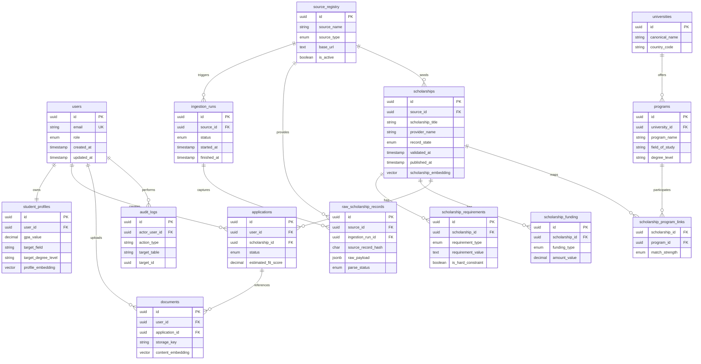

# ScholarAI Data Models

## Purpose
This document defines the canonical v0.1 SLC data model for ScholarAI. It covers the PostgreSQL schema, source-of-truth rules, curation-state handling, document storage references, and the Knowledge Graph Layer design that supports eligibility-aware recommendation logic.

## Data Modeling Principles
1. Store policy-critical scholarship facts in structured PostgreSQL tables.
2. Keep `raw`, `validated`, and `published` states explicit.
3. Preserve a clear line between source ingestion data and user-facing curated data.
4. Keep auditability and curator traceability built into the core schema.
5. Implement the Knowledge Graph Layer logically in v0.1 SLC using relationally derived structures first.

## Source-Of-Truth Rules
| Domain | Operational source of truth | Notes |
|---|---|---|
| Eligibility constraints | Validated PostgreSQL records | Used by filters, ranking, and scholarship detail views |
| Deadlines | Validated PostgreSQL records | Displayed only from curated records |
| Funding rules | Validated PostgreSQL records | Must cite the canonical source record |
| Official requirements | Validated PostgreSQL records | Generated summaries cannot override them |
| User documents | Stored document metadata plus extracted content references | Used for feedback workflows, not scholarship policy truth |

## PostgreSQL Schema Overview
### Core tables
| Table | Purpose |
|---|---|
| `users` | Authentication and role ownership |
| `student_profiles` | Structured student profile data used by recommendations |
| `source_registry` | Approved ingestion sources and scope metadata |
| `ingestion_runs` | Job-level tracking for scraping and parsing runs |
| `raw_scholarship_records` | Untrusted ingestion output preserved for traceability |
| `scholarships` | Canonical curated scholarship records |
| `scholarship_requirements` | Normalized eligibility rules and requirement statements |
| `scholarship_funding` | Funding amount and coverage details |
| `universities` | University entities referenced by programs and scholarships |
| `programs` | Program entities used for field and degree alignment |
| `scholarship_program_links` | Many-to-many linkage between scholarships and programs |
| `documents` | User document storage references and processing status |
| `applications` | User tracking and recommendation snapshots |
| `audit_logs` | Admin and curator action history |
| `embedding_cache` | Reusable embedding store keyed by content hash |

### Supporting conventions
| Field group | Convention |
|---|---|
| Primary keys | UUID for all major tables |
| Audit timestamps | `created_at`, `updated_at` on mutable canonical tables |
| Curation fields | `record_state`, `validated_at`, `validated_by`, `published_at`, `published_by` |
| Soft deletion | `is_active` or `archived_at` for recoverable records |
| Provenance linkage | `source_id`, `source_url`, `source_record_hash`, `ingestion_run_id` |

## Key Table Definitions
### `users`
| Field | Type | Notes |
|---|---|---|
| `id` | UUID PK | Primary identifier |
| `email` | VARCHAR(255) UNIQUE | Login identity |
| `password_hash` | VARCHAR(255) | Credential storage |
| `role` | ENUM(`ENDUSER_STUDENT`,`INTERNAL_USER`,`DEV`,`ADMIN`,`UNIVERSITY`,`OWNER`) | Legacy role claim remains during compatibility window |
| `institution_id` | UUID FK -> `universities.id` NULL | Required for university-scoped users |
| `created_at` | TIMESTAMP | Audit field |
| `updated_at` | TIMESTAMP | Audit field |

### Authorization supporting tables
#### `capabilities`
| Field | Type | Notes |
|---|---|---|
| `id` | UUID PK | Capability identifier |
| `capability_key` | VARCHAR(128) UNIQUE | Stable machine-readable key |
| `resource` | VARCHAR(64) | Domain module, for example `curation` |
| `action` | VARCHAR(64) | Operation, for example `publish` |
| `risk_tier` | ENUM(`low`,`medium`,`high`,`critical`) | Governance and review requirement |
| `is_active` | BOOLEAN | Change control support |
| `created_at` | TIMESTAMP | Audit field |
| `updated_at` | TIMESTAMP | Audit field |

#### `role_capabilities`
| Field | Type | Notes |
|---|---|---|
| `role` | ENUM(`ENDUSER_STUDENT`,`INTERNAL_USER`,`DEV`,`ADMIN`,`UNIVERSITY`,`OWNER`) | Composite PK part |
| `capability_id` | UUID FK -> `capabilities.id` | Composite PK part |
| `granted_by` | UUID FK -> `users.id` NULL | Traceability for policy changes |
| `created_at` | TIMESTAMP | Audit field |

#### `user_capabilities`
| Field | Type | Notes |
|---|---|---|
| `user_id` | UUID FK -> `users.id` | Composite PK part |
| `capability_id` | UUID FK -> `capabilities.id` | Composite PK part |
| `grant_reason` | TEXT NULL | Exception workflow note |
| `expires_at` | TIMESTAMP NULL | Time-bounded elevated access |
| `created_at` | TIMESTAMP | Audit field |

#### `user_institution_access`
| Field | Type | Notes |
|---|---|---|
| `user_id` | UUID FK -> `users.id` | Composite PK part |
| `institution_id` | UUID FK -> `universities.id` | Composite PK part |
| `access_level` | ENUM(`viewer`,`editor`,`reviewer`,`admin`) | Institution-local authority |
| `created_at` | TIMESTAMP | Audit field |
| `updated_at` | TIMESTAMP | Audit field |

### Token claim compatibility window contract
During migration, auth tokens may include both:
- legacy role claim (`role`)
- new capability claim set (`capabilities`)

Runtime authorization must prefer capability evaluation and only use role fallback until the deprecation milestone is met.

### `student_profiles`
| Field | Type | Notes |
|---|---|---|
| `id` | UUID PK | Profile identifier |
| `user_id` | UUID FK -> `users.id` | One-to-one profile owner |
| `citizenship_country_code` | VARCHAR(3) | ISO-style code |
| `current_country_code` | VARCHAR(3) NULL | Optional residency context |
| `gpa_value` | DECIMAL(3,2) | Raw GPA value |
| `gpa_scale` | DECIMAL(3,2) | Needed for normalization |
| `english_test_type` | VARCHAR(32) NULL | IELTS, TOEFL, none |
| `english_test_score` | DECIMAL(4,2) NULL | Optional language score |
| `target_degree_level` | VARCHAR(32) | v0.1 SLC default `MS` |
| `target_field` | VARCHAR(64) | One of the v0.1 SLC program families |
| `target_country_code` | VARCHAR(3) | v0.1 SLC default `CAN` |
| `research_experience_level` | SMALLINT NULL | Structured ordinal feature |
| `leadership_experience_level` | SMALLINT NULL | Structured ordinal feature |
| `volunteer_experience_level` | SMALLINT NULL | Structured ordinal feature |
| `profile_embedding` | VECTOR(384) NULL | `all-MiniLM-L6-v2` embedding |
| `created_at` | TIMESTAMP | Audit field |
| `updated_at` | TIMESTAMP | Audit field |

### `source_registry`
| Field | Type | Notes |
|---|---|---|
| `id` | UUID PK | Source identifier |
| `source_name` | VARCHAR(255) | Human-readable source |
| `source_type` | ENUM(`official_university`,`official_provider`,`approved_reference`) | Trust classification |
| `base_url` | TEXT | Registered root URL |
| `country_scope` | VARCHAR(64) | Canada or scoped Fulbright-related |
| `program_scope` | TEXT | Program coverage notes |
| `is_active` | BOOLEAN | Source availability |
| `robots_policy_checked_at` | TIMESTAMP NULL | Compliance evidence |
| `created_at` | TIMESTAMP | Audit field |
| `updated_at` | TIMESTAMP | Audit field |

### `ingestion_runs`
| Field | Type | Notes |
|---|---|---|
| `id` | UUID PK | Run identifier |
| `source_id` | UUID FK -> `source_registry.id` | Source link |
| `run_type` | ENUM(`scheduled`,`manual`,`retry`) | Trigger reason |
| `status` | ENUM(`queued`,`running`,`completed`,`failed`,`partial`) | Run lifecycle |
| `records_seen` | INTEGER | Raw count |
| `records_validated` | INTEGER | Parsed-valid count |
| `records_published` | INTEGER | Published count |
| `started_at` | TIMESTAMP | Run timing |
| `finished_at` | TIMESTAMP NULL | Run timing |
| `error_summary` | TEXT NULL | Failure summary |
| `created_by` | UUID FK -> `users.id` NULL | Admin-triggered runs |

### `raw_scholarship_records`
| Field | Type | Notes |
|---|---|---|
| `id` | UUID PK | Raw record identifier |
| `source_id` | UUID FK -> `source_registry.id` | Source link |
| `ingestion_run_id` | UUID FK -> `ingestion_runs.id` | Run link |
| `source_url` | TEXT | Page URL |
| `source_record_hash` | CHAR(64) | Deduplication and change detection |
| `raw_payload` | JSONB | Parsed but untrusted record |
| `html_snapshot_ref` | TEXT NULL | File path or blob reference |
| `parse_status` | ENUM(`parsed`,`validation_failed`,`needs_review`) | Raw quality status |
| `detected_language` | VARCHAR(16) NULL | Useful for parser QA |
| `captured_at` | TIMESTAMP | Ingestion timestamp |
| `expires_at` | TIMESTAMP NULL | Retention policy support |

### `scholarships`
| Field | Type | Notes |
|---|---|---|
| `id` | UUID PK | Canonical scholarship identifier |
| `source_id` | UUID FK -> `source_registry.id` | Primary source |
| `canonical_slug` | VARCHAR(255) UNIQUE | Stable URL key |
| `provider_name` | VARCHAR(255) | Scholarship provider |
| `scholarship_title` | VARCHAR(255) | Display title |
| `summary_text` | TEXT | Curated summary |
| `source_url` | TEXT | Canonical citation link |
| `country_code` | VARCHAR(3) | v0.1 SLC default `CAN`; scoped exceptions allowed |
| `degree_level` | VARCHAR(32) | v0.1 SLC default `MS` |
| `field_scope` | VARCHAR(128) | Program family alignment |
| `deadline_at` | TIMESTAMP NULL | Canonical deadline |
| `is_deadline_rolling` | BOOLEAN | Rolling-application flag |
| `record_state` | ENUM(`raw`,`validated`,`published`) | Curation-state field |
| `validation_notes` | TEXT NULL | Curator notes |
| `validated_at` | TIMESTAMP NULL | Curation-state field |
| `validated_by` | UUID FK -> `users.id` NULL | Curation-state field |
| `published_at` | TIMESTAMP NULL | Curation-state field |
| `published_by` | UUID FK -> `users.id` NULL | Curation-state field |
| `last_source_checked_at` | TIMESTAMP NULL | Freshness evidence |
| `is_active` | BOOLEAN | Publication control |
| `scholarship_embedding` | VECTOR(384) NULL | Retrieval vector |
| `created_at` | TIMESTAMP | Audit field |
| `updated_at` | TIMESTAMP | Audit field |

### `scholarship_requirements`
| Field | Type | Notes |
|---|---|---|
| `id` | UUID PK | Requirement identifier |
| `scholarship_id` | UUID FK -> `scholarships.id` | Parent scholarship |
| `requirement_type` | ENUM(`citizenship`,`degree`,`field`,`gpa`,`language`,`document`,`other`) | Rule category |
| `operator` | ENUM(`eq`,`gte`,`lte`,`in`,`contains`,`free_text`) | Evaluation operator |
| `requirement_value` | TEXT | Normalized canonical value |
| `is_hard_constraint` | BOOLEAN | Rule filtering importance |
| `source_quote_ref` | TEXT NULL | Citation or snippet pointer |
| `created_at` | TIMESTAMP | Audit field |
| `updated_at` | TIMESTAMP | Audit field |

### `scholarship_funding`
| Field | Type | Notes |
|---|---|---|
| `id` | UUID PK | Funding row identifier |
| `scholarship_id` | UUID FK -> `scholarships.id` | Parent scholarship |
| `funding_type` | ENUM(`full_tuition`,`partial_tuition`,`stipend`,`travel`,`mixed`,`unknown`) | Coverage type |
| `amount_value` | DECIMAL(12,2) NULL | Numeric value when known |
| `amount_currency` | VARCHAR(8) NULL | Currency code |
| `coverage_notes` | TEXT NULL | Human-readable detail |
| `created_at` | TIMESTAMP | Audit field |
| `updated_at` | TIMESTAMP | Audit field |

### `universities`
| Field | Type | Notes |
|---|---|---|
| `id` | UUID PK | University identifier |
| `canonical_name` | VARCHAR(255) UNIQUE | Normalized name |
| `country_code` | VARCHAR(3) | v0.1 SLC expects `CAN` |
| `province_or_state` | VARCHAR(64) NULL | Location context |
| `created_at` | TIMESTAMP | Audit field |
| `updated_at` | TIMESTAMP | Audit field |

### `programs`
| Field | Type | Notes |
|---|---|---|
| `id` | UUID PK | Program identifier |
| `university_id` | UUID FK -> `universities.id` | Owning university |
| `program_name` | VARCHAR(255) | Canonical program title |
| `field_of_study` | VARCHAR(64) | DS, AI, Analytics alignment |
| `degree_level` | VARCHAR(32) | v0.1 SLC `MS` |
| `created_at` | TIMESTAMP | Audit field |
| `updated_at` | TIMESTAMP | Audit field |

### `scholarship_program_links`
| Field | Type | Notes |
|---|---|---|
| `scholarship_id` | UUID FK -> `scholarships.id` | Composite PK part |
| `program_id` | UUID FK -> `programs.id` | Composite PK part |
| `match_strength` | ENUM(`primary`,`secondary`,`broad`) | Ranking support |
| `created_at` | TIMESTAMP | Audit field |

### `documents`
| Field | Type | Notes |
|---|---|---|
| `id` | UUID PK | Document identifier |
| `user_id` | UUID FK -> `users.id` | Owner |
| `application_id` | UUID FK -> `applications.id` NULL | Optional application context |
| `document_type` | ENUM(`cv`,`sop`,`essay`,`transcript`,`other`) | Supported document class |
| `storage_provider` | VARCHAR(64) | Local path or object storage type |
| `storage_key` | TEXT | Canonical storage reference |
| `storage_url` | TEXT NULL | Signed or internal retrieval URL |
| `checksum_sha256` | CHAR(64) | Integrity check |
| `mime_type` | VARCHAR(128) | Upload control |
| `extracted_text_ref` | TEXT NULL | Parsed text artifact reference |
| `content_embedding` | VECTOR(384) NULL | RAG retrieval vector |
| `created_at` | TIMESTAMP | Audit field |
| `updated_at` | TIMESTAMP | Audit field |

### `applications`
| Field | Type | Notes |
|---|---|---|
| `id` | UUID PK | Application identifier |
| `user_id` | UUID FK -> `users.id` | Student owner |
| `scholarship_id` | UUID FK -> `scholarships.id` | Target scholarship |
| `status` | ENUM(`saved`,`planning`,`submitted`,`closed`) | User workflow state |
| `estimated_fit_score` | DECIMAL(5,2) NULL | Snapshot of current ranking output |
| `explanation_snapshot` | JSONB NULL | Local explanation payload |
| `created_at` | TIMESTAMP | Audit field |
| `updated_at` | TIMESTAMP | Audit field |

### `audit_logs`
| Field | Type | Notes |
|---|---|---|
| `id` | UUID PK | Audit entry identifier |
| `actor_user_id` | UUID FK -> `users.id` | Acting admin or curator |
| `action_type` | VARCHAR(64) | Action verb |
| `target_table` | VARCHAR(64) | Table changed |
| `target_id` | UUID | Target row |
| `before_value` | JSONB NULL | Previous state snapshot |
| `after_value` | JSONB NULL | New state snapshot |
| `request_id` | VARCHAR(64) NULL | Traceability |
| `created_at` | TIMESTAMP | Audit field |

### `embedding_cache`
| Field | Type | Notes |
|---|---|---|
| `id` | UUID PK | Cache row identifier |
| `content_hash` | CHAR(64) UNIQUE | Stable content key |
| `model_name` | VARCHAR(128) | Embedding model version |
| `embedding_vector` | VECTOR(384) | Cached embedding |
| `created_at` | TIMESTAMP | Audit field |

## Foreign Key Summary
| Child table | Parent table | Relationship |
|---|---|---|
| `student_profiles.user_id` | `users.id` | one-to-one |
| `ingestion_runs.source_id` | `source_registry.id` | many-to-one |
| `raw_scholarship_records.source_id` | `source_registry.id` | many-to-one |
| `raw_scholarship_records.ingestion_run_id` | `ingestion_runs.id` | many-to-one |
| `scholarships.source_id` | `source_registry.id` | many-to-one |
| `scholarships.validated_by` | `users.id` | many-to-one |
| `scholarships.published_by` | `users.id` | many-to-one |
| `scholarship_requirements.scholarship_id` | `scholarships.id` | many-to-one |
| `scholarship_funding.scholarship_id` | `scholarships.id` | many-to-one |
| `programs.university_id` | `universities.id` | many-to-one |
| `scholarship_program_links.scholarship_id` | `scholarships.id` | many-to-one |
| `scholarship_program_links.program_id` | `programs.id` | many-to-one |
| `documents.user_id` | `users.id` | many-to-one |
| `documents.application_id` | `applications.id` | optional many-to-one |
| `applications.user_id` | `users.id` | many-to-one |
| `applications.scholarship_id` | `scholarships.id` | many-to-one |
| `audit_logs.actor_user_id` | `users.id` | many-to-one |
| `users.institution_id` | `universities.id` | optional many-to-one |
| `role_capabilities.capability_id` | `capabilities.id` | many-to-one |
| `user_capabilities.user_id` | `users.id` | many-to-one |
| `user_capabilities.capability_id` | `capabilities.id` | many-to-one |
| `user_institution_access.user_id` | `users.id` | many-to-one |
| `user_institution_access.institution_id` | `universities.id` | many-to-one |

## Important Indexes
| Index | Target | Purpose |
|---|---|---|
| `idx_scholarships_state_deadline` | `scholarships(record_state, deadline_at)` | Fast curated listing |
| `idx_scholarships_country_field_degree` | `scholarships(country_code, field_scope, degree_level)` | v0.1 SLC search/filtering |
| `idx_requirements_scholarship_type` | `scholarship_requirements(scholarship_id, requirement_type)` | Eligibility evaluation |
| `idx_raw_records_hash` | `raw_scholarship_records(source_record_hash)` | Deduplication |
| `idx_ingestion_runs_source_status` | `ingestion_runs(source_id, status)` | Operational monitoring |
| `idx_applications_user_scholarship` | `applications(user_id, scholarship_id)` | User workflow lookups |
| `idx_audit_logs_target` | `audit_logs(target_table, target_id, created_at)` | Curation traceability |
| `idx_student_profiles_embedding` | HNSW on `student_profiles.profile_embedding` | Similarity retrieval |
| `idx_scholarships_embedding` | HNSW on `scholarships.scholarship_embedding` | Recommendation stage 2 |
| `idx_documents_embedding` | HNSW on `documents.content_embedding` | Document-assistance retrieval |

## Audit Fields And Curation-State Fields
### Audit fields used consistently
- `created_at`
- `updated_at`
- `request_id` where operationally relevant
- `actor_user_id` or equivalent user reference for curator actions

### Curation-state fields on canonical scholarship records
- `record_state`
- `validation_notes`
- `validated_at`
- `validated_by`
- `published_at`
- `published_by`
- `last_source_checked_at`
- `is_active`

## Mermaid ER Diagram

## Knowledge Graph Schema Design
### Node labels
| Label | Source | Purpose |
|---|---|---|
| `StudentProfile` | `student_profiles` | Recommendation query subject |
| `Scholarship` | `scholarships` | Ranked candidate entity |
| `University` | `universities` | Institutional context |
| `Program` | `programs` | Program scope matching |
| `Country` | normalized code set | Geography constraints |
| `DegreeLevel` | normalized taxonomy | Degree alignment |
| `FieldOfStudy` | normalized taxonomy | Program family alignment |
| `Requirement` | `scholarship_requirements` | Explicit eligibility rules |
| `Provider` | derived from `provider_name` | Provider grouping and reporting |

### Relationship types
| From | Relationship | To | Purpose |
|---|---|---|---|
| `StudentProfile` | `SEEKS_DEGREE` | `DegreeLevel` | Degree intent |
| `StudentProfile` | `TARGETS_FIELD` | `FieldOfStudy` | Field intent |
| `StudentProfile` | `HAS_CITIZENSHIP` | `Country` | Hard eligibility filter |
| `StudentProfile` | `TARGETS_COUNTRY` | `Country` | Geography preference |
| `Scholarship` | `HOSTED_IN` | `Country` | Location of scholarship/program |
| `Scholarship` | `FUNDS_PROGRAM` | `Program` | Program linkage |
| `Program` | `OFFERED_BY` | `University` | University linkage |
| `Scholarship` | `REQUIRES` | `Requirement` | Explicit requirement reference |
| `Requirement` | `SCOPES_TO` | `Country` / `DegreeLevel` / `FieldOfStudy` | Typed rule attachment |
| `Scholarship` | `PROVIDED_BY` | `Provider` | Provider grouping |

## v0.1 SLC Graph Implementation Choice
### v0.1 SLC
- Implement the Knowledge Graph Layer as relationally derived graph views and query services backed by PostgreSQL.
- Materialize normalized entities and relationship tables needed for eligibility filtering.
- Keep the logical graph model stable even if Neo4j is not deployed.

### Future Research Extensions
- Mirror the same graph model into a narrowly scoped Neo4j deployment for comparative experiments.
- Benchmark relational graph abstraction versus graph-database traversal.

### Deferred By Stage
- Expand the graph to include alumni outcomes, provider relationships, and collaborative pathways if validated data grows enough to justify it.

## Sync Strategy Between PostgreSQL And Graph Layer
### v0.1 SLC sync approach
1. Ingestion and curation update canonical PostgreSQL tables.
2. A derived graph builder maps validated and published records into relationship-oriented tables or materialized views.
3. Recommendation stage 1 queries these derived relations for eligibility filtering.
4. Graph projections refresh after scholarship publish events and on scheduled nightly reconciliation.

### Future Neo4j sync approach
- Publish only validated or published canonical records into Neo4j.
- Use idempotent upserts keyed by PostgreSQL UUIDs.
- Keep PostgreSQL authoritative; Neo4j remains a read-optimized projection.

## SLC decision (v0.1)
ScholarAI v0.1 SLC will use PostgreSQL as the authoritative data layer, with explicit curation states and a relationally derived Knowledge Graph Layer that supports eligibility-aware filtering without requiring Neo4j from day one.

## Deferred items
- Dedicated Neo4j deployment.
- Mentor and marketplace-related entities.
- Broader geographic and academic taxonomies beyond the v0.1 SLC corpus.

## Assumptions
- A 384-dimension embedding size is used consistently with `all-MiniLM-L6-v2`.
- Canonical scholarship publication can be modeled through explicit state transitions on curated records.
- Local-path or object-storage references are sufficient for v0.1 SLC document handling.

## Risks
- If requirement normalization is too loose, eligibility filtering quality will degrade.
- A single canonical scholarship table can become difficult to evolve without careful migration discipline.
- Graph derivation logic can drift from canonical tables if refresh controls are weak.

