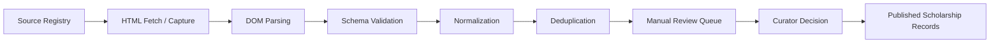

# ScholarAI Ingestion And Curation

## Purpose
This document defines the v0.1 SLC scholarship ingestion, validation, provenance, review, and publication workflow. It ensures that user-facing scholarship data is traceable, manually reviewable, and safe for eligibility and recommendation use.

## Pipeline Principles
1. Raw data is never trusted by default.
2. Published scholarship records must come only from validated records.
3. Human review is mandatory before policy-critical publication.
4. Provenance must be preserved at every stage.
5. Retry logic must never silently overwrite curator decisions.

## Source Registry
### v0.1 SLC source classes
| Source class | Examples | Allowed in v0.1 SLC | Trust level |
|---|---|---|---|
| Official university scholarship pages | University funding and admissions pages in Canada | Yes | Primary |
| Official university program pages | Canadian MS DS/AI/Analytics program pages | Yes | Primary |
| Official provider pages | Fulbright-related official pages where scope is relevant | Yes, scoped only | Primary |
| Approved reference pages | Limited discovery-only reference pages used to locate official sources | Yes, if approved by curator | Secondary |
| Broad aggregators without verification | General scholarship listing sites | No as publication authority | Low |
| DAAD pages | DAAD official scholarship pages | No for v0.1 SLC publication | Deferred |

### Source registry fields
| Field | Purpose |
|---|---|
| `source_name` | Human-readable source name |
| `source_type` | Trust classification |
| `base_url` | Source root |
| `country_scope` | Scope control |
| `program_scope` | Program relevance note |
| `is_active` | Operational status |
| `robots_policy_checked_at` | Compliance evidence |
| `review_notes` | Curator notes |

## End-To-End Ingestion Flow

## Scraping And Ingestion Flow
| Stage | Responsibility | Output |
|---|---|---|
| Source selection | Choose approved source from registry | Eligible source target |
| HTML capture | Fetch page and preserve response context | HTML snapshot and request metadata |
| DOM parsing | Extract candidate scholarship fields | Structured raw payload |
| Schema validation | Check required fields and value types | Valid or review-needed raw record |
| Normalization | Standardize degree, field, deadline, country, funding fields | Candidate canonical record |
| Deduplication | Match against existing raw and canonical records | Merge candidate or new review item |
| Manual review | Curator validates and corrects data | Validated canonical record |
| Publication | Promote record to published state | User-facing scholarship record |

## Schema Validation
### Required validation checks
| Check | Purpose |
|---|---|
| Required fields present | Ensure minimum viable scholarship detail |
| URL validity | Preserve citation traceability |
| Country scope allowed | Prevent non-v0.1 SLC geography leakage |
| Degree level normalization | Enforce MS-only v0.1 SLC scope |
| Program family normalization | Keep DS/AI/Analytics scope consistent |
| Deadline parsing | Prevent invalid deadline display |
| Funding-field parsing | Separate known values from unknown claims |

### Validation outcomes
| Outcome | Meaning |
|---|---|
| `parsed` | Extracted structure is usable |
| `validation_failed` | Missing or invalid required fields |
| `needs_review` | Structurally valid but semantically ambiguous |

## Normalization Rules
| Domain | Rule |
|---|---|
| Degree level | Map variants such as `Master`, `M.Sc.`, `Masters` to `MS` where appropriate |
| Program field | Map source wording to `Data Science`, `Artificial Intelligence`, or `Analytics` |
| Country | Normalize to canonical code values such as `CAN` |
| Funding amounts | Store numeric amount and currency separately when possible |
| Deadlines | Normalize to timestamp with time-zone note if available |
| Provider names | Use canonical provider naming conventions |

## Deduplication Rules
### Primary matching keys
1. Exact `source_record_hash`.
2. Same `source_url`.
3. Same normalized title plus provider plus deadline.

### Secondary review heuristics
| Heuristic | Use |
|---|---|
| Title similarity | Detect renamed or slightly edited pages |
| Provider match | Reduce duplicate provider entries |
| Program overlap | Distinguish program-specific funding from shared awards |
| Source freshness | Prefer newer canonical source data |

### Deduplication outcomes
| Outcome | Action |
|---|---|
| Exact duplicate | Link to existing raw record and close |
| Likely duplicate | Send to review queue with merge suggestion |
| New record | Create new review item |

## Provenance Fields
| Field | Purpose |
|---|---|
| `source_id` | Link to approved source registry entry |
| `source_url` | Citation anchor |
| `source_record_hash` | Immutable raw payload reference |
| `ingestion_run_id` | Operational traceability |
| `last_source_checked_at` | Freshness record |
| `validated_by` / `published_by` | Human accountability |
| `validation_notes` | Curator reasoning |

## Record States
### `raw`
- Data has been fetched and parsed.
- It may be incomplete, duplicated, or inconsistent.
- It must not power user-facing scholarship facts.

### `validated`
- A curator has reviewed and corrected the record.
- Structured fields are considered operationally trustworthy.
- It can power internal logic and pre-publication QA.

### `published`
- The record is approved for user-facing views.
- It is eligible for discovery, eligibility filtering, and ranking.
- It is the only user-facing scholarship state.

## Manual Review Queue
### Queue entry triggers
- Validation ambiguity.
- Deduplication uncertainty.
- Non-standard funding or deadline wording.
- Scope uncertainty for Fulbright-related cross-border cases.
- Significant source change on an already published record.

### Queue metadata
| Field | Purpose |
|---|---|
| `priority` | Order review work |
| `review_reason` | Explain why human review is required |
| `suggested_action` | Merge, correct, reject, or publish |
| `assigned_curator_id` | Ownership |
| `sla_due_at` | Operational follow-up |

## Curator Workflow
1. Open queued record with raw payload and source snapshot.
2. Compare extracted fields against the canonical source page.
3. Normalize title, provider, program alignment, deadline, and funding.
4. Mark hard eligibility fields explicitly in `scholarship_requirements`.
5. Save as `validated` or reject with notes.
6. Publish only after a final review of user-facing completeness.

## Publish And Unpublish Flow
### Publish
1. Record is `validated`.
2. Curator confirms required facts and citations are present.
3. System writes `published_at`, `published_by`, and activates the record.
4. Recommendation and discovery indexes refresh.

### Unpublish
1. Curator or admin identifies stale, incorrect, or out-of-scope data.
2. Record is demoted from `published` to `validated` or archived.
3. User-facing visibility is removed immediately.
4. Audit log entry records the reason and actor.

## Retry And Failure Handling
| Failure type | Handling |
|---|---|
| Fetch failure | Retry with capped exponential backoff |
| Parser failure | Mark run partial and queue parser review |
| Validation failure | Preserve raw record and send to manual review |
| Duplicate conflict | Hold publication until curator resolves merge |
| Source drift | Flag record for revalidation before republishing |
| Downstream index failure | Keep record state unchanged and retry async refresh |

## Human Review Checkpoints
| Checkpoint | Required for v0.1 SLC |
|---|---|
| New source activation | Yes |
| New scholarship record publication | Yes |
| Change to deadline or funding details | Yes |
| Scope exception involving USA/Fulbright logic | Yes |
| Parser change affecting canonical fields | Yes |
| Unpublish decision | Yes |

## Privacy And Logging Boundaries
### Allowed logging
- Source URL
- ingestion run metadata
- parser errors
- deduplication outcomes
- curator action history

### Restricted handling
- Do not log uploaded student document contents in raw logs.
- Do not store unnecessary personal data from user submissions in scholarship curation tables.
- Keep scholarship source snapshots separate from user document stores.

## Publication Safeguards
1. Published records must have an active source citation.
2. Published records must have normalized degree, field, and country scope.
3. Hard constraints must be expressed structurally before ranking uses them.
4. Ambiguous wording must remain in review until clarified.

## Scope Controls In The Pipeline
### v0.1 SLC
- Canada-first corpus from approved sources.
- Fulbright-related USA records only where explicitly in scope.
- Official or curator-approved reference sources only.

### Future Research Extensions
- DAAD ingestion.
- Broader source-comparison experiments.
- Semi-automated validation support for curator productivity.

### Deferred By Stage
- Provider-submitted records with moderation workflows.
- SLAs and operational dashboards for source health.
- Partner-facing curation tooling.

## SLC decision (v0.1)
ScholarAI v0.1 SLC will run a curator-governed pipeline in which raw records are parsed, validated, deduplicated, manually reviewed, and published only after explicit human approval.

## Deferred items
- DAAD publication workflows.
- Fully automated publication without human review.
- Provider self-service publishing tools.

## Assumptions
- The v0.1 SLC team can maintain a protected internal curator workflow.
- Approved reference pages may help discovery but will not replace official publication authority.
- Nightly or event-driven refresh is sufficient for scholarship freshness in the v0.1 SLC corpus.

## Risks
- Manual review can become a bottleneck if source volume grows too quickly.
- Weak deduplication will create confusing duplicate scholarship entries.
- If source snapshots are not preserved, later audit and correction will be difficult.

