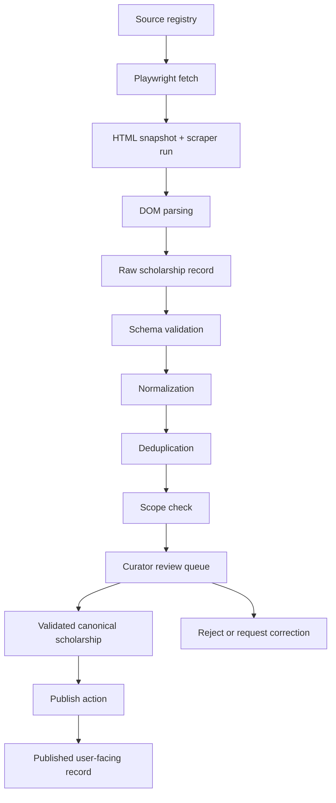
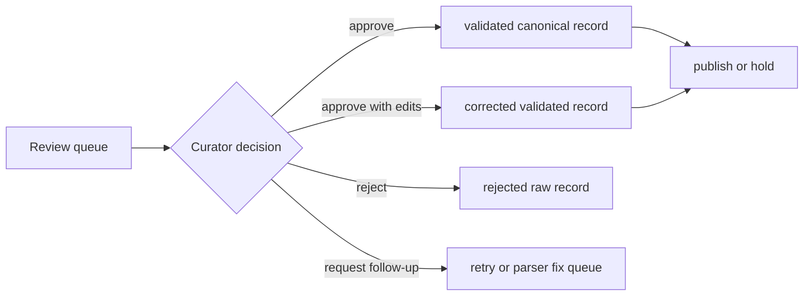

# ScholarAI Ingestion and Curation

## Document Baseline

| Item | Decision |
|---|---|
| Purpose | Define the MVP ingestion, validation, curation, and publication workflow for scholarship data |
| Governing rule | Structured validated data is the source of truth |
| Publication guardrail | Avoid automatic publication from scraped data |
| Human review rule | MVP includes protected curator review checkpoints before publication |

## Pipeline by Release Tier

| Tier | Pipeline stance |
|---|---|
| MVP | Small, strict, review-heavy pipeline with approved sources, raw evidence capture, normalization, deduplication, human review, and explicit publish control |
| Future Research Extensions | Add stronger automated assistance for validation, better reviewer tooling, and richer source onboarding metrics |
| Post-MVP Startup Features | Add partner ingestion, higher-volume workflow automation, and broader regional operations only after the MVP curation loop is stable |

## Source-of-Truth and Visibility Rules

| Rule | Decision |
|---|---|
| Trusted data | Only structured validated scholarship records are trusted for product behavior |
| Raw visibility | `raw` records are not user-visible by default |
| Publication dependency | `published` records must come only from validated records |
| Human checkpoint | A curator must approve publication or republication |
| LLM boundary | LLMs may assist summarization or operator productivity, but they cannot publish or overwrite authoritative scholarship data |

## Source Registry

### Registry purpose

| Need | Why it exists |
|---|---|
| Approved sources only | Prevent out-of-scope or low-quality scraping from entering the pipeline |
| Scope enforcement | Preserve Canada-first and `Fulbright-related USA scope` rules |
| Reliability weighting | Distinguish official sources from lower-trust source types |
| Operational control | Enable pause, retry, or deprecate behavior per source |

### MVP source registry fields

| Field | Purpose |
|---|---|
| `source_key` | Stable internal identifier |
| `display_name` | Human-readable name for reviewers |
| `base_url` | Canonical source root |
| `source_type` | `official_university`, `official_provider`, `manual_curated`, or `other` |
| `country_scope` | Geographic control field |
| `program_scope` | Program eligibility scope for the source |
| `is_official` | Reliability signal |
| `status` | `active`, `paused`, `deprecated`, or `blocked` |
| `crawl_policy` | Delay and access notes |
| `notes` | Curator onboarding notes |

### MVP source registry policy

| Source category | MVP status | Notes |
|---|---|---|
| Official Canadian university scholarship or funding pages | Allowed | Highest-priority ingestion targets |
| Official Canadian provider or funding organization pages | Allowed | Must remain within the three MS program areas |
| Fulbright official pages relevant to Canada-first use cases | Allowed under `Fulbright-related USA scope` | Must stay narrow and directly relevant |
| DAAD sources | `DAAD deferred` | Outside MVP |
| Generic global scholarship aggregators | Discouraged or blocked | Use only if there is a strong curation justification and a review plan |
| Current Chevening example source in code | Out of MVP scope | Keep as non-governing scaffold, not as an approved MVP source |

## Pipeline Stages

## State Definitions

| State | Meaning | User-visible | Allowed transition |
|---|---|---|---|
| `raw` | Parser output plus evidence and provenance | No | to `validated` only after review |
| `validated` | Canonical record approved as structurally correct and in scope | No by default | to `published` only after explicit publish action |
| `published` | Student-facing scholarship record | Yes | back to `validated` on unpublish or correction |

## Pipeline Inputs and Outputs

| Stage | Input | Output | Persistence target |
|---|---|---|---|
| Fetch | Source registry entry | HTML and fetch metadata | `html_snapshots`, `scraper_runs` |
| Parse | HTML snapshot | Extracted candidate fields | `raw_scholarship_records` |
| Validate | Raw record | Validation decision and issues | raw-record status fields |
| Normalize | Raw record | Canonical field candidates | raw-record normalized payload |
| Dedupe | Normalized raw record | duplicate or merge candidate set | raw-record dedupe fields |
| Review | Queue item | approval, rejection, or edit decision | `scholarship_review_events` |
| Canonicalize | Approved queue item | validated scholarship record | `scholarships`, `eligibility_requirements` |
| Publish | Validated scholarship record | published version | `scholarship_publications` |

## Validation Logic

### Required validation checks

| Validation category | MVP rule |
|---|---|
| Required fields | `name`, `source_url`, `country`, and enough provider or university context to identify the opportunity |
| Scope validation | Must match Canada-first rules or the narrow `Fulbright-related USA scope` exception |
| Deadline normalization | Deadline must parse into a canonical date or be explicitly marked missing |
| Degree normalization | Degree values must normalize into canonical degree levels |
| Field normalization | Field names must normalize into the controlled MVP program family |
| Provenance completeness | Source URL, fetch timestamp, source registry key, and parser version must exist |
| Rule structure | Eligibility rules must be mappable into structured `eligibility_requirements` or flagged for manual handling |
| Source consistency | Domain, provider naming, and source registry entry must align |
| Duplicate screening | Candidate must pass exact and near-duplicate checks |

### Validation status model

| Status | Meaning |
|---|---|
| `pending_validation` | Raw record created but not yet checked |
| `validation_failed` | Raw record has blocking structural or scope issues |
| `needs_review` | Machine checks passed enough to enter the curator queue |
| `review_corrected` | Curator edited key fields before approval |
| `approved_validated` | Ready to become or update a canonical scholarship record |

## Normalization Flow

| Raw input | Normalized target | Rule |
|---|---|---|
| Provider naming variants | canonical provider name | Map known aliases to one provider label |
| University naming variants | canonical university name | Prefer official institution name |
| Degree strings | `master` or other canonical enum values | Reduce free-text degree phrases into controlled values |
| Field phrases | MVP program taxonomy | Normalize into Data Science, Artificial Intelligence, or Analytics where justified |
| Deadline strings | ISO date | Preserve original raw value in payload for auditability |
| Funding text | `funding_type` plus optional amount | Separate qualitative type from parsed numeric amount |
| Requirement prose | `EligibilityRequirement` records | Break into type, operator, and value where possible |

## Deduplication Strategy

### MVP dedupe order

| Stage | Method | Action |
|---|---|---|
| Exact duplicate | Match by `source_url` | Merge into existing canonical candidate path |
| Strong duplicate | Normalized title + provider + country + deadline | Flag as likely duplicate for curator review |
| Near duplicate | Similar title and provider with overlapping field and degree scope | Queue as possible merge candidate |
| Cross-source duplicate | Official provider page and university mirror page | Prefer the more authoritative source, keep the other as provenance evidence |

### Dedupe decision rules

| Case | MVP rule |
|---|---|
| Same opportunity, same official URL | Update existing canonical record candidate |
| Same opportunity, multiple official mirrors | Keep one canonical scholarship record with attached provenance history |
| Similar but not clearly identical | Require curator decision |
| Duplicate out-of-scope record | Reject before canonicalization |

## Curator Workflow

### Review checkpoints

| Checkpoint | Human review requirement |
|---|---|
| New source onboarding | Curator confirms the source belongs in the registry |
| Raw-to-review transition | Blocking validation failures are surfaced before queue entry |
| Review decision | Curator approves, rejects, or corrects a candidate record |
| Publish decision | Curator or admin explicitly publishes a validated record |
| Unpublish decision | Curator or admin can remove a published record while preserving validated history |

### MVP curator actions

| Action | Purpose |
|---|---|
| Review | Inspect raw evidence, normalized candidate fields, and validation flags |
| Approve | Create or update the validated canonical record |
| Reject | Keep evidence without promoting it |
| Edit | Correct fields before canonicalization |
| Publish | Make a validated record user-visible |
| Unpublish | Remove user visibility without deleting audit history |
| Republish | Publish a corrected validated version after review |

## Publish and Unpublish Logic

### Publish rules

| Rule | Decision |
|---|---|
| Publish source | Only validated canonical records may be published |
| Raw bypass | Raw records cannot be published directly |
| Review requirement | Publish action requires a human checkpoint |
| Version control | Each publish event should record a publication version or timestamp |
| API visibility | Student-facing routes should default to published records only |

### Unpublish rules

| Case | Action |
|---|---|
| Source is no longer valid | Unpublish immediately and return the record to validated hold state if correction is possible |
| Deadline or rule defect found | Unpublish or temporarily hold, then revalidate before republishing |
| Duplicate discovered after publication | Unpublish duplicate and retain one canonical published record |
| Scope violation found | Unpublish and mark for rejection or archival |

## Retry and Failure Handling

| Failure point | MVP handling |
|---|---|
| Fetch timeout or access failure | Record failure in `scraper_runs`, keep retry count bounded, and do not create a canonical update |
| Parser failure | Mark raw record or run as failed, attach parser version, and route for parser fix rather than publication |
| Validation failure | Keep the record in raw state with blocking reasons |
| Dedupe ambiguity | Hold for curator review; do not auto-merge if evidence is weak |
| Curator rejection | Preserve raw evidence and decision notes for traceability |
| Publish failure | Leave the record validated but unpublished and log the publication error |

### Retry policy

| Area | MVP rule |
|---|---|
| Scraper tasks | Use bounded Celery retries with recorded error context |
| Parser version changes | Reprocess affected raw records only when parser logic meaningfully improves |
| Canonical update conflicts | Prefer manual review over blind overwrite |
| Publication retries | Retry the publish action only after the validation and review state is still confirmed |

## Privacy and Logging Boundaries

| Boundary | Rule |
|---|---|
| Scholarship-source logs | Log operational metadata, source URL, statuses, parser version, and review decisions |
| Student-document logs | Keep separate from scholarship ingestion logs |
| Sensitive content | Do not dump unnecessary student-uploaded content into operational logs |
| Raw HTML storage | Keep for debugging and evidence, but access should remain protected |
| Audit scope | Admin review, correction, publish, unpublish, and delete actions must be auditable |
| Retention posture | Retain enough raw evidence for review and reproducibility, but avoid uncontrolled long-term storage growth |

## MVP Implementation Notes for the Current Repo

| Current repo behavior | Documentation position |
|---|---|
| `ScraperService` currently writes directly into `Scholarship` rows. | Treat this as interim scaffold behavior that should be replaced by raw-record ingestion before trustworthy publication. |
| `admin` routes can directly create, patch, and delete scholarships. | Use them as the basis for the protected curator workflow, but add review-state and publication-state controls. |
| `scraper_runs` and `html_snapshots` already exist. | Keep them as the operational evidence spine of the pipeline. |
| `Scholarship.is_active` is the visible flag today. | It is not sufficient by itself; publication should be controlled through validated-to-published rules and explicit publication metadata. |

## Pipeline Acceptance Checklist

| Check | Pass condition |
|---|---|
| Source control | Every ingested source exists in the source registry |
| Provenance completeness | Every candidate record has required fetch and parser metadata |
| Raw isolation | Raw records are not user-visible |
| Review checkpoint | Human review occurs before publication |
| Publication boundary | Only validated records can be published |
| Scope discipline | Canada-first and `Fulbright-related USA scope` rules are enforced |
| Failure safety | Scrape or parser failures cannot silently create published data |

## MVP Decision

The MVP ingestion and curation pipeline should prioritize a small number of approved sources, store raw evidence separately, normalize and validate before trust is assigned, require human review before publication, and prevent automatic publication from scraped data.

## Deferred Items

- Automatic low-touch publication from scraper output.
- Broad aggregator ingestion as a default MVP strategy.
- DAAD ingestion and other out-of-scope regional pipelines.
- Fully automated dedupe and merge decisions without curator checkpoints.

## Assumptions

- A lightweight admin review queue is sufficient for MVP as long as it supports approve, reject, edit, publish, unpublish, and republish actions.
- The current `scraper_runs` and `html_snapshots` tables can remain part of the final MVP pipeline with additional raw-record and publication tables around them.
- The team can keep source onboarding intentionally narrow enough for manual review to stay tractable.

## Risks

- If the team keeps direct scraper-to-canonical upserts, the documented curation boundary will remain weaker than required for reliable publication.
- If the source registry is not enforced, out-of-scope or low-quality sources can leak into the pipeline.
- If publish and unpublish controls remain too coarse, the platform can expose invalid scholarship data or make rollback harder than it should be.
