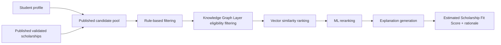

# ScholarAI Recommendation and ML

## Document Baseline

| Item | Decision |
|---|---|
| Purpose | Define the hybrid recommendation pipeline, ML framing, evaluation plan, and research-safe limitations |
| Governing output language | `Estimated Scholarship Fit Score` |
| Source-of-truth rule | Only structured validated scholarship data may drive eligibility and ranking inputs |
| Publication boundary | Student-facing recommendation candidates should come from published scholarship records by default |
| Core research constraint | Do not present model output as real-world scholarship acceptance probability unless real labels exist |

## Section Flow and Dependency Order

| Order | Section | Why it comes first |
|---|---|---|
| 1 | Trusted inputs and candidate pool | Ranking quality depends on validated and published scholarship data, not raw scraped data |
| 2 | Hybrid recommendation pipeline | Establishes the stage order before discussing models or explanations |
| 3 | ML scoring design | Depends on the filtered candidate set and canonical feature schema |
| 4 | Evaluation and labeling strategy | Depends on the defined task and output framing |
| 5 | Hybrid-vs-baseline comparison and limitations | Depends on both pipeline and evaluation definitions |

## Recommendation Scope by Release Tier

| Tier | Recommendation stance |
|---|---|
| MVP | Use a hybrid pipeline that combines rule-based filtering, Knowledge Graph Layer eligibility filtering, vector similarity, and an ML reranker to produce an `Estimated Scholarship Fit Score` |
| Future Research Extensions | Improve graph reasoning, feature richness, relevance-label quality, and explanation depth once the core pipeline is stable |
| Post-MVP Startup Features | Add online personalization, experimentation, and broader regional ranking only after the Canada-first corpus and evaluation design mature |

## Trusted Inputs and Candidate Pool

| Input type | MVP policy |
|---|---|
| Scholarship candidate set | Default to published scholarship records only |
| Canonical scholarship fields | Read from validated canonical records |
| Eligibility rules | Read from validated `eligibility_requirements` only |
| Raw records | Excluded from runtime ranking and explanation logic |
| Student features | Read from `student_profiles`, with student-controlled updates |

## Recommendation Pipeline Overview



## Stage 0: Candidate Pool Rule

| Rule | Decision |
|---|---|
| Default visibility set | Only `published` scholarship records enter the student-facing recommendation pipeline |
| Emergency fallback | If publication metadata is not fully implemented yet, the interim equivalent is active canonical scholarship rows, but this is weaker than the target model |
| Out-of-scope records | Exclude records outside Canada-first scope except `Fulbright-related USA scope` |

## Stage 1: Rule-Based Filtering

### Purpose

| Goal | Why it matters |
|---|---|
| Remove obviously ineligible scholarships early | Reduces wasted ranking work and improves trust |
| Keep filters deterministic and explainable | Supports a 3-developer MVP and clear student feedback |

### MVP rule set

| Rule category | Input | MVP behavior |
|---|---|---|
| Publication state | publication metadata or interim visibility flag | Exclude non-published records |
| Geography | scholarship `country`, source scope | Keep Canada-first and narrow `Fulbright-related USA scope` only |
| Degree compatibility | `student_profiles.degree_level`, `scholarships.degree_levels` | Exclude incompatible degree levels |
| GPA threshold | `student_profiles.gpa`, `scholarships.min_gpa` | Exclude candidates clearly below threshold |
| Field compatibility | `student_profiles.field_of_study`, `scholarships.field_of_study` | Keep compatible or plausibly compatible field matches |
| Deadline state | normalized scholarship deadline | Optionally down-rank or exclude expired opportunities |

### Current repo grounding

| Current implementation | Documentation position |
|---|---|
| `RecommendationService._retrieve_candidates()` currently filters by `is_active`, GPA, and degree level. | Treat this as the first working slice of Stage 1, not the full target rule filter. |
| Field and country logic currently appears later as a heuristic boost. | Move those checks earlier when the curation and publication model is fully in place. |

## Stage 2: Knowledge Graph Layer Eligibility Filtering

### Role in the pipeline

| Item | Decision |
|---|---|
| Purpose | Apply hard eligibility reasoning over validated scholarship rules and student attributes |
| Input data | Validated canonical scholarships, validated eligibility requirements, and student profile fields |
| MVP implementation | Prefer a relationally derived Knowledge Graph Layer over a mandatory standalone graph database |
| Output | Reduced candidate set plus explanation-friendly eligibility signals |

### Eligibility entities

| Entity | Examples |
|---|---|
| Student attributes | citizenship, target country, degree level, field of study, GPA, language test |
| Scholarship rules | citizenship requirement, degree requirement, field requirement, GPA minimum, language condition |

### Stage-2 runtime policy

| Case | MVP behavior |
|---|---|
| Hard mismatch | Exclude candidate before similarity ranking |
| Soft or incomplete rule | Keep candidate and mark rule uncertainty for later explanation |
| Graph layer unavailable | Fall back to deterministic relational rule evaluation instead of failing closed |

## Stage 3: Vector Similarity Ranking

### Purpose

| Goal | Decision |
|---|---|
| Capture soft semantic fit | Compare student profile text and scholarship text embeddings |
| Cost control | Use one shared embedding model and cache embeddings in PostgreSQL-backed fields |
| MVP model choice | `sentence-transformers/all-MiniLM-L6-v2` with 384-dimensional vectors |

### Vector inputs

| Vector | Source |
|---|---|
| Student profile embedding | derived from field, degree, university, research, activities, and optional narrative text |
| Scholarship embedding | derived from validated scholarship name, description, field, and country context |

### Ranking rule

| Step | Behavior |
|---|---|
| Candidate embedding retrieval | Reuse cached vectors when available |
| Missing vector handling | Compute on demand and cache if cost and latency allow |
| Similarity measure | Cosine similarity |
| Candidate reduction | Keep a bounded top-N set for ML reranking |

## Stage 4: ML Scoring

### Output framing

| Rule | Decision |
|---|---|
| Student-facing label | `Estimated Scholarship Fit Score` |
| Disallowed claim | Do not call the output scholarship acceptance probability without real outcome labels |
| Current repo note | The field name `success_probability` exists in code and schema, but the documentation standard does not treat it as a real acceptance probability claim |

### Feature plan

| Feature family | Example features |
|---|---|
| Academic | normalized GPA, GPA gap, degree match |
| Research and activity | publications, research months, leadership roles, volunteer hours |
| Language | language test presence and score |
| Matching features | field match, target-country match, vector similarity |
| Scholarship properties | funding type, funding amount bucket, deadline proximity, requirement density |

### Model plan

| Model | MVP status | Why |
|---|---|---|
| Heuristic reranker | Required fallback | Cheap, deterministic, and safe when trained model is unavailable |
| Gradient-boosted tree model | MVP candidate | Strong fit for small tabular feature sets and explanation support |
| Random forest | MVP baseline | Useful comparison for small tabular data |
| Neural ranking model | Deferred | Too heavy for current data and team constraints |

### Fusion rule

| Signal | MVP role |
|---|---|
| Rule-based filter result | Hard gate |
| Knowledge Graph Layer eligibility result | Hard gate plus explanation signal |
| Vector similarity | Soft relevance score |
| ML reranker | Tabular fit score |
| Rule-based boost | Small deterministic nudge for country and field alignment |

### Fusion equation

```text
Estimated Scholarship Fit Score
= eligibility gate
  -> weighted combination of vector similarity, ML score, and deterministic boosts
```

The exact weights may evolve, but the score remains a ranking-oriented fit estimate rather than an acceptance forecast.

## Explanation Generation Strategy

| Explanation layer | MVP behavior |
|---|---|
| Rule-based rationale | Show why a scholarship passed or failed obvious eligibility checks |
| Knowledge Graph Layer rationale | Show key matched or blocking eligibility entities |
| Vector rationale | Summarize the strongest semantic alignment areas |
| ML rationale | Use feature-contribution output when available |
| Fallback rationale | If model explanations are unavailable, use deterministic feature summaries instead of opaque output |

## Hybrid-vs-Baseline Comparison

| System | Description | Expected use |
|---|---|---|
| Baseline A | Rule-based filtering only | Minimum deterministic benchmark |
| Baseline B | Vector-only ranking after deterministic filtering | Measures semantic retrieval value |
| Baseline C | ML-only reranker on candidate set | Measures tabular signal value |
| Hybrid D | Rule-based + vector similarity | Lower-complexity hybrid baseline |
| Hybrid E | Rule-based + Knowledge Graph Layer + vector similarity + ML score | Target MVP system |

### Comparison goals

| Question | Why it matters |
|---|---|
| Does the hybrid pipeline improve top-K relevance over simpler baselines? | Validates the added complexity |
| Does the Knowledge Graph Layer reduce obviously invalid recommendations? | Tests trust and correctness benefits |
| Does ML reranking add value beyond vector similarity alone? | Justifies the trained model layer |

## Relevance-Labeling Strategy for Evaluation

### Labeling rule

| Label type | MVP decision |
|---|---|
| Real acceptance labels | Not assumed available |
| Evaluation target | Relevance or fit labels, not real scholarship outcomes |
| Label source | Curator review plus heuristic label generation over validated scholarship rules and student profiles |

### Recommended label scale

| Label | Meaning |
|---|---|
| `0` | Ineligible or clearly irrelevant |
| `1` | Technically eligible but weak fit |
| `2` | Plausible fit |
| `3` | Strong fit within the MVP scope |

### Labeling inputs

| Input | Use |
|---|---|
| Validated eligibility rules | Determine hard exclusions |
| Student profile compatibility | Determine degree, field, and country fit |
| Curator judgment | Resolve ambiguous cases and near-duplicate opportunities |
| Published canonical scholarship text | Provide semantic context for fit grading |

## Synthetic Data Plan

### Why synthetic data is needed

| Constraint | Effect |
|---|---|
| No guaranteed real scholarship outcome labels | Blocks any defensible acceptance-probability claim |
| Limited team capacity and timeline | Requires a bootstrap training approach for the reranker |

### MVP synthetic-data approach

| Step | Decision |
|---|---|
| Base records | Use validated scholarship records as the scholarship-side anchor |
| Student generation | Generate synthetic student profiles within Canada-first program scope |
| Label generation | Assign heuristic fit labels using validated rules and controlled rubric logic |
| Versioning | Record generator version, rule set version, and random seed |
| Disclosure | Mark all model results trained on synthetic labels as synthetic-label-based |

### Synthetic-data guardrails

| Guardrail | Decision |
|---|---|
| Scope discipline | Generate only profiles relevant to the three MVP MS program areas |
| Heuristic transparency | Keep label rules documented and reproducible |
| Bias warning | Treat synthetic labels as a convenience for model training, not as ground truth about scholarship success |

## Model Comparison Plan

| Comparison area | MVP plan |
|---|---|
| Tabular models | Compare gradient-boosted tree and random forest models |
| Ranking baselines | Compare vector-only, rule-only, and hybrid approaches |
| Explanation modes | Compare deterministic feature summaries with model-driven contribution outputs |
| Cost/latency behavior | Compare hybrid pipeline with and without optional model or graph stages enabled |

## Evaluation Metrics

### Ranking metrics

| Metric | Why it is included |
|---|---|
| Precision@K | Measures how many top-ranked items are relevant |
| Recall@K | Measures how much relevant opportunity coverage the top-K results achieve |
| NDCG@K | Rewards correct ordering, not just inclusion |
| MAP@K | Useful if graded or binary relevance labels are available |

### Classification or grading metrics

| Metric | Why it is included |
|---|---|
| Macro F1 | Useful for graded relevance labels |
| Accuracy | Only as a secondary metric for heuristic-label tasks |
| Confusion matrix review | Helps inspect over- or under-recommendation patterns |

### Operational metrics

| Metric | Why it matters |
|---|---|
| Candidate set size after each stage | Helps justify pipeline complexity |
| Recommendation latency | Important for MVP usability and low-ops deployment |
| Embedding cache hit rate | Helps control runtime cost |
| Recommendation coverage across published scholarships | Ensures the system is not collapsing to a narrow subset |

## Limitations and Threats to Validity

| Risk | Impact |
|---|---|
| Synthetic labels may reflect heuristic bias rather than real outcomes | Limits external validity |
| Published scholarship data may still be sparse early in MVP | Restricts evaluation depth |
| Graph eligibility rules may be incomplete for some scholarships | Causes false positives or false negatives |
| Vector similarity can overvalue narrative similarity over true rule compliance | Requires strong hard filtering before ranking |
| Current repo fields still use terms like `success_probability` | Risks misleading product framing if UI copy is not corrected |

## Current Repo Alignment and Required Corrections

| Current implementation | Documentation position |
|---|---|
| `RecommendationService` currently combines deterministic filters, vector similarity, heuristic or model score, and explanation fields. | Use this as the current runtime anchor. |
| The service currently documents XGBoost probability and stores `success_probability`. | Keep the implementation note, but the product and documentation must present it as a fit-oriented model score until real labels exist. |
| Training artifacts in `ai_services/training/recommendation.py` still expose `success_probability` logic. | Treat this as legacy naming that should not drive user-facing claims. |

## MVP Decision

The MVP recommendation system should use published validated scholarship data, deterministic eligibility filtering, a logically mandatory Knowledge Graph Layer, vector similarity, and a budget-aware ML reranker to produce an `Estimated Scholarship Fit Score` rather than a real-world acceptance prediction.

## Deferred Items

- Real acceptance-probability claims without valid real outcome labels.
- Heavy neural ranking models or online personalization loops.
- Broad out-of-scope ranking outside Canada-first and `Fulbright-related USA scope`.
- Stronger causal or predictive claims that the data cannot support.

## Assumptions

- Published scholarship records will be the default recommendation candidate pool once publication metadata is implemented.
- A relationally derived Knowledge Graph Layer is sufficient for the first release.
- Synthetic relevance labels are acceptable for early reranker experiments as long as they are disclosed clearly.

## Risks

- If raw or unvalidated records enter the recommendation pipeline, ranking trust will degrade quickly.
- If UI or API layers present the reranker score as acceptance probability, the product will overclaim what the data supports.
- If evaluation relies too heavily on synthetic labels without human review checkpoints, model-selection conclusions may be misleading.
