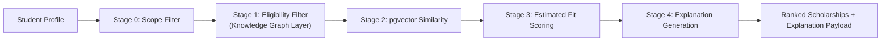

# ScholarAI Recommendation And ML

## Purpose
This document defines the ScholarAI recommendation pipeline, the role of machine learning in MVP, the evaluation plan for ranking quality, and the limitations introduced by constrained data. The design is implementation-ready but remains conservative about claims: ScholarAI estimates fit and competitiveness, it does not claim to predict real scholarship acceptance without true outcome labels.

## Recommendation Principles
1. Apply validated hard constraints before any similarity or scoring step.
2. Keep recommendation inputs grounded in structured validated data.
3. Treat machine learning as an estimation layer, not as policy authority.
4. Provide a simpler baseline path so the product remains shippable if ML maturity lags.
5. Keep explanation generation aligned with the actual ranking features shown to users.

## Recommendation Pipeline Overview
| Stage | Purpose | Input authority | MVP status |
|---|---|---|---|
| Stage 0 | Search and scope filtering | Validated scholarship records | MVP |
| Stage 1 | Knowledge-graph eligibility filtering | Structured validated rules | MVP |
| Stage 2 | Vector similarity ranking | Structured records plus embeddings | MVP |
| Stage 3 | ML scoring and reranking | Estimated features derived from stage 1 and 2 outputs | MVP, with fallback |
| Stage 4 | Explanation generation | Ranking features and validated rule context | MVP |

## Mermaid Recommendation Pipeline

## Stage Details
### Stage 0: validated rule-based filtering
This stage limits the candidate pool to scholarships that are:
- in the MVP geographic scope
- compatible with `MS` degree level
- aligned to the target fields of Data Science, Artificial Intelligence, or Analytics
- in `published` state

### Stage 1: Knowledge Graph Layer eligibility filtering
This stage applies hard constraints derived from `scholarship_requirements`, including:
- citizenship rules
- degree-level constraints
- field-of-study constraints
- minimum GPA requirements where explicit
- language requirements where explicit

The output is a candidate set that is eligible or plausibly eligible according to structured rules. If a hard rule is missing or ambiguous, the scholarship is not automatically disqualified unless the source clearly encodes it as mandatory.

### Stage 2: vector similarity ranking
Stage 2 ranks eligible candidates using semantic similarity between:
- structured scholarship text fields
- normalized program and requirement summaries
- structured student profile text representation

This stage improves retrieval quality among already valid candidates. It does not override hard constraint failures.

### Stage 3: ML scoring
Stage 3 estimates a relative fit score for ranking. It is designed to improve prioritization, not to make factual claims about scholarship outcomes. The score displayed to users should be called:
- `Estimated Scholarship Fit Score`

The system may compute an internal `Application Competitiveness Score` for experiments, but it should not replace the main user-facing score unless its behavior is well-understood and documented.

### Stage 4: explanation generation
This stage turns the most important ranking features and matched constraints into user-facing explanation components:
- matched profile strengths
- unmet or unclear requirement warnings
- field and program alignment
- confidence caveats when data is sparse

## Hybrid Versus Simpler Baselines
| Baseline / Model | Components | Purpose |
|---|---|---|
| Baseline A | Stage 0 only | Scope-controlled listing baseline |
| Baseline B | Stage 0 + Stage 1 | Rules-only eligibility baseline |
| Baseline C | Stage 0 + Stage 1 + Stage 2 | Retrieval-first baseline |
| Baseline D | Stage 0 + Stage 1 + Stage 2 + heuristic rerank | Low-risk product fallback |
| Model E | Stage 0 + Stage 1 + Stage 2 + ML rerank | Full MVP target pipeline |

The product can ship with Baseline D if Model E is not stable enough within the 16-week timeline. This keeps the MVP useful without overcommitting to immature ML behavior.

## Feature Definitions
| Feature | Type | Source | Notes |
|---|---|---|---|
| `gpa_normalized` | Numeric | `student_profiles` | GPA normalized against scale |
| `field_alignment_score` | Numeric | `student_profiles` + `programs` | Derived from target field and program links |
| `degree_match_flag` | Binary | `student_profiles` + `scholarships` | Hard scope alignment |
| `country_match_flag` | Binary | `student_profiles` + `scholarships` | Target geography alignment |
| `language_requirement_gap` | Numeric | profile + requirements | Difference between requirement and supplied score |
| `research_experience_level` | Ordinal | `student_profiles` | Structured self-reported level |
| `leadership_experience_level` | Ordinal | `student_profiles` | Structured self-reported level |
| `volunteer_experience_level` | Ordinal | `student_profiles` | Structured self-reported level |
| `semantic_similarity_score` | Numeric | embeddings | Stage 2 output |
| `hard_constraint_pass_count` | Integer | requirement evaluation | Count of explicit hard matches |
| `hard_constraint_missing_count` | Integer | requirement evaluation | Unclear or missing rule count |
| `deadline_urgency_score` | Numeric | scholarship deadline | Planning value, not fit value |

## Relevance-Labeling Strategy
### Training and offline evaluation inputs
| Label source | Use | Risk |
|---|---|---|
| Synthetic heuristic labels | Initial training and pipeline debugging | Encodes hand-designed bias |
| Curator-reviewed relevance judgments | Small-scale evaluation set | Expensive but higher quality |
| User interaction signals | Future refinement only | Noisy and delayed |

### Manual relevance judgments
For offline evaluation, build a small judged set where curators label candidate scholarships for representative student profiles as:
- `strong fit`
- `possible fit`
- `weak fit`
- `ineligible`

These judgments are used for comparison between baselines and for ranking evaluation, not as a claim of real-world outcome truth.

## Synthetic Data Generation Logic
### Purpose
Synthetic data exists to bootstrap the reranker, support pipeline tests, and enable controlled ablation studies before real outcome labels exist.

### Generation logic
1. Sample student profile attributes within realistic ranges.
2. Combine those attributes with validated scholarship requirements.
3. Apply a transparent heuristic to generate pseudo-labels.
4. Version the generator, seed, and generated dataset.

### Example feature distributions
| Feature | Example distribution |
|---|---|
| GPA | Normal distribution clipped to valid academic range |
| English score | Distribution conditioned on test type when present |
| Research / leadership / volunteering | Low-cardinality ordinal distributions |
| Semantic similarity | Derived from actual embedding comparisons, not synthetic constants |

## Label Strategy
### MVP label framing
- Use ordinal or banded fit labels such as `high`, `medium`, `low`.
- Convert those labels to a normalized ranking score for model training.
- Do not train or display a "probability of winning scholarship" label unless real outcome labels exist.

### Future label evolution
- Add voluntary post-application outcome reporting.
- Separate fit estimation from application competitiveness once enough data exists.

## Model Comparison Plan
| Model family | Why include |
|---|---|
| Rules-only baseline | Shows value of structure without ML |
| Rules + vector baseline | Shows value of semantic retrieval |
| Logistic regression / linear baseline | Provides a simple interpretable reranker |
| Gradient-boosted trees | Strong candidate for tabular feature interactions |

Deep learning is not a default MVP priority because the expected labeled data volume is low and explanation discipline matters more than model complexity.

## Calibration Discussion
If the reranker produces a score that looks probability-like, apply calibration only to stabilize the internal score distribution for ranking consistency. Do not present calibrated outputs as real-world acceptance probabilities. Preferred user-facing behavior:
- show ranked scores or percentile-like bands
- show confidence caveats when data is sparse
- avoid unsupported probability language

## Evaluation Metrics
| Metric | Use |
|---|---|
| Precision@K | Are top results relevant? |
| Recall@K | Are eligible opportunities being surfaced? |
| NDCG@K | Are better opportunities ranked higher? |
| MRR | How quickly does the first strong result appear? |
| Coverage | How much of the published corpus can be surfaced meaningfully? |
| Constraint violation rate | Do ineligible scholarships slip through? |
| Explanation consistency | Do explanations remain stable for similar inputs? |

No hard target thresholds are locked yet because they depend on judged-set quality, corpus size, and label availability.

## Ablation Study Plan
| Ablation | Question |
|---|---|
| Remove Stage 1 | How much do hard constraints improve ranking reliability? |
| Remove Stage 2 | How much does semantic retrieval improve prioritization? |
| Replace ML reranker with heuristic rerank | Does ML add value beyond structured scoring? |
| Remove explanation layer | How much explanation affects user trust and actionability? |

## User-Facing Score Presentation
To stay aligned with the product and design docs, the recommendation UI should show:
- score label: `Estimated Scholarship Fit Score`
- short rationale: 2 to 4 structured factors
- warnings: unmet or ambiguous requirements
- provenance hint: last validated date and source link

The UI should not show hidden model jargon or unsupported certainty.

## Limitations
1. Real scholarship outcome labels are absent in MVP, so any ML training signal is provisional.
2. A narrow Canada-first corpus improves reliability but reduces breadth.
3. Requirement ambiguity can distort labels and evaluation judgments.
4. User profile quality affects ranking usefulness more than model complexity alone.
5. Synthetic labels are useful for bootstrapping but can also encode the system designer's assumptions.

## MVP
- Stage 0 to Stage 4 pipeline with rules, graph-aware filtering, vector retrieval, estimated fit scoring, and explanation output.
- Ship a heuristic fallback if the ML reranker is not stable enough.

## Future Research Extensions
- Compare relational graph abstraction against a narrowly scoped Neo4j implementation.
- Collect richer judged sets and voluntary outcomes for stronger evaluation.
- Explore separate competitiveness modeling once true labels exist.

## Post-MVP Startup Features
- Personalization from longitudinal user behavior.
- Provider-specific ranking objectives.
- Recommendation optimization for conversion and application tracking workflows.

## MVP decision
ScholarAI MVP will use a hybrid recommendation pipeline that prioritizes validated eligibility rules first, semantic retrieval second, and estimated fit scoring third, with all outputs framed as non-causal estimates rather than scholarship acceptance predictions.

## Deferred items
- Outcome-based acceptance prediction.
- Deep-learning recommendation models.
- Broad personalization using large-scale behavioral data.

## Assumptions
- A judged relevance set can be assembled from curator review and representative student profiles.
- The heuristic fallback pipeline remains product-valuable if ML quality is not yet sufficient.
- A 384-dimension embedding model is adequate for MVP semantic retrieval.

## Risks
- Synthetic labels can overfit to the heuristics used to generate them.
- Sparse or inconsistent requirement data can hurt both filtering and ranking.
- Users may interpret a high score as an admission guarantee unless the UX remains disciplined.
