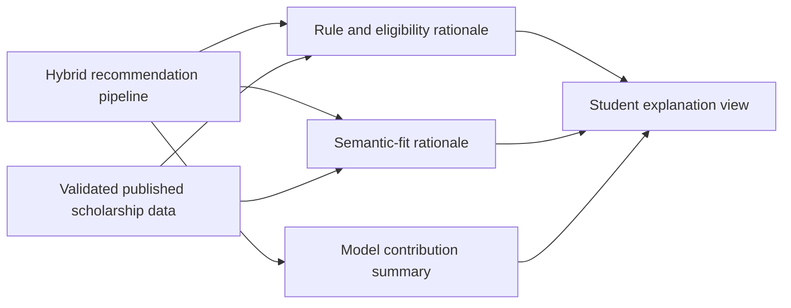
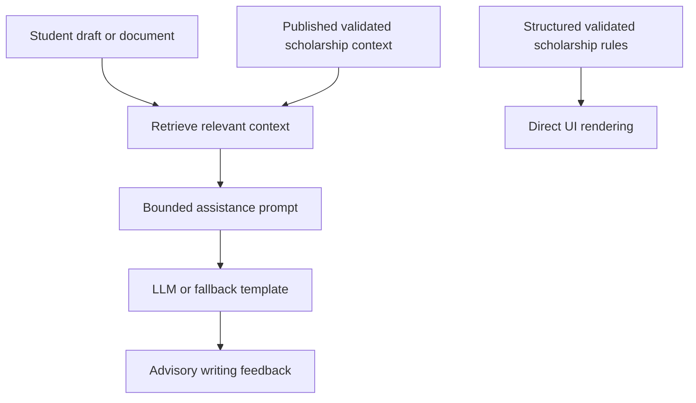
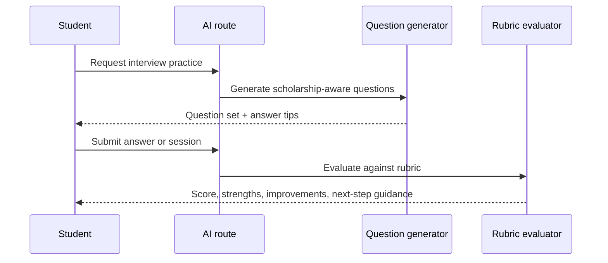

# ScholarAI XAI, RAG, and Interview

## Document Baseline

| Item | Decision |
|---|---|
| Purpose | Define explanation strategy, document-assistance boundaries, interview simulation design, and runtime AI guardrails |
| Explanation posture | Explanations must reflect the recommendation pipeline, not invent hidden reasoning |
| RAG boundary | RAG is limited to document assistance and cannot become the authority for scholarship rules |
| Interview posture | Interview scoring is rubric-based readiness feedback, not a prediction of real scholarship outcomes |
| Runtime posture | Keep LLM usage budget-aware, optional where possible, and fallback-safe |

## Section Flow and Dependency Order

| Order | Section | Dependency |
|---|---|---|
| 1 | Explanation strategy | Depends on the hybrid recommendation pipeline in `08_recommendation_and_ml.md` |
| 2 | RAG boundary and architecture | Depends on validated scholarship data and document scope rules |
| 3 | Interview simulation | Depends on scholarship context, student profile context, and AI runtime guardrails |
| 4 | Cost, fallback, and validity limits | Depends on all AI-assisted features above |

## AI Scope by Release Tier

| Tier | AI stance |
|---|---|
| MVP | Explanations for recommendation output, document-assistance-only AI for SOP feedback, and rubric-based interview simulation with fallback-safe runtime behavior |
| Future Research Extensions | Stronger explanation studies, broader document-assistance coverage, richer retrieval corpora, voice interview support, and more formal evaluator comparison |
| Post-MVP Startup Features | Higher-touch collaboration workflows, advanced evaluation instrumentation, and larger-scale AI orchestration if usage justifies cost |

## Explainability Strategy

### Explanation goals

| Goal | Why it matters |
|---|---|
| Show why a scholarship appears in the ranking | Increases trust and supports student action |
| Separate hard-rule reasoning from soft relevance reasoning | Prevents students from confusing eligibility with narrative similarity |
| Stay grounded in validated data | Avoids explanations that cite untrusted or unpublished records |

### Explanation layers

| Layer | MVP behavior |
|---|---|
| Eligibility explanation | Show which hard requirements were satisfied or blocked |
| Knowledge Graph Layer explanation | Show the main matched entities or rule paths used in filtering |
| Vector explanation | Summarize which profile and scholarship themes aligned semantically |
| ML contribution explanation | Show feature-contribution summaries when the reranker is active |
| Confidence and limits | State clearly when the system is ranking fit rather than predicting outcomes |

### Explanation architecture

### Explanation methods

| Method | MVP role | Notes |
|---|---|---|
| Deterministic rule explanation | Required | Lowest-cost and most trustworthy explanation layer |
| Lightweight feature contribution summary | Required fallback | Already consistent with current `RecommendationService` logic |
| SHAP | MVP candidate when a tree model is active | Use if the reranker is actually loaded and explanation cost is acceptable |
| LIME | Future Research Extensions | Useful as a secondary comparison, not required for MVP runtime |

### Student-facing explanation content

| Section | Example content |
|---|---|
| Why this matches | field alignment, degree alignment, target-country match |
| Eligibility checks | passed GPA threshold, passed degree rule, pending unclear language rule |
| Ranking signals | semantic profile similarity, funding or timing relevance, profile-strength signals |
| Limits | score reflects fit, not guaranteed scholarship success |

## RAG Boundary and Document Assistance Scope

### Hard boundary

| Rule | Decision |
|---|---|
| Allowed use | SOP feedback grounded in scholarship context |
| Disallowed use | Acting as the authority for scholarship rules, deadlines, or official eligibility |
| Scholarship-rule authority | Always remains the validated scholarship record, not the generated response |
| Raw data usage | Never retrieve from raw scraped records |

### MVP RAG scope

| Area | MVP use |
|---|---|
| SOP improvement | Ground suggestions in the student's draft, scholarship context, and validated scholarship description |
| Scholarship Q&A about rules | Do not delegate authoritative answers to RAG; instead surface validated scholarship fields directly |

### Retrieval corpus policy

| Retrieval source | MVP policy |
|---|---|
| Student-uploaded documents | Allowed for document assistance |
| Published scholarship descriptions | Allowed as context for fit and writing alignment |
| Validated scholarship requirements | Allowed as reference context, but UI should still render the structured rule directly |
| Raw records and raw HTML | Not allowed in RAG retrieval |
| Generic unverified web content | Not allowed in the MVP document-assistance path |

### MVP document-assistance architecture

### Current repo grounding

| Current implementation | Documentation position |
|---|---|
| `SopService` currently prompts an LLM directly using student profile and scholarship data. | Treat this as the first working document-assistance slice. |
| A dedicated RAG route or retrieval service is not present in the mounted API surface. | Document MVP RAG as a bounded retrieval pattern for document assistance, not as a broad chat or rules engine. |

## Runtime AI Cost and Fallback Guardrails

### Cost-control rules

| Guardrail | MVP decision |
|---|---|
| On-demand invocation | Run LLM assistance only when a student explicitly requests it |
| Model choice | Prefer the smallest adequate model already configured in the repo, such as `gpt-4o-mini` |
| Context limits | Use bounded document excerpts and scholarship context instead of full corpora |
| Caching | Cache deterministic retrieval results and reusable embeddings where helpful |
| Async offload | Route heavy or long-running generation through Celery when latency becomes disruptive |
| Budget posture | Keep the product functional even if LLM volume is reduced or temporarily disabled |

### Fallback rules

| Failure case | MVP fallback |
|---|---|
| LLM unavailable | Return deterministic writing checklist or rubric-based guidance |
| Retrieval missing | Fall back to scholarship detail fields and generic structure guidance, not fabricated context |
| Token budget exceeded | Trim context to highest-priority sections and return partial guidance |
| Cost cap reached | Disable optional generation features before affecting the core recommendation path |

## Interview Simulation Design

### Interview scope

| Item | Decision |
|---|---|
| MVP input mode | Text-first interview practice |
| Scholarship context | Use published scholarship context when available |
| Student context | Use student profile to tailor questions and feedback |
| Output framing | Readiness and improvement feedback, not scholarship-outcome prediction |

### Interview pipeline

### Question-generation strategy

| Category | Purpose |
|---|---|
| Motivation | Why the scholarship and field matter to the student |
| Research | Depth and relevance of academic preparation |
| Leadership | Evidence of initiative and responsibility |
| Cultural fit | Alignment with scholarship mission or community values |
| Career vision | Clear long-term direction |
| Personal reflection | Self-awareness and maturity |

### Rubric-based scoring

| Criterion | Description | MVP scale |
|---|---|---|
| Relevance | Does the answer address the question directly? | 1-5 |
| Clarity | Is the answer understandable and well-structured? | 1-5 |
| Evidence | Does the student support claims with examples? | 1-5 |
| Scholarship alignment | Does the answer connect to the scholarship context appropriately? | 1-5 |
| Reflection | Does the answer show judgment and self-awareness? | 1-5 |
| Communication discipline | Is the answer concise and coherent? | 1-5 |

### Session outputs

| Output | MVP behavior |
|---|---|
| Per-answer feedback | strengths, improvements, and a sample stronger answer |
| Session summary | overall readiness band plus top strengths and critical improvements |
| Rubric trace | criterion-level scores retained for feedback consistency |

### Runtime guardrails for interview AI

| Guardrail | Decision |
|---|---|
| Primary dependency | LLM-based evaluation is optional support, not a hard dependency for the rest of the product |
| Fallback mode | Use deterministic rubric templates and static coaching prompts if the LLM is unavailable |
| Voice support | Defer to Future Research Extensions even though config hooks exist |
| Safety limit | Avoid overconfident language such as "you will succeed" or "you will fail" |

## Explainability and AI Limitations

| Limitation | Impact |
|---|---|
| Feature contributions are only as good as the model and feature set | Can mislead if presented as deeper truth than they are |
| RAG responses may still sound authoritative even when intended as advisory | Requires UI copy and product boundaries to stay explicit |
| Interview feedback is subjective and model-mediated | It cannot replace a real interviewer or mentor |
| Current runtime uses direct LLM calls in services | Cost and latency need stronger control as usage grows |

## Threats to Validity

| Threat | Why it matters |
|---|---|
| Explanation faithfulness | Fallback explanations may reflect heuristics instead of exact model internals |
| Retrieval quality | Weak retrieval corpora can reduce document-assistance usefulness |
| Evaluation subjectivity | Interview-scoring agreement with human reviewers is not guaranteed |
| Data boundary drift | If raw or unvalidated scholarship data leaks into prompts, trust and reproducibility degrade |

## Current Repo Alignment and Required Corrections

| Current implementation | Documentation position |
|---|---|
| `SopService` and `InterviewService` already use one configured OpenAI model. | Keep this as the current runtime baseline. |
| Interview feedback currently returns a single score and lists of strengths and improvements. | Frame this as rubric-based readiness feedback, not predictive assessment. |
| The mounted API currently exposes SOP and interview routes but not a dedicated general-purpose RAG endpoint. | Keep RAG bounded to document assistance instead of inventing a broader runtime surface. |

## MVP Decision

The MVP should provide grounded recommendation explanations, document-assistance-only AI for student writing, and rubric-based interview practice with clear limits, low-cost runtime defaults, and safe fallbacks when LLM services are unavailable or too expensive.

## Deferred Items

- Broad RAG chat about scholarship rules or platform policy.
- Voice-first interview simulation as a required MVP dependency.
- LIME-backed runtime explanation as a mandatory production feature.
- High-cost multi-model orchestration without a demonstrated need.

## Assumptions

- The existing `gpt-4o-mini`-style runtime is the budget-aware default unless the team explicitly changes providers.
- Direct rendering of structured scholarship rules in the UI will coexist with advisory document assistance.
- Deterministic fallback guidance is acceptable when LLM services are unavailable.

## Risks

- If document assistance starts answering scholarship-rule questions as if it were authoritative, the trust model will break.
- If runtime LLM costs are not capped, optional AI features can become disproportionately expensive relative to MVP value.
- If interview feedback is presented as objective or predictive, the product will overstate what the system can justify.
