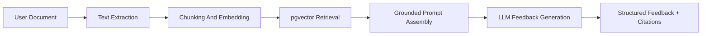

# ScholarAI XAI, RAG, And Interview

## Purpose
This document defines the explainability layer, bounded RAG workflows, and interview-practice subsystem for ScholarAI. It keeps user-facing AI assistance aligned with the product's trust model: validated scholarship facts remain authoritative, while generated outputs remain advisory.

## Explainability Layer
### Goals
1. Make recommendation outputs understandable enough to support user action.
2. Show why a scholarship was ranked highly or flagged cautiously.
3. Keep explanations consistent with actual scoring inputs.
4. Avoid false precision and misleading certainty.

### Global explanation strategy
Global explanations are used for system understanding and product QA. They summarize:
- which features most influence ranking across many profiles
- which hard constraints eliminate the largest number of candidates
- which requirement categories drive low match outcomes most often

Global explanations are primarily for internal analysis, research reporting, and admin visibility rather than default end-user display.

### Local explanation strategy
Local explanations are attached to a specific recommendation result. Each explanation should answer:
- Which validated constraints were satisfied?
- Which profile attributes most improved the ranking?
- Which missing or ambiguous facts reduce confidence?

Preferred local methods:
- rule-trace explanations from stages 0 and 1
- feature-contribution summaries from the reranker
- stable fallback explanations when ML is unavailable

## User-Facing Explanation Format
### Recommendation explanation payload
| Section | Content |
|---|---|
| Fit summary | One-line overview of why the scholarship ranks highly |
| Top factors | 2 to 4 concise drivers |
| Hard-constraint status | Passed, unclear, or warning states |
| Caution notes | Missing language score, unclear deadline wording, limited evidence |
| Provenance | Last validated date and canonical source link |

### UX guardrails
- Show explanations in progressive disclosure panels, not as dense model dumps.
- Lead with plain language, then allow deeper inspection.
- Visually distinguish validated facts from generated interpretation.
- Use calm state labels rather than dramatic red/green verdicts.

## RAG Scope Boundary
RAG is limited to document assistance and related guidance use cases:
- SOP improvement
- essay feedback
- document quality suggestions
- scholarship-tailoring guidance using validated scholarship facts as inputs

RAG must not be the authority for:
- scholarship eligibility truth
- deadline truth
- funding-rule truth
- official requirement truth

## RAG Knowledge Sources
### v0.1 SLC sources
| Source type | Allowed in RAG | Notes |
|---|---|---|
| User-uploaded SOPs and essays | Yes | Core document-feedback source |
| Internal writing guidance corpus | Yes | Curated guidance material |
| Validated scholarship metadata | Yes, as structured inputs | Passed in as factual context, not free-form retrieval authority |
| Raw scholarship pages | No | Not trustworthy enough |
| Published scholarship requirements as text chunks | Limited | Only when traceable to validated records |

## Chunking Strategy
| Content type | Chunking rule |
|---|---|
| User documents | 400 to 700 token chunks with light overlap |
| Internal writing guides | 500 to 800 token chunks with section-aware splitting |
| Validated scholarship excerpts | Small citation-oriented chunks keyed to structured record fields |

Chunking should prefer semantic boundaries such as paragraphs, headings, and rubric sections over arbitrary fixed-width slices.

## Mermaid RAG Pipeline

## Retrieval Pipeline
1. Extract text from the uploaded document.
2. Split into chunks using document-aware boundaries.
3. Embed chunks and store vectors keyed to the document reference.
4. Retrieve relevant user-document chunks and approved guidance chunks.
5. Inject validated scholarship facts separately as structured context when needed.
6. Generate feedback with explicit grounding and citation blocks.

## Grounding And Citation Strategy
| Rule | Purpose |
|---|---|
| Cite retrieved chunk references | Make feedback traceable |
| Cite validated scholarship fields separately | Keep policy facts grounded |
| Do not fabricate citations | Preserve trust |
| Return "insufficient context" when grounding is weak | Avoid hallucinated guidance |

### Citation format
User-facing citations should be compact and readable, for example:
- `Your SOP section 2`
- `Writing Guide: Motivation Section`
- `Validated Scholarship Record: Language Requirement`

## Hallucination Controls
1. Do not let the model answer policy questions using free-form retrieval alone.
2. Inject validated scholarship facts from structured tables when scholarship-specific tailoring is requested.
3. Refuse or narrow the response when citations are insufficient.
4. Keep prompts explicit about advisory scope and non-authoritative behavior.

## Interview Simulation Design
### Product goal
Give students a safe practice environment for scholarship-style questions and structured, rubric-based feedback.

### v0.1 SLC delivery stance
- Text-based interview practice is the guaranteed v0.1 SLC path.
- Audio upload and transcription are optional enhancements if time and infrastructure allow.

### Interview flow
1. User selects a scholarship or general interview mode.
2. System generates 3 to 5 questions from a bounded prompt set.
3. User responds by text or, if enabled, audio.
4. System scores the response against a fixed rubric.
5. System returns structured feedback and one suggested rewrite direction.

## Rubric-Based Scoring
| Dimension | Meaning |
|---|---|
| Relevance | Did the answer address the question directly? |
| Specificity | Did the answer include concrete evidence or examples? |
| Clarity | Was the response organized and understandable? |
| Reflection | Did the answer show self-awareness and motivation? |
| Scholarship alignment | Did the answer connect to the scholarship context when applicable? |

The rubric should use ordinal bands or constrained numeric bands for consistency. Raw rubric outputs should not be presented as scientific truth.

## Runtime AI Constraints
| Area | Constraint |
|---|---|
| Model access | Prefer one primary provider path with documented fallback |
| Request size | Keep prompts bounded and context selective |
| Cost control | Cache reusable context and avoid repeated full-document calls |
| Timeout behavior | Return partial structured guidance when possible |
| Concurrency | Queue non-urgent document analysis if load spikes |

## Request Budgeting
### v0.1 SLC budgeting rules
- Limit the number of retrieved chunks per RAG request.
- Limit interview sessions to a small fixed question count.
- Cache embeddings and reusable prompt scaffolds.
- Prefer asynchronous processing for larger document analyses.

## Graceful Degradation
| Failure mode | Fallback behavior |
|---|---|
| LLM provider unavailable | Return structured offline guidance template and retry option |
| Embedding service unavailable | Disable semantic retrieval and provide basic document checklist feedback |
| Audio transcription unavailable | Fall back to text input |
| Citation context insufficient | Return a narrowed response with an explicit limitation notice |

## Explanation UX And Brand Alignment
To stay aligned with the brand and design docs:
- explanations should be calm, precise, and structured
- warnings should use neutral language rather than alarmist framing
- feedback panels should clearly separate `validated facts`, `retrieved evidence`, and `generated guidance`
- empty or limited-context states should be explicit and informative

## Internal Evaluation Signals
| Area | Signal |
|---|---|
| Explanations | Stability and user-rated helpfulness |
| RAG | Citation coverage and grounded-response rate |
| Interview | Rubric consistency and user-rated usefulness |
## SLC decision (v0.1)
- Explanation payloads for recommendations.
- Document-assistance RAG with grounded citations.
- Text-first interview practice with rubric-based scoring.

## Future Research Extensions
- Comparative studies of explanation formats and trust outcomes.
- Audio-first interview evaluation and human correlation studies.
- More advanced grounded generation with richer internal knowledge sources.

## Deferred By Stage
- Longitudinal coaching histories.
- Personalized writing and interview improvement plans.
- Team or advisor review workflows around AI-generated feedback.

## SLC decision (v0.1)
ScholarAI v0.1 SLC will provide explanation-oriented recommendations, grounded document-assistance RAG, and rubric-based interview practice while keeping validated scholarship facts separate from generated guidance.

## Deferred items
- Audio-first interview as a guaranteed requirement.
- Broad free-form scholarship Q&A as a product surface.
- Advanced explanation visualizations beyond the core structured panel design.

## Assumptions
- Text-first interview practice is sufficient for v0.1 SLC value if audio support slips.
- Structured scholarship facts can be injected directly into prompts when scholarship-specific tailoring is needed.
- Users benefit more from grounded and modest feedback than from broader but less reliable AI behavior.

## Risks
- If citations are weak, users may over-trust generated feedback.
- Explanation text can drift from actual model behavior if pipelines change without updating the formatter.
- Interview scoring may appear more objective than it truly is unless bounded clearly in the UI.

