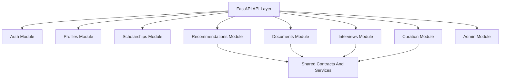

# ScholarAI Backend API And Repository

## Purpose
This document defines the FastAPI modular monolith structure, API boundary, async task split, repository layout, and implementation guardrails for later code work. It keeps the backend design understandable, testable, and aligned with the documentation-first workflow.

## Current Implementation Note
- The mounted API surface currently lives in `backend/app/api/v1/__init__.py` and includes `auth`, `profile`, `scholarships`, `saved-opportunities`, `recommendations`, `documents`, `interviews`, and `curation`.
- Public scholarship discovery reads are now open for published records:
  - `GET /api/v1/scholarships`
  - `GET /api/v1/scholarships/{id}`
- The current code still diverges from this target doc in a few places:
  - the canonical public student route is singular `/profile`; the current implementation is mounted from `backend/app/api/v1/routes/students.py`
  - the standard error envelope is not implemented consistently yet
  - list responses are not yet normalized across all endpoints
  - shared contract extraction is still incomplete; canonical enums still live in `backend/app/models/models.py`
  - `admin` is described here as a conceptual module, but the current mounted internal workflow is concentrated in `curation`

## Backend Architecture Stance
ScholarAI v0.1 uses one FastAPI backend with clearly separated internal modules. Business domains stay in-process and share one primary PostgreSQL data layer rather than being split into separate deployable services.

## Internal Module Boundaries
| Module | Responsibility | Must not own |
|---|---|---|
| `auth` | Authentication, session lifecycle, role checks | Scholarship curation logic |
| `profiles` | Student profile CRUD and normalization behind the singular `/profile` API surface | Recommendation ranking |
| `scholarships` | Discovery, detail views, publication-safe read models | Document feedback generation |
| `recommendations` | Stage orchestration, ranking, explanations | Direct curation writes |
| `documents` | Upload metadata, extraction orchestration, feedback request lifecycle | Scholarship policy truth |
| `interviews` | Practice sessions, prompts, rubric outputs | Scholarship publication |
| `curation` | Source registry, ingestion review, publish/unpublish workflow | Student-facing recommendation scoring |
| `admin` | Audit visibility, operational actions, system controls | Core ranking logic changes |
| `shared` | Utilities, typed contracts, common error handling | Domain-specific decision making |

## Mermaid Backend Module Structure


## Suggested FastAPI Package Layout
```text
backend/
├── app/
│   ├── main.py
│   ├── api/
│   │   └── v1/
│   │       ├── router.py
│   │       └── routes/
│   │           ├── auth.py
│   │           ├── students.py  # mounted at /profile
│   │           ├── scholarships.py
│   │           ├── recommendations.py
│   │           ├── documents.py
│   │           ├── interviews.py
│   │           ├── curation.py
│   │           └── admin.py
│   ├── core/
│   │   ├── config.py
│   │   ├── database.py
│   │   ├── security.py
│   │   └── errors.py
│   ├── models/
│   ├── schemas/
│   ├── services/
│   │   ├── recommendation_service/
│   │   ├── document_service/
│   │   ├── interview_service/
│   │   ├── curation_service/
│   │   └── embedding_service/
│   └── tasks/
├── tests/
└── alembic/
```

## Key Endpoint Groups
| Group | Example endpoints | Purpose |
|---|---|---|
| Auth | `POST /api/v1/auth/register`, `POST /api/v1/auth/login`, `GET /api/v1/auth/me` | Identity and access |
| Profiles | `GET /api/v1/profile`, `PUT /api/v1/profile` | Student profile management |
| Scholarships | `GET /api/v1/scholarships`, `GET /api/v1/scholarships/{id}` | Discovery and detail |
| Recommendations | `POST /api/v1/recommendations` | Ranked scholarships plus explanations |
| Documents | `POST /api/v1/documents`, `POST /api/v1/documents/{id}/feedback` | Upload and document assistance |
| Interviews | `POST /api/v1/interviews`, `POST /api/v1/interviews/{id}/responses`, `GET /api/v1/interviews/{id}` | Practice sessions |
| Curation | `GET /api/v1/curation/records`, `POST /api/v1/curation/records/{id}/approve`, `POST /api/v1/curation/records/{id}/publish` | Internal review workflow |
| Admin-like operations | `GET /api/v1/analytics`, `POST /api/v1/curation/ingestion-runs` | Operational controls currently mounted under analytics/curation |

## Authorization Contract (Capability-Based)
### Canonical role bundles
- `ENDUSER_STUDENT`
- `INTERNAL_USER`
- `DEV`
- `ADMIN`
- `UNIVERSITY`
- `OWNER`

Roles are assignment bundles. Runtime access checks must evaluate explicit capabilities.

### Core authorization rules
1. Deny by default when no capability mapping exists.
2. Each protected endpoint must define required capabilities.
3. `UNIVERSITY` access is institution-scoped and must enforce `institution_id` filtering.
4. Cross-institution access must return a normalized forbidden envelope.
5. High-risk endpoints require audit logging of capability decisions.

### Endpoint-level capability baseline
| Group | Capability examples | Scope rule |
|---|---|---|
| Auth | `auth.session.read`, `auth.session.refresh` | User-owned only |
| Profiles | `profile.self.read`, `profile.self.write` | Self only unless elevated internal capability |
| Scholarships | `scholarship.public.read` | Published-only for public reads |
| Saved opportunities | `saved_opportunity.self.read`, `saved_opportunity.self.write` | Self only |
| Recommendations | `recommendation.self.generate` | Self only |
| Documents | `document.self.create`, `document.self.feedback` | Self only by default |
| Interviews | `interview.self.create`, `interview.self.respond`, `interview.self.read` | Self only |
| Curation | `curation.queue.read`, `curation.record.validate`, `curation.record.publish` | Internal global or institution-scoped by policy |
| Admin | `admin.audit.read`, `admin.ingestion.run` | Internal high privilege |
| University panel | `university.applications.read`, `university.students.read` | Must be bound to `institution_id` |
| Owner dashboards | `owner.system.read`, `owner.system.control` | Highest privilege; full audit required |

### Implemented dependency aliases by route group
The current backend uses typed dependency aliases in route signatures. This is the code-truth baseline for protected endpoints:

| Route group | Alias | Required capability or set |
|---|---|---|
| `GET /api/v1/auth/me` | `SessionReadUser` | `auth.session.read` |
| `GET/PUT /api/v1/profile` | `ProfileReadUser`, `ProfileWriteUser` | `profile.self.read`, `profile.self.write` |
| `GET/POST/DELETE /api/v1/saved-opportunities/*` | `SavedOpportunityReadUser`, `SavedOpportunityWriteUser` | `saved_opportunity.self.read`, `saved_opportunity.self.write` |
| `POST /api/v1/recommendations` | `RecommendationUser` | `recommendation.self.generate` |
| `GET/POST /api/v1/documents*` | `DocumentReadUser`, `DocumentCreateUser`, `DocumentFeedbackUser` | `document.self.read`, `document.self.create`, `document.self.feedback` |
| `POST/GET /api/v1/interviews*` | `InterviewCreateUser`, `InterviewReadUser`, `InterviewRespondUser` | `interview.self.create`, `interview.self.read`, `interview.self.respond` |
| `GET /api/v1/curation/records*`, `GET /api/v1/curation/ingestion-runs*` | `CurationQueueUser` | `curation.queue.read` |
| `PATCH/POST /api/v1/curation/records/*` | `CurationValidateUser` | any of `curation.record.validate`, `curation.record.publish` |
| `POST /api/v1/curation/ingestion-runs` | `IngestionRunUser` | `admin.ingestion.run` |
| `GET /api/v1/mentor*` | `MentorReviewUser` | any of `document.mentor.review`, `document.mentor.submit` |
| `GET /api/v1/analytics` | `AdminAuditUser` | any of `admin.audit.read`, `owner.system.read` |

### Compatibility-window claim strategy
During migration, token/session payloads may include both:
- legacy claim: `role`
- new claims: `capabilities`, `policy_version`, `institution_scope`

Authorization engines must evaluate capabilities first and only use role fallback during the defined compatibility window.

### Implemented token claim validation rules
Current behavior in `get_current_user` enforces:
1. If `capabilities` claim is present, it must be an array.
2. Every `capabilities` entry must be a string.
3. If `institution_scope` is present, it must match the user `institution_id`.
4. `UNIVERSITY` users must have a non-null `institution_id` in storage.
5. `UNIVERSITY` tokens must include an `institution_scope` claim.

## Request And Response Patterns
### Request patterns
| Pattern | Rule |
|---|---|
| Mutation requests | Use explicit request models and idempotency where practical |
| Filter requests | Prefer query params for list filtering |
| Long-running AI or ingestion work | Return accepted state and track asynchronously when needed |
| Scholarship-specific guidance | Accept scholarship ID plus user document or prompt context |

### Response patterns
| Pattern | Rule |
|---|---|
| Normalized list responses | Use a stable top-level envelope. Discovery endpoints should return `items`, `total`, `page`, `page_size`, `has_more`, and `applied_filters`. Non-discovery list endpoints should still keep `items` and `total` stable and add endpoint-specific `meta` only when needed |
| Detail responses | Include provenance-safe scholarship facts and last validation timestamp |
| Recommendation responses | Include ranked items, explanation payloads, and score disclaimers |
| Async responses | Include `job_id`, `status`, and polling endpoint when applicable |

### Discovery filter and pagination contract
For `GET /api/v1/scholarships`, the list envelope is the canonical public discovery shape:

```json
{
  "items": [],
  "total": 0,
  "page": 1,
  "page_size": 12,
  "has_more": false,
  "applied_filters": {
    "country_code": "CA",
    "query": "ai",
    "field_tag": "computer science",
    "degree_level": "MS",
    "provider": "University of Toronto",
    "funding_type": "full",
    "min_amount": 1000,
    "max_amount": 5000,
    "has_deadline": true,
    "deadline_within_days": 30,
    "deadline_after": "2026-03-20T00:00:00Z",
    "deadline_before": "2026-04-19T00:00:00Z",
    "sort": "deadline"
  }
}
```

Rules for discovery echo and pagination:
1. `applied_filters` echoes the effective normalized filter values, not the raw query string.
2. `country_code` and `degree_level` are uppercased when present.
3. `funding_type` and `sort` are lowercased when present.
4. `query`, `field_tag`, and `provider` are trimmed before echo.
5. `sort` normalizes to one of `deadline`, `title`, or `recent`.
6. `page` defaults to `1`.
7. `page_size` defaults to `12` and must stay bounded by endpoint validation.
8. `has_more` is computed from the effective slice, not guessed from request intent.

## Error Contract Strategy
### Standard error shape
```json
{
  "error": {
    "code": "SCHOLARSHIP_NOT_FOUND",
    "message": "Scholarship record not found",
    "status": 404,
    "request_id": "req_123",
    "details": null
  }
}
```

### Handled error envelope rules
Handled business-rule and validation failures should use the same envelope shape instead of mixing ad hoc `detail` payloads.

```json
{
  "error": {
    "code": "INVALID_DISCOVERY_FILTERS",
    "message": "Minimum amount cannot be greater than maximum amount",
    "status": 400,
    "request_id": "req_123",
    "details": {
      "field": "min_amount"
    }
  }
}
```

### Error rules
1. Use stable machine-readable codes.
2. Keep end-user messages concise and non-ambiguous.
3. Include `request_id` for operational traceability.
4. Avoid leaking internal provider or infrastructure details in public responses.
5. Handled `404`, `400`, `409`, and similar application-level responses should not invent endpoint-specific error wrappers.
6. Framework-native validation output may still exist internally during transition, but public route contracts should converge on the normalized envelope above.

## Shared Contract Source Of Truth
Enums and other cross-boundary contract values should have one canonical definition in a `shared/contracts` layer rather than being re-declared independently in routes, schemas, and services.

Current branch reality:
- the shared contracts package is not fully extracted yet
- canonical enum definitions are still authored in `backend/app/models/models.py`

Target rule:
1. Move public contract enums and shared literals into `shared/contracts`.
2. Treat that layer as the only source-of-truth for API-visible enum values.
3. Downstream SQLAlchemy models, Pydantic schemas, and frontend/generated clients should import from that shared contract layer rather than duplicating lists by hand.

## API Versioning Strategy
### v0.1
- Use a single explicit version prefix: `/api/v1`.
- Keep breaking changes behind future version bumps rather than silent schema drift.
- Treat schema changes as documentation and migration events, not casual refactors.

### Future
- Add versioned compatibility policy when public integrations exist.

## Async Task Boundaries
| Async task | Why async |
|---|---|
| Scheduled ingestion runs | Network-bound and bursty |
| Embedding generation | CPU / external-model cost |
| Bulk reindex or graph refresh | Non-interactive maintenance |
| Larger document feedback jobs | Potentially slow and rate-limited |

### Keep synchronous
- Scholarship listing and detail reads
- basic recommendation requests at normal scale
- curator state transitions
- profile updates

## Monorepo Structure
```text
scholarai-platform/
├── docs/
│   └── scholarai/
├── backend/
│   ├── app/
│   ├── tests/
│   ├── alembic/
│   └── requirements.txt
├── frontend/
│   ├── src/
│   ├── public/
│   └── package.json
├── docker-compose.yml
└── README.md
```

## Backend Implementation Guardrails For AI-Generated Code
1. Generated code must map to documented module boundaries.
2. Generated schemas must not invent undocumented fields or endpoints.
3. Every generated route must use explicit request and response models.
4. Generated persistence code must respect source-of-truth and curation-state rules.
5. Generated code must not bypass audit logging for curator or admin mutations.
6. Human review is required before accepting generated migrations, security logic, or ranking logic.

## Repository Guardrails
| Area | Guardrail |
|---|---|
| Docs | Update canonical docs before broad implementation changes |
| Schema changes | Require documentation update plus migration plan |
| AI code generation | Treat output as draft, never as final authority |
| Tests | New modules should ship with unit or integration coverage plan |

## v0.1
- One FastAPI backend with clearly separated internal modules.
- `/api/v1` versioned routes for core user and admin workflows.
- Celery used only for meaningful async tasks.

## Future Research Extensions
- Comparative API instrumentation for evaluation experiments.
- More advanced internal service boundaries if complexity justifies them.

## Deferred By Stage Startup Features
- Public partner APIs.
- Webhooks and provider submission endpoints.
- Tenant-aware admin boundaries if commercialization requires them.

## v0.1 decision
ScholarAI v0.1 will use a versioned FastAPI modular monolith with explicit internal boundaries, a stable error contract, and strict guardrails for any later AI-generated implementation code.

## Deferred items
- Public integration APIs.
- Multi-service decomposition.
- Tenant-aware platform partitioning.

## Assumptions
- One backend process plus Celery workers is sufficient for v0.1 complexity.
- Recommendation and document feedback paths can remain inside the same backend without unacceptable coupling.
- Documentation will stay ahead of major API changes.

## Risks
- Module boundaries can erode quickly if route handlers start owning business logic directly.
- Async task sprawl can recreate microservice complexity unless kept disciplined.
- AI-generated code can introduce undocumented contracts unless review standards stay strict.

