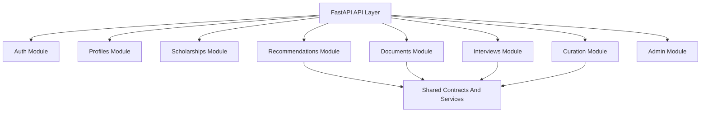

# ScholarAI Backend API And Repository

## Purpose
This document defines the FastAPI modular monolith structure, API boundary, async task split, repository layout, and implementation guardrails for later code work. It keeps the backend design understandable, testable, and aligned with the documentation-first workflow.

## Backend Architecture Stance
ScholarAI MVP uses one FastAPI backend with clearly separated internal modules. Business domains stay in-process and share one primary PostgreSQL data layer rather than being split into separate deployable services.

## Internal Module Boundaries
| Module | Responsibility | Must not own |
|---|---|---|
| `auth` | Authentication, session lifecycle, role checks | Scholarship curation logic |
| `profiles` | Student profile CRUD and normalization | Recommendation ranking |
| `scholarships` | Discovery, detail views, publication-safe read models | Document feedback generation |
| `recommendations` | Stage orchestration, ranking, explanations | Direct curation writes |
| `documents` | Upload metadata, extraction orchestration, feedback request lifecycle | Scholarship policy truth |
| `interviews` | Practice sessions, prompts, rubric outputs | Scholarship publication |
| `curation` | Source registry, ingestion review, publish/unpublish workflow | Student-facing recommendation scoring |
| `admin` | Audit visibility, operational actions, system controls | Core ranking logic changes |
| `shared` | Utilities, typed contracts, common error handling | Domain-specific decision making |

## Mermaid Backend Module Structure


## Suggested FastAPI Package Layout
```text
backend/
├── app/
│   ├── main.py
│   ├── api/
│   │   └── v1/
│   │       ├── router.py
│   │       └── routes/
│   │           ├── auth.py
│   │           ├── profiles.py
│   │           ├── scholarships.py
│   │           ├── recommendations.py
│   │           ├── documents.py
│   │           ├── interviews.py
│   │           ├── curation.py
│   │           └── admin.py
│   ├── core/
│   │   ├── config.py
│   │   ├── database.py
│   │   ├── security.py
│   │   └── errors.py
│   ├── models/
│   ├── schemas/
│   ├── services/
│   │   ├── recommendation_service/
│   │   ├── document_service/
│   │   ├── interview_service/
│   │   ├── curation_service/
│   │   └── embedding_service/
│   └── tasks/
├── tests/
└── alembic/
```

## Key Endpoint Groups
| Group | Example endpoints | Purpose |
|---|---|---|
| Auth | `POST /api/v1/auth/register`, `POST /api/v1/auth/login`, `GET /api/v1/auth/me` | Identity and access |
| Profiles | `GET /api/v1/profile`, `PUT /api/v1/profile` | Student profile management |
| Scholarships | `GET /api/v1/scholarships`, `GET /api/v1/scholarships/{id}` | Discovery and detail |
| Recommendations | `POST /api/v1/recommendations` | Ranked scholarships plus explanations |
| Documents | `POST /api/v1/documents`, `POST /api/v1/documents/{id}/feedback` | Upload and document assistance |
| Interviews | `POST /api/v1/interviews`, `POST /api/v1/interviews/{id}/responses`, `GET /api/v1/interviews/{id}` | Practice sessions |
| Curation | `GET /api/v1/curation/queue`, `POST /api/v1/curation/{id}/validate`, `POST /api/v1/curation/{id}/publish` | Internal review workflow |
| Admin | `GET /api/v1/admin/audit-logs`, `POST /api/v1/admin/ingestion-runs/{source_id}` | Operational controls |

## Request And Response Patterns
### Request patterns
| Pattern | Rule |
|---|---|
| Mutation requests | Use explicit request models and idempotency where practical |
| Filter requests | Prefer query params for list filtering |
| Long-running AI or ingestion work | Return accepted state and track asynchronously when needed |
| Scholarship-specific guidance | Accept scholarship ID plus user document or prompt context |

### Response patterns
| Pattern | Rule |
|---|---|
| List responses | Include `items`, pagination metadata, and filter echo |
| Detail responses | Include provenance-safe scholarship facts and last validation timestamp |
| Recommendation responses | Include ranked items, explanation payloads, and score disclaimers |
| Async responses | Include `job_id`, `status`, and polling endpoint when applicable |

## Error Contract Strategy
### Standard error shape
```json
{
  "error": {
    "code": "SCHOLARSHIP_NOT_FOUND",
    "message": "Scholarship record not found",
    "request_id": "req_123",
    "status": 404
  }
}
```

### Error rules
1. Use stable machine-readable codes.
2. Keep end-user messages concise and non-ambiguous.
3. Include `request_id` for operational traceability.
4. Avoid leaking internal provider or infrastructure details in public responses.

## API Versioning Strategy
### MVP
- Use a single explicit version prefix: `/api/v1`.
- Keep breaking changes behind future version bumps rather than silent schema drift.
- Treat schema changes as documentation and migration events, not casual refactors.

### Future
- Add versioned compatibility policy when public integrations exist.

## Async Task Boundaries
| Async task | Why async |
|---|---|
| Scheduled ingestion runs | Network-bound and bursty |
| Embedding generation | CPU / external-model cost |
| Bulk reindex or graph refresh | Non-interactive maintenance |
| Larger document feedback jobs | Potentially slow and rate-limited |

### Keep synchronous
- Scholarship listing and detail reads
- basic recommendation requests at normal scale
- curator state transitions
- profile updates

## Monorepo Structure
```text
scholarai-platform/
├── docs/
│   └── scholarai/
├── backend/
│   ├── app/
│   ├── tests/
│   ├── alembic/
│   └── requirements.txt
├── frontend/
│   ├── src/
│   ├── public/
│   └── package.json
├── docker-compose.yml
└── README.md
```

## Backend Implementation Guardrails For AI-Generated Code
1. Generated code must map to documented module boundaries.
2. Generated schemas must not invent undocumented fields or endpoints.
3. Every generated route must use explicit request and response models.
4. Generated persistence code must respect source-of-truth and curation-state rules.
5. Generated code must not bypass audit logging for curator or admin mutations.
6. Human review is required before accepting generated migrations, security logic, or ranking logic.

## Repository Guardrails
| Area | Guardrail |
|---|---|
| Docs | Update canonical docs before broad implementation changes |
| Schema changes | Require documentation update plus migration plan |
| AI code generation | Treat output as draft, never as final authority |
| Tests | New modules should ship with unit or integration coverage plan |

## MVP
- One FastAPI backend with clearly separated internal modules.
- `/api/v1` versioned routes for core user and admin workflows.
- Celery used only for meaningful async tasks.

## Future Research Extensions
- Comparative API instrumentation for evaluation experiments.
- More advanced internal service boundaries if complexity justifies them.

## Post-MVP Startup Features
- Public partner APIs.
- Webhooks and provider submission endpoints.
- Tenant-aware admin boundaries if commercialization requires them.

## MVP decision
ScholarAI MVP will use a versioned FastAPI modular monolith with explicit internal boundaries, a stable error contract, and strict guardrails for any later AI-generated implementation code.

## Deferred items
- Public integration APIs.
- Multi-service decomposition.
- Tenant-aware platform partitioning.

## Assumptions
- One backend process plus Celery workers is sufficient for MVP complexity.
- Recommendation and document feedback paths can remain inside the same backend without unacceptable coupling.
- Documentation will stay ahead of major API changes.

## Risks
- Module boundaries can erode quickly if route handlers start owning business logic directly.
- Async task sprawl can recreate microservice complexity unless kept disciplined.
- AI-generated code can introduce undocumented contracts unless review standards stay strict.
