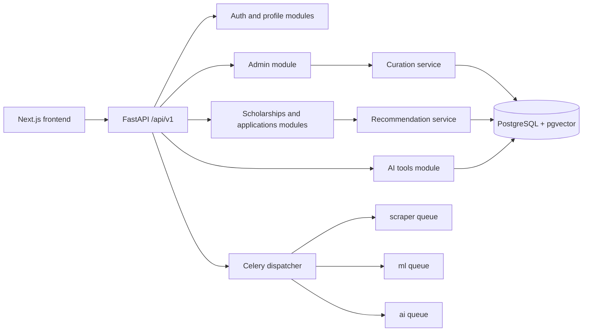

# ScholarAI Backend API and Repository

## Document Baseline

| Item | Decision |
|---|---|
| Purpose | Define the modular monolith backend shape, FastAPI module boundaries, endpoint groups, async task boundaries, and the monorepo proposal |
| Runtime baseline | FastAPI + SQLAlchemy + Alembic + Celery + Redis + PostgreSQL |
| API base path | `/api/v1` |
| Scope discipline | Keep the backend deployable as one application boundary for MVP |
| Repository stance | Keep one monorepo with clear package ownership instead of splitting repos or services |

## Release-Tier Boundary

| Tier | Backend stance |
|---|---|
| MVP | One FastAPI app, one PostgreSQL database, one Redis broker, one Celery worker tier, one shared monorepo |
| Future Research Extensions | Additional offline evaluation jobs, graph experiments, and richer curation automation inside the same repo unless scale proves otherwise |
| Post-MVP Startup Features | Stronger service isolation, partner APIs, and team-specific deployment pipelines only after real operational pressure appears |

## Modular Monolith Structure

| Layer | Current repo anchor | MVP responsibility |
|---|---|---|
| API entry | `backend/app/main.py` | App startup, middleware, lifespan hooks, router registration, health endpoint |
| API router | `backend/app/api/v1/__init__.py` | Route mounting and top-level path ownership |
| Route modules | `backend/app/api/v1/routes` | HTTP request validation, auth dependency checks, response models |
| Domain services | `backend/app/services` | Business logic, orchestration, AI provider calls, recommendation flow |
| Data access and config | `backend/app/core` | Settings, DB session wiring, security, rate limiting, audit hooks |
| Domain schema | `backend/app/models/models.py` | Canonical relational entities and persistence model |
| Async boundary | `backend/app/tasks` | Celery app, queue routing, scheduled jobs, long-running work |
| Experiments | `ai_services/` | Offline model training, evaluation utilities, prototype research code |
| Documentation | `docs/scholarai/` | Authoritative product and architecture decisions |

## Proposed Backend Module Boundaries

| Module | Route prefix | Service focus | MVP status |
|---|---|---|---|
| `auth` | `/auth` | registration, login, refresh, current-user identity | Locked |
| `profile` | `/profile` | student profile CRUD and profile completeness | Locked |
| `scholarships` | `/scholarships` | published scholarship discovery, detail, and recommendation retrieval | Locked |
| `applications` | `/applications` | application tracking and status changes | Locked |
| `admin` | `/admin` | scholarship admin CRUD, curation controls, scraper operations, audit visibility, platform stats | Locked |
| `ai` | `/ai` | bounded SOP assistance and interview support tied to validated data rules | Locked |
| `curation` internal service boundary | none in current router | raw ingestion review, validation decisions, publication transitions | MVP internal module, API surface can stay under `admin` |
| `recommendation` internal service boundary | none in current router | rule filtering, Knowledge Graph Layer checks, vector ranking, ML scoring, explanations | Locked as service layer |
| `ops` internal service boundary | none in current router | backups, health checks, deployment hooks, maintenance tasks | Locked as internal concern |
| `credentials`, `mentorship`, `interview`, `sop` legacy route files | not mounted | old or alternate route surfaces | Not part of the documented MVP API surface |

## FastAPI Endpoint Groups

| Endpoint group | Current path set | Purpose | Notes |
|---|---|---|---|
| Authentication | `/api/v1/auth/register`, `/login`, `/refresh`, `/me` | identity and session lifecycle | Already mounted |
| Student profile | `/api/v1/profile`, `/me` | create, read, update student profile | Already mounted |
| Scholarship discovery | `/api/v1/scholarships`, `/recommendations`, `/{scholarship_id}` | browse published scholarships and retrieve ranked recommendations | Recommendation route should remain read-oriented |
| Application tracking | `/api/v1/applications`, `/{application_id}/status` | student application log and workflow state | Keep as lightweight tracking in MVP |
| Admin operations | `/api/v1/admin/scholarships`, `/scraper/runs`, `/scraper/trigger`, `/audit-logs`, `/stats` | admin CRUD, job trigger, audit review, ops visibility | Curation endpoints may be added here rather than adding a new top-level public module |
| AI tools | `/api/v1/ai/sop/generate`, `/sop/improve`, `/interview/questions`, `/interview/evaluate`, `/interview/session` | bounded SOP assistance and interview practice | Existing route names do not turn sparse-input first-draft generation into an MVP commitment |

## API Conventions

| Topic | MVP rule |
|---|---|
| Versioning | Keep `/api/v1` as the only public API version during MVP |
| Auth model | JWT-style bearer auth with current-user dependency checks |
| Response shape | Use Pydantic response models for route outputs |
| Write boundaries | Student-facing routes never write raw scholarship ingestion data |
| Admin boundaries | Publication and curation actions remain admin-only |
| Error discipline | Return explicit validation or permission errors instead of silent fallback behavior |
| Background work | Requests may enqueue long jobs, but should not block on scraping or bulk recomputation |
| Auditability | Admin mutations and publication actions should emit audit entries |

## Internal Request and Job Boundaries



## Async Task Boundaries

| Queue | Current task anchor | MVP responsibility | Synchronous alternative that stays in-process |
|---|---|---|---|
| `scraper` | `tasks.run_full_scrape` | extraction runs, normalization batches, and source refresh orchestration | small admin previews or record inspection |
| `ml` | `tasks.compute_match_scores`, `tasks.recompute_all_scores` | match-score recomputation, batch ranking refresh, offline score rebuilds | single-request recommendation reads using cached or on-demand scoring |
| `ai` | `tasks.generate_sop` | bounded SOP assistance and revision jobs | short interview evaluation calls if latency remains acceptable |
| `default` | no major named job currently documented | reserve for lightweight background hooks only if needed | preferred for most MVP work to remain synchronous unless latency demands otherwise |

## Task Ownership Rules

| Work type | Where it belongs |
|---|---|
| Scholarship search and detail reads | FastAPI request path |
| Recommendation reads over already-available data | FastAPI request path, with optional cached score refresh in `ml` |
| Full-source scraping and batch normalization | `scraper` queue |
| Bulk recommendation recompute | `ml` queue |
| Bounded SOP assistance | `ai` queue |
| Publication review decisions | Admin request path backed by transactional DB writes |
| Backup operations | Dedicated backup container, not the request path |

## Curation API Position

| Need | MVP API decision |
|---|---|
| Review raw records | Keep as admin-only actions, preferably under `/api/v1/admin/curation/*` if the surface is added |
| Publish or unpublish records | Keep under admin scope with audit logging |
| Student access to raw data | Disallowed |
| Public write APIs for source import | Disallowed for MVP |

This keeps the externally visible API small while still leaving room for a curation workflow that matches `06_data_models.md` and `07_ingestion_and_curation.md`.

## Monorepo Proposal

| Top-level path | Role | Ownership bias |
|---|---|---|
| `frontend/` | student and admin UI | frontend-focused developer |
| `backend/` | FastAPI app, models, services, tasks, migrations, scripts | backend-focused developer |
| `ai_services/` | offline ML training, evaluation, and research artifacts | data and ML-focused developer |
| `docs/scholarai/` | authoritative product and architecture pack | shared ownership with one doc driver each week |
| `setup/` | setup helpers, one-off ETL utilities, prototype ingestion scripts | backend or data developer as needed |
| `.github/` | CI workflow and automation | shared |

## Monorepo Rules

| Rule | Decision |
|---|---|
| One repo for MVP | Locked |
| Shared contracts | Pydantic schemas and docs define the interface between frontend, backend, and ML artifacts |
| Runtime vs experiment split | Runtime code stays in `backend/`; experimental training code stays in `ai_services/` |
| Docs authority | `docs/scholarai/` overrides older informal architecture notes when conflicts appear |
| Service extraction | Rejected for MVP unless one module becomes operationally independent and painful inside the monolith |

## Repository Layout Target

```text
scholarai-platform/
|-- frontend/
|   \-- src/app/
|-- backend/
|   |-- app/
|   |   |-- api/v1/
|   |   |-- core/
|   |   |-- models/
|   |   |-- services/
|   |   \-- tasks/
|   |-- alembic/
|   |-- scripts/
|   \-- tests/
|-- ai_services/
|-- docs/scholarai/
|-- setup/
|-- docker-compose.yml
\-- .github/workflows/ci.yml
```

## Required Backend Changes to Match the Documentation Pack

| Gap | Required correction |
|---|---|
| Curation is mostly implicit inside admin and scraper logic | Add an explicit internal curation service boundary, even if the public route surface remains under `admin` |
| Legacy route files still exist beside the mounted API | Keep them unmounted until they are reconciled with the documented scope |
| AI help routes are mounted, but their authority limits can be misread | Keep the routes, but constrain them to assistance and rubric feedback only |
| The Compose stack includes optional infrastructure | Do not make Neo4j or OpenSearch required runtime dependencies unless the MVP clearly needs them |

## Interface Dependencies

| Dependency | Used by | Why |
|---|---|---|
| PostgreSQL + `pgvector` | all core backend modules | source of truth, ranking data, embeddings |
| Redis | Celery app | broker and result backend |
| Celery beat | scraper and score refresh jobs | schedule long-running jobs outside request lifecycle |
| GitHub Actions CI | backend and frontend teams | smoke-test and lint gate before merge |
| Docker Compose | all three developers | common local and demo environment |

## Future Research Extensions

| Item | Why it is not core MVP backend work |
|---|---|
| deeper graph-backed module experiments | useful for architecture comparison, but not required for a functional modular monolith |
| richer offline evaluation workers | supports research depth, but can remain outside the runtime-critical API surface |
| additional curation automation layers | valuable later, but human-reviewed admin flow is the safer MVP path |

## Post-MVP Startup Features

| Item | Why it is separate |
|---|---|
| service extraction by domain | only justified after real scaling pressure appears |
| partner-facing APIs | depends on external integration demand not present in MVP |
| multi-environment deployment pipelines | adds coordination and ops cost beyond the current team capacity |

## MVP Decision

The MVP backend remains a single FastAPI modular monolith inside the existing monorepo, with the mounted endpoint groups limited to auth, profile, scholarships, applications, admin, and AI tools, and with long-running work isolated to the existing Celery queue families.

## Deferred Items

- Public-facing curation APIs outside admin scope.
- Service decomposition into separate deployables.
- Mandatory OpenSearch or broad Neo4j dependence.
- New top-level mentorship or credentials modules unless they survive a later scope review.

## Assumptions

- The mounted routers in `backend/app/api/v1/__init__.py` define the authoritative MVP HTTP surface.
- Admin-owned curation actions can remain under the `admin` route family without weakening the modular monolith boundary.
- A single monorepo remains the lowest-risk coordination model for a 3-developer, 16-week project.

## Risks

- If internal module boundaries stay implicit, the monolith can devolve into route-to-service sprawl.
- If long-running AI or scraping work leaks back into request handlers, latency and reliability will degrade quickly.
- If legacy routes are reintroduced without documentation review, the API surface will drift from the pack.
