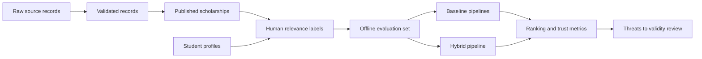

# ScholarAI Research and Evaluation

## Document Baseline

| Item | Decision |
|---|---|
| Purpose | Define the research questions, hypotheses, evaluation methodology, ablation plan, and validity limits for ScholarAI |
| Research posture | Thesis-safe, implementation-grounded, and explicit about data limitations |
| Trust boundary | Structured validated data remains the authority for scholarship facts |
| Label boundary | Do not assume real scholarship acceptance labels exist |
| Core output framing | Recommendation quality is evaluated as fit or relevance, not acceptance prediction |

## Research Scope by Release Tier

| Tier | Research stance |
|---|---|
| MVP | Evaluate whether the modular monolith, curation pipeline, and hybrid recommendation stack improve relevance and trust within the Canada-first scope |
| Future Research Extensions | Explore stronger graph reasoning, richer human labeling, and broader cross-region evaluation once the validated dataset matures |
| Post-MVP Startup Features | Run live experiments, cohort analysis, and business KPIs only after real users and production-grade instrumentation exist |

## Primary Research Questions

| ID | Question | Why it matters |
|---|---|---|
| RQ1 | Does the validated-data-first curation flow improve scholarship trustworthiness compared with direct raw-record use? | ScholarAI's core product claim depends on trusted structured data |
| RQ2 | Does the hybrid recommendation pipeline outperform simpler baselines on fit or relevance ranking? | Justifies the added system complexity |
| RQ3 | Does the Knowledge Graph Layer reduce obviously ineligible recommendations? | Tests whether graph-style eligibility reasoning adds value |
| RQ4 | Do explanations based on deterministic rules and feature signals improve reviewer trust and debugging ability? | Supports thesis defensibility and safer product behavior |
| RQ5 | Can limited AI assistance for SOP feedback and interview simulation stay useful without becoming the authority on scholarship rules? | Validates the bounded AI strategy |

## Hypotheses

| ID | Hypothesis | Evaluation signal |
|---|---|---|
| H1 | Recommendations generated only from published validated scholarships will produce fewer invalid suggestions than pipelines that rely on unreviewed records. | curator-rated invalid recommendation rate |
| H2 | Hybrid ranking that combines rule-based filtering, Knowledge Graph Layer checks, vector similarity, and ML scoring will outperform rule-only and vector-only baselines. | Precision@K, Recall@K, NDCG@K, MAP@K |
| H3 | Knowledge Graph Layer eligibility filtering will improve top-K precision by removing candidates that look semantically similar but fail hard rules. | precision delta before and after eligibility gating |
| H4 | Deterministic and model-backed explanations will make recommendation outputs easier to inspect than opaque scores alone. | reviewer rubric scores and debugging speed observations |
| H5 | SOP and interview assistance can be evaluated as rubric-based quality support without requiring them to authoritatively answer scholarship-rule questions. | rubric consistency, failure-case audit, fallback rate |

## Evaluation Units

| Evaluation unit | Artifact under test | Data source |
|---|---|---|
| Curation quality | raw -> validated -> published workflow | source registry, raw records, validated fields, review events |
| Recommendation ranking | `Estimated Scholarship Fit Score` pipeline | published scholarship set + student profiles + evaluation labels |
| Eligibility reasoning | Knowledge Graph Layer or relationally derived equivalent | validated eligibility requirements |
| Explanation quality | human-readable rule and feature rationale | recommendation outputs and reviewer inspection |
| AI assistance | SOP feedback and interview evaluation | bounded prompts, rubric outputs, audit samples |
| System feasibility | latency, job completion, operational simplicity | logs, job traces, CI results, deployment checks |

## Evaluation Dataset Strategy

| Dataset component | MVP plan |
|---|---|
| Scholarship records | Use published validated scholarships only |
| Student profiles | Use a mix of real test profiles, team-authored seed profiles, and disclosed synthetic profiles within the Canada-first scope |
| Recommendation labels | Curator or team-member relevance labels with a documented rubric |
| AI assistance samples | Team-authored documents and interview prompts, plus bounded synthetic examples where needed |
| Raw records | Use for curation evaluation only, not for student-facing ranking evaluation |

## Relevance-Labeling Protocol

| Label | Meaning | Who assigns it |
|---|---|---|
| `0` | Ineligible or clearly irrelevant | curator or reviewer |
| `1` | Eligible but weak fit | curator or reviewer |
| `2` | Plausible fit | curator or reviewer |
| `3` | Strong fit within Canada-first MVP scope | curator or reviewer |

| Protocol step | Decision |
|---|---|
| Label source | Human labeling comes first; heuristic pre-labeling may assist but cannot replace review for the evaluation subset |
| Label scope | Focus on the three MVP program areas and `Fulbright-related USA scope` only where relevant |
| Disagreement handling | Use a short adjudication pass rather than averaging conflicting labels silently |
| Versioning | Store label rubric version, reviewer, and review date |

## End-to-End Evaluation Flow

## Recommendation Evaluation Methodology

| Step | MVP method |
|---|---|
| Candidate generation | Published scholarship set only |
| Baselines | rule-only, vector-only, rule + vector, heuristic-only rerank |
| Target system | rule + Knowledge Graph Layer + vector similarity + ML rerank |
| Evaluation mode | offline batch evaluation over a labeled set |
| Reporting style | compare relative ranking quality, failure cases, and operational cost, not acceptance prediction |

## Curation Evaluation Methodology

| Question | Metric or review method |
|---|---|
| Are raw records being converted into consistent validated fields? | validation pass rate, required-field completeness |
| Are publication decisions traceable? | audit completeness and review-event coverage |
| Are bad records blocked before publication? | pre-publication rejection rate and sampled curator review |
| Does provenance remain intact? | proportion of published records with source and review metadata present |

## AI Assistance Evaluation Methodology

| Feature | MVP evaluation method |
|---|---|
| SOP improvement | rubric review of clarity, structure, relevance to scholarship prompt, and hallucination risk |
| Interview simulation | rubric review of question quality, response scoring consistency, and feedback usefulness |
| Rule-answer containment | sample audits verifying that AI responses do not invent scholarship requirements |
| Fallback behavior | count how often the system correctly falls back to deterministic or template guidance when model output is unavailable or weak |

## Metrics

### Ranking Metrics

| Metric | Use |
|---|---|
| Precision@K | top-K recommendation quality |
| Recall@K | coverage of relevant scholarships in the returned list |
| NDCG@K | ordering quality with graded relevance |
| MAP@K | overall ranked retrieval quality |

### Curation and Trust Metrics

| Metric | Use |
|---|---|
| Required-field completeness | validated record quality |
| Pre-publication rejection rate | signal for source and extraction quality |
| Audit coverage | proportion of admin publication actions with review trail |
| Invalid recommendation rate | trustworthiness of student-visible outputs |

### Operational Metrics

| Metric | Use |
|---|---|
| Recommendation latency | practical usability of the API |
| Job completion rate | reliability of Celery-backed work |
| Embedding cache hit rate | runtime efficiency |
| Manual review throughput | curator effort required by the workflow |

## Ablation Study Plan

| Variant | What is removed or simplified | Why compare it |
|---|---|---|
| A | Rule-based filtering only | minimum defensible baseline |
| B | Rule-based + vector similarity | isolates the value of semantic retrieval |
| C | Rule-based + ML rerank | tests whether tabular ML adds value without graph gating |
| D | Rule-based + Knowledge Graph Layer + vector similarity | isolates the value of graph eligibility checks before ML |
| E | Full hybrid pipeline | target MVP system |

| Ablation question | Expected learning |
|---|---|
| Does graph gating improve precision enough to justify the added implementation cost? | informs whether relational graph logic is sufficient |
| Does ML reranking materially improve NDCG@K over simpler hybrids? | informs whether the trained model belongs in MVP runtime |
| Are explanations still coherent when the ML layer is disabled? | validates fallback-safe behavior |

## Model Comparison Plan

| Comparison area | MVP plan |
|---|---|
| Tabular rerankers | heuristic scorer vs random forest vs gradient-boosted tree |
| Explanation mode | deterministic feature summary vs model-contribution summary |
| Data regime | human-labeled subset vs synthetic-label bootstrap experiments |
| Runtime posture | online scoring vs cached score reuse |

## Reproducibility Rules

| Rule | Decision |
|---|---|
| Dataset versioning | record scholarship snapshot date, publication state, and label version |
| Synthetic data disclosure | mandatory whenever synthetic profiles or heuristic labels are used |
| Random seed control | record seeds for synthetic generation and model training |
| Config capture | keep model config, feature schema, and evaluation script version in repo |
| Report discipline | present both strengths and failure cases, not only best results |

## Limitations and Threats to Validity

| Threat | Impact |
|---|---|
| Small or narrow labeled set | limits statistical confidence and generalization |
| Synthetic profiles or heuristic labels | can encode reviewer bias and inflate apparent performance |
| Canada-first scope | results do not imply global scholarship coverage |
| Legacy score naming such as `success_probability` in code | can be misread as stronger predictive capability than the data supports |
| Human reviewer inconsistency | can distort fit labels and explanation assessments |
| Evolving curation workflow during the semester | changes the evaluation data distribution over time |

## Decision Summary

| Topic | Decision |
|---|---|
| Real-world acceptance prediction | Rejected for MVP research claims |
| Offline evaluation | Required |
| Human-labeled evaluation subset | Required |
| Synthetic data | Allowed only with explicit disclosure and bounded use |
| Live user experiments | Deferred |

## Future Research Extensions

| Item | Why it is not core MVP research work |
|---|---|
| larger human-labeling campaigns | requires more reviewer capacity than the MVP window safely allows |
| deeper explanation-tool comparisons | useful academically, but secondary to establishing a reliable baseline |
| broader cross-region comparative studies | conflicts with the Canada-first MVP scope |

## Post-MVP Startup Features

| Item | Why it is separate |
|---|---|
| production cohort analysis | depends on real user traffic and retention history |
| business KPI experimentation | not relevant until the product exists beyond thesis delivery |
| live ranking experiments | requires stronger deployment and instrumentation maturity |

## MVP Decision

The MVP research plan evaluates curation quality, ranking quality, eligibility correctness, explanation usefulness, and bounded AI assistance using published validated scholarship data, human-reviewed relevance labels, and offline comparisons against simpler baselines.

## Deferred Items

- Causal claims about scholarship acceptance outcomes.
- Large-scale live experiments with real production cohorts.
- Broad geographic evaluation beyond Canada-first and narrow `Fulbright-related USA scope`.
- Research claims that depend on unlabeled scraped data being treated as ground truth.

## Assumptions

- Real acceptance labels are not available in a quantity that would justify probability claims.
- A small but carefully reviewed labeled evaluation set is feasible within the 16-week timeline.
- The recommendation and curation pipelines will be stable enough by mid-project to support comparative evaluation.

## Risks

- If the team skips disciplined labeling, the evaluation section will collapse into anecdotal claims.
- If raw or unpublished records leak into the evaluation candidate set, the trust findings will be invalid.
- If synthetic data is overused, the final conclusions may say more about the generator than the product.
