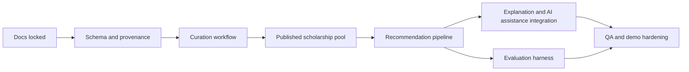

# ScholarAI Execution Plan

## Document Baseline

| Item | Decision |
|---|---|
| Purpose | Define the 16-week delivery plan, team ownership split, milestone cut rules, and dependency order |
| Team size | 3 developers |
| Delivery style | documentation-led MVP execution with weekly review and two-week milestone slices |
| Architecture guardrail | modular monolith only |
| Budget posture | low-ops, reuse current repo and Compose-based environments |

## Release-Tier Boundary

| Tier | Delivery meaning |
|---|---|
| MVP | What the team must ship within 16 weeks |
| Future Research Extensions | What can be explored if the thesis implementation stabilizes early |
| Post-MVP Startup Features | What becomes relevant only after MVP completion and user validation |

## Team Ownership Split

| Team member | Primary ownership | Secondary ownership |
|---|---|---|
| Developer A | backend platform, API contracts, database migrations, deployment support | admin workflows and audit trail |
| Developer B | ingestion, curation, recommendation pipeline, evaluation scripts | data-model maintenance and offline ML experiments |
| Developer C | frontend UX, design-system implementation, student flows, QA coordination | AI assistance UX and documentation polish |

## Shared Ownership Rules

| Area | Rule |
|---|---|
| Documentation pack | one file owner, but all major scope changes require team review |
| Migrations and schema changes | Developer A reviews, Developer B signs off when data semantics change |
| Recommendation changes | Developer B owns logic, Developer A reviews API and runtime impact |
| Frontend scope cuts | Developer C proposes, team confirms against MVP guardrails |
| Release readiness | all three developers participate in final smoke and rollback check |

## Execution Phases

| Phase | Weeks | Goal |
|---|---|---|
| Phase 1 | 1-2 | lock documentation, repo conventions, and MVP scope |
| Phase 2 | 3-6 | stabilize backend core, data model, ingestion skeleton, and student profile flows |
| Phase 3 | 7-10 | implement curation workflow, recommendation pipeline, and initial UI flows |
| Phase 4 | 11-13 | add AI assistance, evaluation harness, and QA hardening |
| Phase 5 | 14-16 | fix defects, run evaluation, prepare demo, and freeze MVP |

## 16-Week Roadmap

| Week | Primary objective | Owner lead | Exit criteria |
|---|---|---|---|
| 1 | finalize docs `01` to `14`, lock terminology, confirm repo map | all | no major scope ambiguity remains |
| 2 | align migrations, schema gaps, and route ownership with docs | Developer A | backend structure and migration plan agreed |
| 3 | implement validated data model gaps and source registry basics | Developer B | curation tables and provenance model in place |
| 4 | stabilize profile, scholarship list, and admin CRUD paths | Developer A | core API flows pass smoke tests |
| 5 | implement raw -> validated review flow and publication controls | Developer B | no student-visible path depends on raw records |
| 6 | build first real student and admin UI flows on the design system | Developer C | profile, scholarship list, and admin review screens usable |
| 7 | integrate recommendation rule filters and published-record candidate pool | Developer B | recommendations run only on trusted records |
| 8 | add Knowledge Graph Layer eligibility logic and vector retrieval path | Developer B | hard eligibility mismatches are filtered correctly |
| 9 | wire recommendation explanations into API and UI | Developers A and C | explanation payloads visible and understandable |
| 10 | add application tracking and basic analytics or admin stats polish | Developer A | end-to-end core student journey is connected |
| 11 | implement bounded SOP and interview assistance flows | Developer C | AI assistance respects authority boundaries |
| 12 | create offline evaluation set and baseline comparison scripts | Developer B | evaluation pipeline runs on stable snapshot |
| 13 | expand QA coverage, CI reliability, and deployment rehearsal | Developers A and C | deployable MVP candidate exists |
| 14 | run ablation experiments, fix critical defects, cut weak features | all | only MVP-safe features remain enabled |
| 15 | demo hardening, documentation cleanup, rollback test, backup test | all | release checklist passes |
| 16 | final evaluation run, presentation preparation, and MVP freeze | all | thesis demo package and docs are consistent |

## Dependency Order

## Milestone Objectives

| Milestone | Must be true at completion |
|---|---|
| M1: Scope lock | Docs, naming, and architecture decisions stop moving casually |
| M2: Trusted data baseline | Raw, validated, and published states exist and student views use trusted records only |
| M3: Recommendation baseline | Rule filters, graph eligibility, and vector retrieval all run on the MVP corpus |
| M4: Student workflow complete | profile -> scholarship discovery -> recommendation -> application tracking works end-to-end |
| M5: Evaluation and release | QA, deployment, rollback, and research reporting are complete enough for final submission |

## MVP Feature Cut Rules

| Priority | Keep or cut rule |
|---|---|
| P0 | Keep if the feature is required for trusted scholarship discovery, recommendation, curation, or final demo coherence |
| P1 | Keep only if the feature is stable by week 13 and does not add major ops or QA cost |
| P2 | Cut if the feature depends on broad new infrastructure, broad USA expansion, DAAD support, or unvalidated AI claims |

| Candidate feature | Default outcome if schedule slips |
|---|---|
| Neo4j as mandatory runtime | cut to relationally derived Knowledge Graph Layer |
| OpenSearch | cut |
| Mentor marketplace or mentorship matching | cut |
| Credential verification flows | cut |
| Advanced interview analytics dashboards | cut |
| Broad USA discovery | cut |
| DAAD integration | cut |

## Weekly Operating Cadence

| Meeting or artifact | Purpose |
|---|---|
| weekly planning review | confirm file owner goals, blockers, and scope cuts |
| mid-week technical sync | resolve API, data-model, and UI contract issues early |
| end-of-week demo | force integration instead of siloed progress |
| documentation update | keep docs aligned with implementation changes |

## Staffing Load Summary

| Stream | Approximate lead load | Notes |
|---|---|---|
| Backend and platform | heavy throughout weeks 2-15 | highest risk around migrations and deployment |
| Data, curation, recommendation, evaluation | heavy throughout weeks 3-16 | highest risk around labels and pipeline correctness |
| Frontend and UX | light in weeks 1-2, heavy in weeks 5-15 | must track backend reality, not design in isolation |

## Future Research Extensions

| Item | Why it is not core MVP work |
|---|---|
| richer human-labeling campaigns | too labor-intensive for the first semester pass |
| advanced graph experiments | useful academically, but not required for the core demo |
| broader A/B style UX studies | requires a more stable and broader user base |

## Post-MVP Startup Features

| Item | Why it is separate |
|---|---|
| partner or provider integrations | depends on real external relationships |
| broader regional expansion | requires new sourcing, validation, and compliance work |
| multi-tenant ops or service extraction | unjustified before the product proves usage |

## MVP Decision

The execution plan commits the team to a documentation-first, modular-monolith MVP with trusted data, recommendation quality, and a coherent student journey as the only non-negotiable outcomes for the 16-week window.

## Deferred Items

- Broad USA discovery beyond `Fulbright-related USA scope`.
- DAAD support.
- High-ops infrastructure upgrades, service decomposition, or optional search-stack expansion.
- Features that are attractive in demos but weakly connected to the trusted-discovery core.

## Assumptions

- All three developers can contribute consistently across the 16-week period.
- The existing backend foundation is usable and does not need a ground-up rewrite.
- The team will enforce feature cuts by week 14 instead of carrying unstable work to the end.

## Risks

- If documentation and implementation drift in weeks 3-8, the team will waste time integrating incompatible assumptions.
- If ownership stays vague, the three-person team will duplicate work or leave critical gaps uncovered.
- If feature cutting happens too late, testing and evaluation quality will collapse in the final two weeks.
