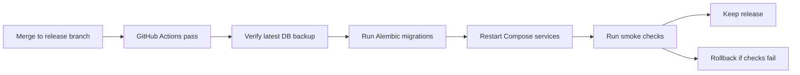

# ScholarAI QA, DevOps, and Risks

## Document Baseline

| Item | Decision |
|---|---|
| Purpose | Define the QA strategy, CI/CD plan, deployment and rollback approach, and operating risk register |
| Delivery posture | low-ops, reproducible, and team-manageable |
| Current automation anchor | `.github/workflows/ci.yml` |
| Runtime baseline | Docker Compose with backend, frontend, PostgreSQL, Redis, Celery, Flower, and backup job |
| Testing philosophy | prioritize trust boundaries, core flows, and regression-catching smoke coverage over broad but shallow test volume |

## Release-Tier Boundary

| Tier | QA and ops stance |
|---|---|
| MVP | simple CI, Compose-based deployment, backup and rollback discipline, targeted automated coverage |
| Future Research Extensions | deeper evaluation automation, data-quality dashboards, richer synthetic test harnesses |
| Post-MVP Startup Features | staged environments, stronger observability stack, blue-green or canary rollout patterns |

## Current QA and CI Baseline

| Area | Current repo evidence | MVP implication |
|---|---|---|
| Backend CI | compile + `pytest tests -q` in `.github/workflows/ci.yml` | keep as merge gate and expand with focused tests |
| Frontend CI | `npm ci` + `npm run lint` | keep as minimum gate until real UI flows justify stronger automated checks |
| Backend tests present | router, admin audit, audit service, migrations, config, rate limit, ops scaffold, database exports | a useful smoke base already exists |
| Deployment baseline | `docker-compose.yml` | use as the primary local and demo environment |
| Backup process | `postgres-backup` container running `scripts/backup_database.py --loop` | keep backup checks in release readiness |

## QA Plan by Test Layer

| Layer | What to test | Tooling |
|---|---|---|
| Unit tests | services, scoring helpers, validation logic, normalization helpers | `pytest` |
| API tests | auth, profile, scholarship discovery, admin mutations, AI route boundaries | `pytest` with FastAPI test clients |
| Data-quality tests | schema validation, provenance transitions, publish/unpublish rules, dedup rules | `pytest` around curation services |
| Async job tests | scraper dispatch, score recompute, and SOP assistance fallback behavior | `pytest` with task-level tests |
| Frontend smoke tests | critical page rendering and core flows once UI exists | lint now, browser smoke later if time allows |
| Documentation consistency checks | terminology and scope drift in the doc pack | lightweight manual review plus targeted grep checks |

## Must-Pass Regression Areas

| Area | Why it is mandatory |
|---|---|
| raw vs validated vs published boundary | prevents untrusted scholarship data from leaking to users |
| recommendation route behavior | core product path |
| admin publish and unpublish flow | protects source-of-truth rules |
| auth and current-user behavior | protects student data and role separation |
| backup and restore procedure | protects demo and evaluation continuity |

## Environment Plan

| Environment | Purpose | Tooling |
|---|---|---|
| Local development | daily feature work and developer integration | Docker Compose |
| Shared MVP environment | demo-ready integrated stack for QA and stakeholder review | Docker Compose on one small VM or host |
| CI environment | compile, lint, and smoke tests before merge | GitHub Actions |

## Deployment Plan

| Step | MVP deployment approach |
|---|---|
| Build | build frontend and backend images from the repo state |
| Config | use environment files or host secrets, with no secrets committed to git |
| Database migration | run Alembic migrations before exposing new app version |
| Application rollout | restart Compose services in controlled order: database dependencies first, then backend, worker, beat, frontend |
| Health verification | check backend `/health`, key API routes, and core frontend page load |
| Data protection | confirm latest backup exists before risky deployment |

## Release Sequence

## Rollback Plan

| Trigger | Rollback action |
|---|---|
| migration failure before app restart | stop release, restore previous code and fix migration issue |
| backend health failure after deploy | revert to previous image or repo revision and restart backend-related services |
| critical data integrity issue | restore latest valid backup to a clean database after team decision |
| AI provider outage | disable optional AI-assisted features and keep discovery and recommendation flows live |

| Rollback rule | Decision |
|---|---|
| Rollback speed over elegance | preferred |
| Partial feature disablement | allowed if it preserves the trusted-discovery core |
| Schema rollback | avoid destructive down-migrations during MVP unless tested beforehand |
| Backup restore rehearsal | required before final demo period |

## Observability and Logging Boundaries

| Area | MVP rule |
|---|---|
| Application logs | log request IDs, route outcomes, task start or failure, and admin actions |
| Sensitive content | avoid logging full SOP drafts, interview answers, tokens, or personal profile details |
| Job monitoring | use Flower for Celery visibility and lightweight log review |
| Metrics | keep lightweight counters or log-derived checks rather than building a heavy observability stack |
| Audit trail | admin publication and mutation actions must be traceable |

## Incident Categories

| Category | Example | Response owner |
|---|---|---|
| Data-trust incident | unpublished or invalid scholarship becomes visible | Developer B with Developer A support |
| API incident | key route failure or auth regression | Developer A |
| UI incident | student cannot complete core flow | Developer C |
| AI-assistance incident | model failure, poor fallback, or hallucinated rule answer | Developer C with Developer B review |
| Ops incident | backup failure, Redis outage, or broken deployment | Developer A |

## Risk Register

| ID | Risk | Likelihood | Impact | Mitigation |
|---|---|---|---|---|
| R1 | Raw or unvalidated records leak into student-facing endpoints | Medium | High | test publication boundaries and require admin-reviewed publish state |
| R2 | Recommendation output is framed as acceptance probability | Medium | High | enforce `Estimated Scholarship Fit Score` wording in API and UI |
| R3 | Optional infra like Neo4j or OpenSearch becomes accidental MVP work | Medium | Medium | treat both as conditional or deferred in planning and release checks |
| R4 | Compose deployment drifts from developer machines | Medium | Medium | keep one shared Compose file and rehearse deployment early |
| R5 | Backup process exists but restore process is untested | Medium | High | run at least one restore drill before week 15 |
| R6 | AI routes increase cost or failure rate late in the semester | Medium | Medium | keep bounded model usage and graceful non-AI fallbacks |
| R7 | Frontend automation lags too far behind new UI complexity | High | Medium | keep UI scope narrow and add smoke checks for only the critical paths |
| R8 | Research evaluation is blocked by unstable implementation | Medium | High | freeze features by week 14 and protect time for evaluation |

## QA Ownership Matrix

| Area | Primary owner | Reviewer |
|---|---|---|
| Backend API tests | Developer A | Developer B |
| Curation and data-quality tests | Developer B | Developer A |
| Frontend smoke and UX acceptance | Developer C | Developer A |
| AI assistance failure cases | Developer C | Developer B |
| Deployment and rollback rehearsal | Developer A | all |

## Future Research Extensions

| Item | Why it is not MVP |
|---|---|
| richer offline benchmark automation | useful, but secondary to getting trustworthy flows working |
| broader browser-based UI automation | costly until the UI stabilizes |
| advanced observability dashboards | too much setup relative to the MVP runtime |

## Post-MVP Startup Features

| Item | Why it is separate |
|---|---|
| staged rollout environments | needs more team time and deployment maturity |
| managed observability and alerting stack | adds recurring cost and setup overhead |
| canary or blue-green deployment | only justified with a real user base and higher uptime pressure |

## MVP Decision

The MVP uses focused automated testing, Compose-based deployment, GitHub Actions CI, explicit backup and rollback discipline, and a small but concrete risk register to protect the trusted-discovery core without adding heavy ops overhead.

## Deferred Items

- Blue-green, canary, or multi-environment production rollout patterns.
- Heavy observability platforms and real-time alerting stacks.
- Broad end-to-end browser automation beyond critical smoke paths.
- Complex rollback choreography that exceeds the team's operating capacity.

## Assumptions

- GitHub Actions remains available as the main CI gate.
- A single shared MVP environment is sufficient for integration and demo rehearsal.
- The team can schedule at least one backup-restore drill and one deployment rehearsal before final delivery.

## Risks

- If testing stays too shallow around provenance and publication state, the most important product boundary can fail silently.
- If deployment rehearsal is delayed, the final demo period will absorb avoidable operational surprises.
- If logs capture too much sensitive user content, the platform will create privacy problems while trying to improve observability.
