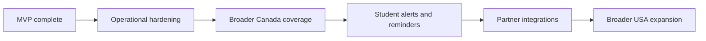

# ScholarAI Future Roadmap

## Document Baseline

| Item | Decision |
|---|---|
| Purpose | Separate non-MVP work into clear future tracks without polluting the 16-week execution plan |
| Separation rule | Every roadmap item must be labeled as either Future Research Extensions or Post-MVP Startup Features |
| MVP protection rule | Nothing in this file is required for MVP acceptance |
| Scope baseline | Canada-first MVP, `Fulbright-related USA scope`, `DAAD deferred` |
| Architecture baseline | modular monolith remains the reference point even for near-term expansion |

## What This File Is Not

| Misread | Correction |
|---|---|
| "Future roadmap" means extra MVP backlog | No. MVP is defined in `02_prd_and_scope.md` and `12_execution_plan.md`. |
| Startup path means immediate service scaling | No. Post-MVP startup features depend on real usage and evidence. |
| Research extension means a guaranteed build commitment | No. It is a candidate path if time, supervision, or academic goals justify it. |

## MVP Boundary Reminder

| MVP remains | Explicitly not MVP |
|---|---|
| Canada-first scholarship discovery for the three target MS programs | broad USA scholarship discovery |
| validated-data-first curation and publication flow | DAAD support |
| hybrid recommendation with `Estimated Scholarship Fit Score` | outcome-probability claims |
| bounded SOP and interview assistance | AI authority over scholarship rules |

## Future Research Extensions

| Area | Candidate extension | Why it belongs here |
|---|---|---|
| Knowledge Graph Layer | compare relationally derived graph logic with a narrow Neo4j implementation | academically interesting, but not required for MVP |
| Evaluation | increase human-labeled evaluation depth and inter-reviewer agreement analysis | improves rigor, but needs more reviewer time |
| Recommendation | test richer ablations, stronger feature engineering, and alternative rerankers | useful research value beyond the first defensible hybrid |
| XAI | compare deterministic explanations with more formal explanation tooling | useful for thesis analysis, not necessary for MVP operation |
| RAG assistance | test retrieval strategies for document assistance only | bounded research topic, not core product truth |
| Interview support | evaluate rubric consistency across broader answer sets | useful academically, secondary to the core flow |
| Data coverage | add a carefully scoped DAAD prototype after MVP | explicitly deferred by current scope rules |

## Future Research Extension Entry Criteria

| Criterion | Why it matters |
|---|---|
| trusted curation workflow is stable | otherwise research results rest on unstable data |
| recommendation baseline is already implemented | otherwise ablation work has no reference point |
| the extra work does not jeopardize the MVP freeze | protects final delivery |

## Post-MVP Startup Features

| Area | Candidate feature | Why it belongs here |
|---|---|---|
| Product | saved searches, alerts, and application reminders | useful after the core workflow proves value |
| Partnerships | provider or university partner integrations | depends on external relationships not present in MVP |
| Geographic expansion | broader USA discovery beyond Fulbright-related scope | requires new sourcing and governance work |
| Operations | stronger hosting, managed databases, and richer observability | only justified with real product usage |
| Personalization | user-behavior-informed ranking and notification systems | depends on enough live usage data |
| Commercialization | subscription or institutional reporting features | belongs after product and demand validation |

## Startup Roadmap Sequence

## Near-Term After MVP

| Horizon | Research track | Startup track |
|---|---|---|
| 0-3 months | deeper recommendation evaluation and explanation studies | harden deployment, improve onboarding, add saved items |
| 3-6 months | DAAD prototype or broader graph experiment if justified | alerts, reminders, and improved admin workflows |
| 6-12 months | larger-scale comparative studies if real data exists | partner integrations, broader regional expansion, higher-uptime operations |

## Roadmap Guardrails

| Guardrail | Decision |
|---|---|
| Startup ideas cannot retroactively become MVP requirements | Locked |
| New geography requires explicit source and validation planning | Locked |
| RAG remains assistance-only even in future phases unless governance changes with evidence | Locked |
| Outcome-probability claims remain disallowed until real labels exist | Locked |

## Decision Summary

| Topic | Decision |
|---|---|
| DAAD | Future Research Extensions only |
| Broad USA discovery | Post-MVP Startup Features only |
| Neo4j as a larger graph platform | Future Research Extensions unless proven necessary later |
| Managed infra upgrades | Post-MVP Startup Features |
| Commercial features | Post-MVP Startup Features |

## Why the Separation Matters

| Risk if mixed together | Result |
|---|---|
| roadmap ideas leak into MVP delivery | the 16-week plan becomes unrealistic |
| research experiments are treated as product commitments | implementation quality suffers |
| startup goals outrun the trusted-data model | product credibility drops |

## MVP Decision

The MVP stops at a Canada-first, trusted-data scholarship platform with bounded AI assistance; everything in this file exists only as a later research or startup path after that baseline is delivered.

## Deferred Items

- DAAD support.
- Broad USA scholarship discovery beyond `Fulbright-related USA scope`.
- Partner integrations, commercial layers, and higher-ops deployment models.
- Advanced graph, retrieval, or personalization work that is not necessary for the 16-week MVP.

## Assumptions

- The team wants to preserve a credible startup path without allowing it to redefine MVP scope.
- Any post-MVP work will begin from the modular monolith unless scale evidence clearly argues otherwise.
- Future roadmap decisions will continue to respect the validated-data-first rule.

## Risks

- If this roadmap is read as an implementation backlog, the team will overcommit.
- If future research experiments are started before MVP stabilization, evaluation quality and delivery quality will both suffer.
- If post-MVP expansion ignores the source-of-truth and governance rules, new features will reintroduce trust problems the MVP was designed to avoid.
